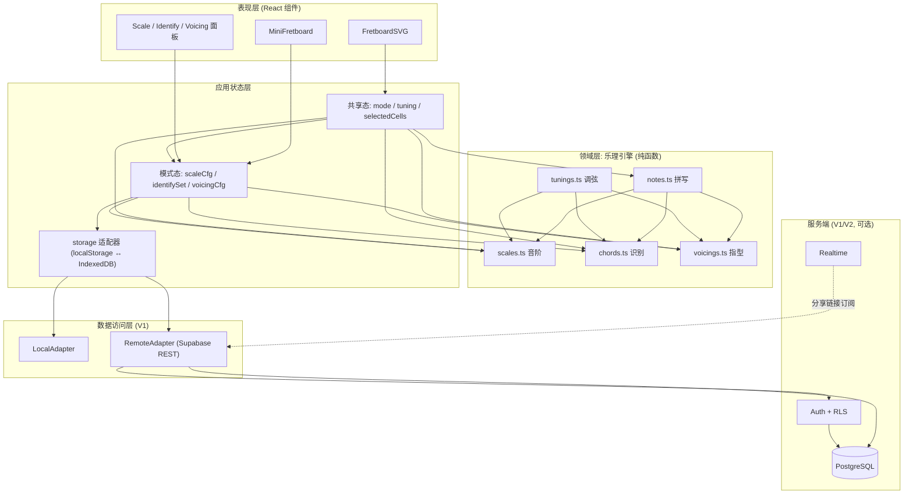

# 电吉他指板学习网站 — 方案设计与技术架构

| 项 | 内容 |
| --- | --- |
| 文档版本 | v1.0 |
| 状态 | 待评审（后端选型待拍板） |
| 项目代号 | Fret Lab（`fret-fec`） |
| 前端基线 | React 18 + TypeScript + Vite 5（已确定，不在本文档讨论范围内） |
| 本文档解决的问题 | 三大核心功能的可落地设计 + 后端/数据库选型的最终建议 |
| 目标读者 | 懂技术、前端已定、后端未定的开发者（很可能是你自己 / 单人团队） |

---

## 目录

- [0. 核心结论速览（TL;DR）](#0-核心结论速览tldr)
- [1. 需求拆解与功能边界](#1-需求拆解与功能边界)
- [2. 总体架构](#2-总体架构)
- [3. 乐理领域层设计](#3-乐理领域层设计)
- [4. 前端架构](#4-前端架构)
- [5. 后端与数据库选型推荐](#5-后端与数据库选型推荐)
- [6. 数据模型设计](#6-数据模型设计)
- [7. 接口设计](#7-接口设计)
- [8. 部署与工程化](#8-部署与工程化)
- [9. 里程碑路线图](#9-里程碑路线图)
- [10. 风险与开放问题](#10-风险与开放问题)
- [附录 A：常用常量速查表](#附录-a常用常量速查表)
- [附录 B：TypeScript 类型总表](#附录-btypescript-类型总表)
- [附录 C：验收自查清单（发版前逐条勾选）](#附录-c验收自查清单发版前逐条勾选)
- [附录 D：架构决策记录（ADR 摘要）](#附录-d架构决策记录adr-摘要)

---

## 0. 核心结论速览（TL;DR）

1. **乐理计算 100% 放在前端，做成纯函数、零网络依赖。** 音阶生成、和弦识别、指型生成都是确定性算法，输入空间极小（12 个音 × 若干调式 × 0–24 品），耗时在毫秒级。把它放到后端只会引入网络延迟、服务器成本和部署复杂度，换不来任何东西。这条判断决定了后面所有选型。
2. **后端只负责「需要跨设备、需要持久化、需要共享」的三类数据**：账号、收藏/练习记录、分享链接。三大核心功能在没有任何后端的情况下必须 100% 可用。
3. **数据库选 PostgreSQL，不选 MongoDB。** 指板数据的本质是「强 schema 的数组 + 多对多关系」，Postgres 的关系约束 + `JSONB` 半结构化字段能同时覆盖两种形态；MongoDB 在这里丢掉 JOIN 和约束，却没有换来收益。
4. **分阶段选型**：MVP = 纯前端 + `localStorage`；V1 = Supabase（Postgres + Auth + RLS + Realtime）；V2 = 有明确理由时再自建 Fastify + Postgres。
5. **推荐 V1 用 Supabase 的核心理由**：它就是标准 Postgres + 一套自动生成的 REST/Realtime 层，省掉 70% 后端样板代码，而且随时可以 `pg_dump` 迁走，不存在锁定。
6. **如果一开始就确定要做 SSR / SEO / 前后端共享乐理代码**，那就是唯一应该考虑自建（方案 B）的场景 —— 因为这时 monorepo 里共享 `packages/theory` 的价值才会真正兑现。

---

## 1. 需求拆解与功能边界

### 1.1 三个核心功能的可验收拆解

#### 功能 F1：空白指板 + 点击显音

| 编号 | 验收条目 | 优先级 |
| --- | --- | --- |
| F1-1 | 渲染标准调弦（E2 A2 D3 G3 B3 E4）6 弦 × 0–24 品的指板，含琴枕、品丝、品位记号（3/5/7/9/12/15/17/19/21/24） | MVP |
| F1-2 | 点击任意「弦 × 品」交叉点，在该位置显示对应音名（含正确变音记号） | MVP |
| F1-3 | 再次点击同一位置取消显示；支持点击已被高亮的位置切换 | MVP |
| F1-4 | 音名显示可切换为音级（degree）或音名（letter name） | MVP |
| F1-5 | 点击时可听到该音（复用 `src/audio/` 的 Karplus-Strong 合成），可全局静音 | V1 |
| F1-6 | 支持键盘导航（方向键移动焦点、Enter 触发），可访问性达标 | V1 |
| F1-7 | 支持切换调弦（Drop D / 半音降 / 7 弦 / 8 弦 / 自定义） | V1 |
| F1-8 | 左手模式（镜像指板） | V2 |

#### 功能 F2：选择「调 + 调式」显示音阶

| 编号 | 验收条目 | 优先级 |
| --- | --- | --- |
| F2-1 | 选择根音（12 个音，含升/降两种拼写偏好）与调式，指板高亮全部音阶音 | MVP |
| F2-2 | 每个高亮音显示其**音级标签**（`1 2 b3 4 5 b6 b7`），而非固定音名数组查表结果 | MVP |
| F2-3 | 音名拼写必须正确：F 大调第 4 级显示 **Bb**（不是 A#）；C 布鲁斯显示 **C Eb F Gb G Bb**（不是 F#） | MVP |
| F2-4 | 支持显示模式切换：仅音级 / 仅音名 / 两者同显 / 仅根音标注 | MVP |
| F2-5 | 内置至少 20 种音阶：大调、自然小调、五声大小调、布鲁斯、和声小调、旋律小调、Dorian、Phrygian、Lydian、Mixolydian、Locrian、全音阶、减音阶、半减音阶、Altered、Lydian Dominant、日本/和声大调等 | V1 |
| F2-6 | 把音阶音限制到某个「把位窗口」（如 0–5 品 / 5–9 品）显示把位图 | V1 |
| F2-7 | 与音频联动：一键上行/下行播放整条音阶 | V1 |
| F2-8 | 自定义音阶（用户自选音程集合，存为收藏） | V2 |

#### 功能 F3：和弦模式（识别 + 指型）

F3 实际是两个方向相反的子功能，设计和验收要分开。

**(a) F3a 指板 → 和弦名（识别）**

| 编号 | 验收条目 | 优先级 |
| --- | --- | --- |
| F3a-1 | 用户在指板上点出若干音（可含空弦、可多弦同音），实时给出和弦名 | MVP |
| F3a-2 | 输入 `x32010` 识别为 **C（C 大三和弦）**；输入 `C E G` 识别为 **C** | MVP |
| F3a-3 | 允许省略音的按法：`C E Bb` 识别为 **C7**（省略五音），不因缺少 G 而失败 | MVP |
| F3a-4 | 识别转位/斜杠和弦：低音不是根音时输出 `C/E`、`G/B`、`Am7/G` | MVP |
| F3a-5 | 返回 **Top-3 候选**及置信度，而不是只给一个答案（歧义是本质属性，见 3.5 节） | V1 |
| F3a-6 | 显示每个候选的「缺失音 / 多余音」解释，帮助用户理解为什么是这个名字 | V1 |
| F3a-7 | 非和弦音簇给出降级描述（音程列表，如 `R, 4, 5` → 「sus4 无三音」） | V1 |
| F3a-8 | 反向填充：从识别结果直接跳到 F3b 的指型列表 | V2 |

**(b) F3b 和弦名 → 指型（生成）**

| 编号 | 验收条目 | 优先级 |
| --- | --- | --- |
| F3b-1 | 输入「根音 + 和弦类型」，枚举指板上所有可弹按法 | MVP |
| F3b-2 | 每个指型以 MiniFretboard 小图 + 品位图（如 `x32010`）+ 音名列表呈现 | MVP |
| F3b-3 | 结果按「易按度」排序，标注难度等级 1–5 | MVP |
| F3b-4 | 可通过滑杆约束：最大跨度（maxSpan 3/4/5）、最高品位（maxFret 5/12/24）、是否允许闷音、最少发声弦数 | V1 |
| F3b-5 | 去重：`x32010` 与同音集的重复按法只保留一个 | MVP |
| F3b-6 | 点击某个指型可播放（扫弦/琶音），并叠加到主指板 | V1 |
| F3b-7 | 支持自定义调弦下生成（Drop D 的 `000xxx` = D5） | V1 |
| F3b-8 | 「同和弦不同把位连接」可视化（CAGED 系统映射） | V2 |

### 1.2 范围切分总表

| 能力 | MVP（纯前端，无后端） | V1（Supabase） | V2（按需自建/进阶） |
| --- | --- | --- | --- |
| 指板渲染 | ✅ 6 弦 24 品，标准调弦 | 多调弦 + 左手模式 | 7/8 弦、自定义弦距 |
| 点击显音 | ✅ 音名/音级切换 | 点击发声、键盘导航 | 音程关系连线可视化 |
| 音阶模式 | ✅ 12 根音 × ~10 调式 | 20+ 音阶、把位窗口、播放 | 自定义音阶收藏 |
| 和弦识别 | ✅ 精确识别 + 基础评分 | Top-3 + 解释 + 歧义提示 | 麦克风输入实时识别 |
| 指型生成 | ✅ 全枚举 + 剪枝 + 排序 | 参数约束 + 播放 + 收藏 | CAGED 连接、指型库共建 |
| 音频 | ✅ 单音拨弦（已实现） | 和弦扫弦、音阶播放 | 音色切换、效果器 |
| 持久化 | ✅ localStorage（收藏/设置） | Postgres（账号级同步） | 数据导出/API 开放 |
| 账号 | ❌ | ✅ 邮箱/OAuth 登录 | 团队/教师班级 |
| 分享 | ✅ URL 编码状态（无服务端） | 短链 + 可预览卡片 | 协作实时编辑 |
| 练习记录 | ❌（可选本地） | ✅ 时长/准确率统计 | 图表 + 目标/成就 |
| 离线可用 | ✅ 天然离线（纯静态） | ✅ PWA 缓存静态资源 | ✅ 冲突合并同步 |

**MVP 的硬边界（明确不做）**：不做账号、不做服务端、不做支付、不做社区、不做 UGC 指型上传。理由：这些功能对「能不能学会指板」这个核心价值零贡献，但会吃掉 60% 以上的开发时间。

---

## 2. 总体架构

### 2.1 分层结构（ASCII 图）

```text
┌──────────────────────────────────────────────────────────────────────────────┐
│  表现层 Presentation                                                          │
│  ┌──────────────┐ ┌──────────────┐ ┌──────────────┐ ┌──────────────────────┐ │
│  │ FretboardSVG │ │ MiniFretboard│ │ ScalePanel   │ │ IdentifyPanel /      │ │
│  │ （主指板）    │ │ （指型小图）  │ │ （音阶面板）  │ │ VoicingPanel         │ │
│  └──────┬───────┘ └──────┬───────┘ └──────┬───────┘ └──────────┬───────────┘ │
└─────────┼────────────────┼────────────────┼────────────────────┼─────────────┘
          │                │                │                    │
          ▼                ▼                ▼                    ▼
┌──────────────────────────────────────────────────────────────────────────────┐
│  应用状态层 App State（React 内置：useState / useMemo / useReducer 局部）      │
│  ┌────────────────────────────┐  ┌────────────────────────────────────────┐  │
│  │ 共享态 shared              │  │ 模式态（每个模式独立，互不污染）        │  │
│  │  mode, tuningId, fretCount │  │  scaleCfg / identifySet / voicingCfg   │  │
│  │  selectedCells, audioOn    │  │  + 各自的派生结果 memo                  │  │
│  └────────────────────────────┘  └────────────────────────────────────────┘  │
│  持久化端口：storage.ts（localStorage / IndexedDB 适配器，接口稳定）           │
└───────────────────────────────────┬──────────────────────────────────────────┘
                                    │ 只向下调用纯函数，无副作用
                                    ▼
┌──────────────────────────────────────────────────────────────────────────────┐
│  领域层 Domain = 乐理引擎（src/theory/）★ 纯函数、零依赖、零 IO ★             │
│  ┌────────────┐┌────────────┐┌────────────┐┌────────────┐┌────────────────┐ │
│  │ notes.ts   ││ scales.ts  ││ chords.ts  ││ voicings.ts││ tunings.ts     │ │
│  │ 音高/音名   ││ 音阶建模    ││ 和弦模板    ││ 指型生成    ││ 调弦定义        │ │
│  │ 拼写算法    ││ 音级推导    ││ 识别+评分   ││ DFS+剪枝    ││ 弦→MIDI 映射    │ │
│  └────────────┘└────────────┘└────────────┘└────────────┘└────────────────┘ │
│  同层：audio/（Karplus-Strong 波形合成，只在播放时接触 Web Audio API）          │
└───────────────────────────────────┬──────────────────────────────────────────┘
                                    │ （MVP 到此为止，下面全部可选）
                                    ▼
┌──────────────────────────────────────────────────────────────────────────────┐
│  数据访问层 Data Access（V1 才出现，接口先定义好）                              │
│  ┌────────────────────────┐  ┌────────────────────────────────────────────┐ │
│  │ LocalAdapter           │  │ RemoteAdapter（Supabase / REST / GraphQL）  │ │
│  │ localStorage/IndexedDB │  │ 认证、收藏、练习记录、分享链接              │ │
│  └────────────────────────┘  └────────────────────────────────────────────┘ │
│  统一接口 Repository<T>：list / get / upsert / remove / sync                  │
└───────────────────────────────────┬──────────────────────────────────────────┘
                                    ▼
┌──────────────────────────────────────────────────────────────────────────────┐
│  服务端 Server（V1/V2，与三大核心功能无关）                                    │
│  Supabase：Postgres + Auth + RLS + Realtime + Storage                        │
│  ── 或 ──  Fastify + Postgres（自建，可共享 packages/theory）                  │
│  只存：账号 / 收藏 / 练习记录 / 自定义音阶 / 指型库 / 分享链接                  │
└──────────────────────────────────────────────────────────────────────────────┘
```

### 2.2 同一张图的 mermaid 版本



### 2.3 「纯前端可跑」是一条硬约束，不是权宜之计

**约束表述**：删除整个 `src/data/remote/` 与所有网络调用后，三大功能（F1/F2/F3）必须仍然 100% 可用，且没有降级提示。

这条约束带来的实际收益：

| 收益 | 说明 |
| --- | --- |
| 开发速度 | 不需要写后端、不需要本地起数据库、不需要处理 CORS / 环境变量 / 迁移脚本，`pnpm dev` 即可开发全部功能 |
| 零服务器成本与零运维 | MVP 阶段月费 \$0；没有宕机面、没有安全补丁、没有备份责任 |
| 延迟与体验 | 指型生成在本地内存里跑，交互延迟 = 计算时间（毫秒级），无网络往返；离线也能用 |
| 技术风险最小 | 后端选型可以推迟到「有真实用户和数据需求」时再决策，避免过早架构（YAGNI） |
| 可测试性 | 乐理引擎是纯函数，Vitest 单测覆盖率可以做到 100%，无需 mock 网络 |
| SEO 与首屏 | 纯静态产物可丢到任意 CDN；后续若需要 SSR 再上框架，不影响领域层 |

**代价与对冲**：

| 代价 | 对冲方式 |
| --- | --- |
| 数据无法跨设备 | V1 上 Supabase 后，通过同一套 `Repository` 接口切换到 `RemoteAdapter`，UI 不改 |
| 数据可能被用户清空 | 提供「导出 JSON / 导入 JSON」，并在 localStorage 写入前做 schema 版本迁移（见 6.4） |
| 无用户体系，无法运营 | 分享链接先用 URL 编码（无服务端），V1 再升级为短链 |
| 算法在客户端暴露 | 乐理算法没有商业机密价值，暴露无成本；反而可被社区参考 |

### 2.4 后端出现后各层如何演进

演进的关键是**从一开始就把「数据访问」收敛到一个接口后面**，而不是让组件直接 `fetch`。

```ts
// src/data/types.ts —— MVP 就定义好，LocalAdapter 先实现，V1 加 RemoteAdapter
export interface Repository<T extends { id: string }> {
  list(filter?: Partial<Record<keyof T, unknown>>): Promise<T[]>;
  get(id: string): Promise<T | null>;
  upsert(item: T): Promise<T>;
  remove(id: string): Promise<void>;
}
```

| 阶段 | 表现层 | 状态层 | 领域层 | 数据访问层 | 服务端 |
| --- | --- | --- | --- | --- | --- |
| MVP | 不变 | 状态直接落在 `useState` + `useMemo` | 纯函数，最完整 | 仅 `LocalAdapter`（localStorage） | 无 |
| V1（Supabase） | 新增登录页 / 收藏按钮 / 统计页 | 新增 `useAuth`、`useFavorites`，共享态不变 | **完全不动** | 新增 `RemoteAdapter`；`storage.ts` 做「本地优先 + 后台同步」 | Postgres + Auth + RLS + Realtime |
| V2（自建） | 若做 SEO 则加 SSR 外壳，组件复用 | 可迁移到 URL 查询参数 + 服务端状态 | **完全不动**；若 monorepo 则被服务端 import 复用 | `RemoteAdapter` 换 baseURL，或换成 tRPC client | Fastify + Postgres + 可能的 Redis |
| V2（协作） | 新增访客模式与在线光标 | 新增冲突合并（CRDT 或 last-write-wins + 版本号） | 不变 | 新增 WebSocket/Realtime 订阅 | Realtime 或自建 WS |

**结论**：只要领域层是纯函数、数据访问收敛在 `Repository` 后面，后端从「没有」到「Supabase」再到「自建」，改动都被限制在 6 个文件以内。这是本文档最值钱的一条架构决定。

---

## 3. 乐理领域层设计

这一层是产品的全部价值所在，也是唯一需要「写对」的地方。它只依赖 TypeScript 标准库，不 import React、不 import DOM、不发起网络请求。

### 3.1 音高的三种表示及其换算

同一个音在系统里有三种身份，混用是 bug 之源，所以要在类型上分开：

| 表示 | 类型 | 取值 | 用途 | 是否携带拼写信息 |
| --- | --- | --- | --- | --- |
| **音高类 Pitch Class** | `PitchClass = 0..11` | C=0, C#/Db=1, …, B=11 | 音集运算、和弦匹配、掩码位运算 | ❌ 不含 |
| **MIDI 音高** | `Midi = number` | C4=60（中央 C，科学音高记号法） | 频率换算、音域排序、低音判定 | ❌ 不含 |
| **拼写音名 SpelledNote** | `{ letter: 0..6, alter: number }` | `{letter:5, alter:-1}` = Bb | **显示**、音级推导、根音输入 | ✅ 含 |

> 铁律：**任何显示给用户的音名都必须来自 `SpelledNote`，绝不来自 `PitchClass` 查表。** 一旦某个组件里出现 `['C','C#','D',...][pc]`，F 大调就会显示成 A#，这类 bug 会顺着 UI 渗进截图、分享链接和用户笔记里。

```ts
// src/theory/notes.ts
export const LETTERS = ['C', 'D', 'E', 'F', 'G', 'A', 'B'] as const;
export const LETTER_NATURAL_PC = [0, 2, 4, 5, 7, 9, 11] as const;

export type Letter = 0 | 1 | 2 | 3 | 4 | 5 | 6;
export interface SpelledNote { letter: Letter; alter: number }  // alter: +1 = #, -1 = b

const A4_MIDI = 69;
const A4_FREQ = 440;

/** MIDI → 频率（十二平均律） */
export function midiToFreq(midi: number): number {
  return A4_FREQ * Math.pow(2, (midi - A4_MIDI) / 12);
}

/** 频率 → 最近的 MIDI 音高 */
export function freqToMidi(freq: number): number {
  return Math.round(A4_MIDI + 12 * Math.log2(freq / A4_FREQ));
}

export function midiToPc(midi: number): PitchClass {
  return (((midi % 12) + 12) % 12) as PitchClass;
}

export function spelledToPc(n: SpelledNote): PitchClass {
  return (((LETTER_NATURAL_PC[n.letter] + n.alter) % 12) + 12) % 12 as PitchClass;
}

export function formatSpelled(n: SpelledNote): string {
  const acc = n.alter >= 0 ? '#'.repeat(n.alter) : 'b'.repeat(-n.alter);
  return LETTERS[n.letter] + acc;
}

/** 解析用户输入："F" / "Bb" / "F#" / "C##" */
export function parseNoteName(name: string): SpelledNote {
  const letter = LETTERS.indexOf(name[0]?.toUpperCase() as typeof LETTERS[number]);
  if (letter < 0) throw new Error(`非法音名: ${name}`);
  let alter = 0;
  for (const ch of name.slice(1)) {
    if (ch === '#') alter += 1;
    else if (ch === 'b') alter -= 1;
    else throw new Error(`非法变音记号: ${ch}`);
  }
  return { letter: letter as Letter, alter };
}
```

> 以下代码是**接口契约与算法说明**（推荐的命名与签名）。仓库 `src/theory/` 里已有的等价实现使用了一套略有差异的命名（如 `pc()` 代替 `midiToPc()`、`spellWithLetter()` 代替 `spellDegree()`），完整的对照表见 [附录 B.2](#b2-与仓库现有实现的命名对照)。实施时以仓库现有导出为准，语义以本文档为准。

**从「指板位置」到「音高」的唯一入口**（所有模式共用，避免各模式各写一份）：

```ts
// src/theory/tunings.ts
export interface Tuning {
  id: string;                 // 'standard' | 'dropD' | 'halfStepDown' | ...
  name: string;               // '标准调弦 (EADGBE)'
  stringCount: number;        // 6 | 7 | 8
  openMidis: number[];        // index 0 = 最低音弦（第 6 弦）。标准调弦: [40,45,50,55,59,64]
}

/** 指板位置 → MIDI。fret = -1 表示闷音，返回 null */
export function positionToMidi(t: Tuning, stringIndex: number, fret: number): number | null {
  if (fret < 0) return null;
  const open = t.openMidis[stringIndex];
  if (open === undefined) throw new Error(`越界弦号: ${stringIndex}`);
  return open + fret;
}
```

标准调弦参考值（写测试时直接用）：

| 弦 | 音名 | 科学音高 | MIDI | Pitch Class |
| --- | --- | --- | --- | --- |
| 6（最粗） | E2 | E2 | 40 | 4 |
| 5 | A2 | A2 | 45 | 9 |
| 4 | D3 | D3 | 50 | 2 |
| 3 | G3 | G3 | 55 | 7 |
| 2 | B3 | B3 | 59 | 11 |
| 1（最细） | E4 | E4 | 64 | 4 |

A4 = MIDI 69 = 440 Hz 是唯一的锚点（`midiToFreq(69) === 440`）；24 品时第 6 弦最高音 = 40 + 24 = 64 = E4，正好是第 1 弦空弦（一个八度 = 12 品，这是自查指板坐标的好用例）。

### 3.2 正确的音名拼写算法（本设计的关键点之一）

#### 3.2.1 为什么不能用 12 个固定音名查表

最直观的实现是：

```ts
// ❌ 错误示范
const NAMES = ['C','C#','D','D#','E','F','F#','G','G#','A','A#','B'];
const nameOf = (pc: number) => NAMES[pc];
```

它在 F 大调上必然输出 `F G A A# C D E`，而正确写法是 `F G A Bb C D E`。区别不是「风格问题」：

1. **每个字母只能用一次。** F 大调的音阶是「F 到 F 的七个不同字母」，写 A# 会导致 A 出现两次、B 一次都不出现，音阶的字母骨架被破坏。
2. **和声功能标注失效。** 音级标签要写成 `1 2 3 4 5 6 7`，写 A# 之后无法确定它该标成 4 还是 #3。
3. **与教材/DAW/乐谱不一致。** 用户拿着教材对不上，会觉得网站是错的。
4. **数值上等价但语义上不等价。** A# 和 Bb 频率相同，但在 Bb 调里是 1 级，在 F 调里是 4 级；分享链接里保存 `A#` 会让重放时的音级全部错位。

#### 3.2.2 算法：音级字母 + 变音记号推导

核心三步：

```text
1. 由「音级号」确定字母：letter = (tonic.letter + (degreeNumber - 1)) mod 7
   —— 音级的字母步进是固定的，与调无关。第 3 级永远是根音字母往后数 2 个。
2. 该字母的自然音高：naturalPc = LETTER_NATURAL_PC[letter]
3. 目标音高与自然音高之差 = 需要几个升降号：
   alter = normalizeToSigned(targetPc - naturalPc)   // 收敛到 -5..+6
```

伪代码 / 实际实现：

```ts
// src/theory/notes.ts
/** 把 0..11 的差收敛到 -5..+6，使变音记号数量最少 */
function normalizeAlter(diff: number): number {
  let a = ((diff % 12) + 12) % 12;   // 0..11
  if (a > 6) a -= 12;                // -5..+6
  return a;
}

/**
 * 按音级拼写：给定主音、音级号、目标 pitch class，返回正确拼写的音名
 * @param tonic 主音的拼写（自带字母与变音记号）
 * @param degreeNumber 音级号，1..7（和弦张力音可为 9/11/13）
 * @param targetPc 目标 pitch class，通常 = (tonicPc + intervalSemitones) % 12
 */
export function spellDegree(tonic: SpelledNote, degreeNumber: number, targetPc: PitchClass): SpelledNote {
  const letterStep = degreeNumber - 1;                       // 1→0, 3→2, 7→6, 9→8
  const letter = ((tonic.letter + letterStep) % 7) as Letter; // 9 级也自动落到正确字母
  const naturalPc = LETTER_NATURAL_PC[letter];
  const alter = normalizeAlter(targetPc - naturalPc);
  return { letter, alter };
}

/** 由音级标签（'1' / 'b3' / '#4' / 'b5' / '7'）取音级号 */
export function degreeNumberOf(label: string): number {
  const m = /^([#b]*)(\d+)$/.exec(label);
  if (!m) throw new Error(`非法音级标签: ${label}`);
  return Number(m[2]);
}

/** 音级标签里自带的变音记号数量，用于开发期自检 */
export function labelAlter(label: string): number {
  const m = /^([#b]*)(\d+)$/.exec(label)!;
  return [...m[1]].reduce((n, ch) => n + (ch === '#' ? 1 : -1), 0);
}
```

#### 3.2.3 逐级验算（C 布鲁斯音阶）

`intervals = [0, 3, 5, 6, 7, 10]`，`degrees = ['1','b3','4','b5','5','b7']`，主音 `C`（letter=0）。

| 半音偏移 | 音级标签 | 音级号 | 字母步进 | 字母 | 自然 pc | 目标 pc | 差 | 变音记号 | 结果 |
| --- | --- | --- | --- | --- | --- | --- | --- | --- | --- |
| 0 | `1` | 1 | 0 | C | 0 | 0 | 0 | — | **C** |
| 3 | `b3` | 3 | 2 | E | 4 | 3 | −1 | b | **Eb** |
| 5 | `4` | 4 | 3 | F | 5 | 5 | 0 | — | **F** |
| 6 | `b5` | 5 | 4 | G | 7 | 6 | −1 | b | **Gb** ← 不是 F# |
| 7 | `5` | 5 | 4 | G | 7 | 7 | 0 | — | **G** |
| 10 | `b7` | 7 | 6 | B | 11 | 10 | −1 | b | **Bb** |

同一算法在 F 大调与 C# 大调上的表现：

| 场景 | 音级 | 字母 | 自然 pc | 目标 pc | 差 | 输出 | 固定数组的错解 |
| --- | --- | --- | --- | --- | --- | --- | --- |
| F 大调 4 级 | `4` | B | 11 | 10 | −1 | **Bb** | A# ❌ |
| F 大调 7 级 | `7` | E | 4 | 4 | 0 | **E** | E ✅（巧合正确） |
| C# 大调 7 级 | `7` | B | 11 | 0 | +1 | **B#** | C ❌ |
| Gb 大调 4 级 | `4` | C | 0 | 11 | −1 | **Cb** | B ❌ |
| C 布鲁斯 b5 | `b5` | G | 7 | 6 | −1 | **Gb** | F# ❌ |

**开发期自检不变量**（放进 Vitest，扫描所有内置音阶定义）：

```ts
// 音级标签自带的变音记号数量，必须等于算法推导出的 alter
// 若不相等，说明音阶定义的 intervals 或 degrees 写错了
for (const scale of ALL_SCALES) {
  for (const root of ALL_ROOT_SPELLINGS) {
    const spelled = spellScale(root, scale);
    spelled.forEach((s, i) => {
      expect(s.alter).toBe(labelAlter(scale.degrees[i]));
      expect(s.letter).toBe((root.letter + degreeNumberOf(scale.degrees[i]) - 1) % 7);
    });
  }
}
```

这条不变量会立刻抓出「b5 写成了 F#」这类定义错误 —— 因为 `#` 的数量对不上算法推导的 `b`。

#### 3.2.4 根音拼写与 `|alter| > 2` 的处理

- 用户从 12 键选择器挑根音时只有一个 pitch class，需要一套默认拼写：`PREFERRED_SPELLING = ['C','Db','D','Eb','E','F','F#','G','Ab','A','Bb','B']`（偏降号，因为吉他教材与布鲁斯/爵士语境里降号更常见），并提供全局「用升号显示」开关覆盖。**这个开关只影响根音的拼写选择，不影响各级音名的推导** —— 推导永远由算法给出唯一正确答案。
- `|alter| > 2`（如 G# 大调的 7 级 = F##，理论正确但可读性差）时：算法照常返回，`formatSpelled` 输出 `F##`；同时在 UI 上给一个「更常用的等音调：Ab 大调」的提示。不做静默替换。

### 3.3 音阶建模

```ts
// src/theory/scales.ts
export interface ScaleDef {
  id: string;                 // 'major' | 'minorPentatonic' | 'blues' | ...
  name: string;               // '大调（Ionian）'
  aliases: string[];          // ['ionian', 'major']  —— 用于搜索/分享链接解析
  intervals: number[];        // 相对主音的半音偏移，升序，intervals[0] === 0
  degrees: string[];          // 与 intervals 一一对应，如 ['1','b3','4','b5','5','b7']
  category: 'major-modes' | 'minor-modes' | 'pentatonic' | 'blues'
          | 'symmetric' | 'exotic';
}

export interface SpelledScaleNote {
  pc: PitchClass;
  degree: string;             // 'b3'
  degreeNumber: number;       // 3
  name: string;               // 'Eb'
  spelled: SpelledNote;
  interval: number;           // 半音偏移（原始，未取模）
  midi?: number;              // 指板上的具体位置才有
}

export function spellScale(tonic: SpelledNote, scale: ScaleDef): SpelledScaleNote[];
```

内置音阶表（截选，MVP 需要这 12 条）：

| id | 名称 | intervals | degrees |
| --- | --- | --- | --- |
| `major` | 大调 / Ionian | `[0,2,4,5,7,9,11]` | `1 2 3 4 5 6 7` |
| `naturalMinor` | 自然小调 / Aeolian | `[0,2,3,5,7,8,10]` | `1 2 b3 4 5 b6 b7` |
| `majorPentatonic` | 大调五声 | `[0,2,4,7,9]` | `1 2 3 5 6` |
| `minorPentatonic` | 小调五声 | `[0,3,5,7,10]` | `1 b3 4 5 b7` |
| `blues` | 布鲁斯（小调） | `[0,3,5,6,7,10]` | `1 b3 4 b5 5 b7` |
| `bluesMajor` | 大调布鲁斯 | `[0,2,3,4,7,9]` | `1 2 b3 3 5 6` |
| `dorian` | Dorian | `[0,2,3,5,7,9,10]` | `1 2 b3 4 5 6 b7` |
| `phrygian` | Phrygian | `[0,1,3,5,7,8,10]` | `1 b2 b3 4 5 b6 b7` |
| `lydian` | Lydian | `[0,2,4,6,7,9,11]` | `1 2 3 #4 5 6 7` |
| `mixolydian` | Mixolydian | `[0,2,4,5,7,9,10]` | `1 2 3 4 5 6 b7` |
| `locrian` | Locrian | `[0,1,3,5,6,8,10]` | `1 b2 b3 4 b5 b6 b7` |
| `harmonicMinor` | 和声小调 | `[0,2,3,5,7,8,11]` | `1 2 b3 4 5 b6 7` |

#### 为什么 `degrees` 必须显式存下来，而不是从 `intervals` 推

因为 `interval` → `degreeNumber` 的映射**不是单射**：

| pitch class 偏移 | 可能的音级写法 | 典型语境 |
| --- | --- | --- |
| 6 | `b5` 或 `#4` | 布鲁斯/减和弦用 b5；Lydian 用 #4 |
| 8 | `b6` 或 `#5` | 自然小调用 b6；增和弦用 #5 |
| 3 | `b3` 或 `#9` | 小调用 b3；属七升九用 #9 |
| 10 | `b7` 或 `#6` | 蓝调用 b7；旋律小调上行用 #6 |

同一组 `intervals` 配上不同 `degrees`，就得到两种拼写完全不同的音阶（`C Eb F Gb G Bb` vs `C D# F F# G A#`）。所以：

```text
intervals 决定「音响」（哪些音高）
degrees   决定「写法」（每个音叫什么、标几级）
两者必须成对定义，缺一不可。
```

如果将来要提供「同名异写」变体（例如爵士教材里常见的 `C blues (with #4)`），做法是新增一个 `ScaleDef`，`id = 'bluesSharp4'`，只改 `degrees`，复用同一份 `intervals` —— 这正是把两者分开的收益。

`letterStep` 一律从 `degrees` 的**数字部分**推导（`'b5'` → 5 → 字母步进 4），标签里自带的 `b`/`#` 只用于显示和开发期自检，不参与字母选择。这一点很容易写错：如果拿 `'b5'` 的 `b` 去调整字母，就会得到 F（比 G 低一个字母），整套拼写全乱。

### 3.4 和弦建模

```ts
// src/theory/chords.ts
export interface ChordTemplate {
  suffix: string;           // 'maj7'，拼进和弦名 'Cmaj7'
  displayName: string;      // '大七和弦'
  symbol: string;           // 展示用简写，如 'Δ7'
  intervals: number[];      // 半音偏移，可 >12 表示张力音（14 = 9 度，17 = 11 度，21 = 13 度）
  essential: number[];      // ★ 必须出现才算成立的特征音（intervals 的子集）
  priority: number;         // 常用度 0..3，越大越常见，用于同分排序
  category: 'triad' | 'seventh' | 'extended' | 'suspended' | 'added' | 'power' | 'altered';
}
```

`essential` 是这个设计的第二个关键点：**它把「和弦的本质」和「和弦的完整音集」分开**。现实中的吉他按法几乎从不弹全所有音，判定和弦名必须只看特征音。

| suffix | intervals | essential | 为什么这些是 essential |
| --- | --- | --- | --- |
| `''`（大三） | `[0,4,7]` | `[0,4]` | 根音 + 大三度定义大和弦；五音可省略（`x32010` 实际也只在 3 弦弹一个 G） |
| `m` | `[0,3,7]` | `[0,3]` | 小三度是唯一区分大小调的音 |
| `dim` | `[0,3,6]` | `[0,3,6]` | 减三和弦靠减五度成立，b5 不能省 |
| `aug` | `[0,4,8]` | `[0,4,8]` | 同上，#5 是特征 |
| `5`（强力和弦） | `[0,7]` | `[0,7]` | 只有两个音，都必需 |
| `sus2` | `[0,2,7]` | `[0,2]` | 二度是特征；五音是装饰 |
| `sus4` | `[0,5,7]` | `[0,5]` | 四度是特征 |
| `6` | `[0,4,7,9]` | `[0,4,9]` | 六度是特征；五音可省 |
| `m6` | `[0,3,7,9]` | `[0,3,9]` | 同上 |
| `7`（属七） | `[0,4,7,10]` | `[0,4,10]` | 三音 + 小七度定义属功能，五音可省（爵士吉他常弹 `C E Bb`） |
| `maj7` | `[0,4,7,11]` | `[0,4,11]` | 大七度是特征 |
| `m7` | `[0,3,7,10]` | `[0,3,10]` | 小三度 + 小七度 |
| `m7b5`（半减） | `[0,3,6,10]` | `[0,3,6,10]` | b5 与 b7 都是特征，不能省 |
| `dim7` | `[0,3,6,9]` | `[0,3,6,9]` | 减七度是和弦定义本身 |
| `mMaj7` | `[0,3,7,11]` | `[0,3,11]` | 小三度 + 大七度的冲突音响是特征 |
| `add9` | `[0,4,7,14]` | `[0,4,14]` | 加了九音但**没有七音**，这是与 `9` 的唯一区别 |
| `9` | `[0,4,7,10,14]` | `[0,4,10,14]` | 属七 + 九音，五音可省 |
| `maj9` | `[0,4,7,11,14]` | `[0,4,11,14]` | 同上 |
| `m9` | `[0,3,7,10,14]` | `[0,3,10,14]` | 同上 |
| `11` | `[0,4,7,10,14,17]` | `[0,4,10,17]` | 十一音是特征；三音与十一音冲突，实际演奏常省三音，故 4 不在 essential |
| `13` | `[0,4,7,10,14,17,21]` | `[0,4,10,21]` | 十三音是特征；五音/九音/十一音可省 |
| `7sus4` | `[0,5,7,10]` | `[0,5,10]` | 四度（替代三音）+ 小七度 |
| `7b5` | `[0,4,6,10]` | `[0,4,6,10]` | 变化音都是特征 |
| `7#5` | `[0,4,8,10]` | `[0,4,8,10]` | 同上 |
| `7b9` | `[0,4,7,10,13]` | `[0,4,10,13]` | 降九音是特征 |
| `7#9` | `[0,4,7,10,15]` | `[0,4,10,15]` | 升九音是特征 |

`priority` 取值约定：大小三和弦 / `7` / `m7` / `maj7` = 3；`5` / `sus4` / `sus2` / `6` / `m6` = 2；`dim` / `aug` / `m7b5` / `dim7` / `mMaj7` 及各类变化属和弦 = 1；`11` / `13` = 0。它只在分数接近时起作用，作用见 3.5.3 的算例。

### 3.5 和弦识别算法（指板 → 和弦名）

#### 3.5.1 为什么不能做「精确匹配」

如果实现成「输入音集的 pitch class 集合必须与模板完全相等」，那么下面这些**真实存在的按法**会全部识别失败：

| 真实按法 | 实际音 | 精确匹配的后果 |
| --- | --- | --- |
| `x32010`（开放 C） | C E G C E → pc 集 `{0,4,7}` | ✅ 能过（但注意有 5 个音、只有 3 个 pc，必须先去重） |
| `x32310`（Cadd9） | C E G D E → `{0,2,4,7}` | ❌ 不属于任何三和弦模板 |
| `8 x 8 9 8 x`（C7 省略五音） | C E Bb → `{0,4,10}` | ❌ 缺 G |
| `x 3 2 0 1 0` vs 双音按法 | 同 pc 出现在多根弦 | ❌ 若用数组而非集合 |
| `x 3 5 5 5 3`（Cm7 高把位） | C G Bb Eb → 四音齐全 | ✅ |
| 用户点到 `C F G`（sus4） | `{0,5,7}` | 需匹配 `sus4`（缺三音是定义，不是错误） |
| 用户点错一个音 | 含一个调外音 | ❌ 直接报「无法识别」，体验崩塌 |

结论：匹配必须是**「特征音子集 + 加权评分」**，而不是集合相等。评分要同时处理「缺失」「多余」「低音」「常用度」四个维度，并永远返回 Top-K 而不是单个答案。

#### 3.5.2 算法流程

```text
输入: Position[]  （每项 { string: number, fret: number | -1 }，-1 = 闷弦）

S1 归一化
    notes = positions.filter(p => p.fret >= 0).map(p => ({
      string, fret, midi: openMidi[string] + fret, pc: midi % 12
    }))
    if (notes.length < 2) return { type: 'interval' }   // 单音不做和弦命名
    bass = notes 中 string 最小者的 pc        // 调弦音高单调递增，故弦序即音高序
    bassMidi = 同一音的 midi
    pcSet = new Set(notes.map(n => n.pc))     // ★ 必须去重

S2 候选根音
    candidates = [...pcSet]                    // 根音一般就在已弹响的音里
    （可选）再补入 pcSet 中每个音的上方五度/下方五度，用于识别根音被省略的按法，
    默认关闭：吉他按法极少省略根音，开着只会引入噪声

S3 对每个候选根音 rootPc，构造相对音程集合（掩码）
    rel = new Set(notes.map(n => (n.pc - rootPc + 12) % 12))

S4 遍历所有 ChordTemplate 打分（见 3.5.3）

S5 全局排序，输出 Top-K（K=3），并附解释字段
```

实现签名：

```ts
export interface Position { string: number; fret: number }   // fret: -1 = 闷弦

export interface ChordCandidate {
  rootPc: PitchClass;
  rootName: string;              // 'C' / 'Bb'（按上下文拼写偏好）
  suffix: string;
  name: string;                  // 'Cmaj7'
  bassName?: string;             // 低音非根音时给出，渲染成 'C/E'
  score: number;
  confidence: number;            // 0..1，Top-K 内归一化
  missing: number[];             // 缺失的可选音（音程，供 UI 解释）
  extra: number[];               // 多余音（音程）
  notes: { string: number; fret: number; name: string; interval: number }[];
}

export function identifyChord(
  positions: Position[],
  tuning: Tuning,
  opts?: { rootPrefer?: 'flat' | 'sharp'; topK?: number }
): { type: 'chord'; candidates: ChordCandidate[] }
| { type: 'interval'; label: string }        // 'R + 5' 等降级描述
| { type: 'empty' };
```

#### 3.5.3 评分公式

```ts
const W = {
  vetoMissingEssential: true,   // 硬否决
  missingOptional:  12,         // 缺失可选音的扣分
  extraForeign:     22,         // 多余的外来音（小二度、三全音冲突等）
  extraExtension:    4,         // 多余但属于常用张力音（9/11/13 类）
  coverageBonus:    20,         // 覆盖率满分奖励
  priorityBonus:     8,         // × priority(0..3)
  nonRootBass:       8,         // 低音不是根音（转位/斜杠和弦）
  thinVoicing:      15,         // 有效音高类 < 3 时命名可信度低
} as const;

function scoreCandidate(rel: Set<number>, bassPc: number, rootPc: number, t: ChordTemplate): number | null {
  const tplPcs = new Set(t.intervals.map(i => ((i % 12) + 12) % 12));
  const essPcs = new Set(t.essential.map(i => ((i % 12) + 12) % 12));

  // ① 特征音否决：缺任何一个 essential → 该候选不成立
  for (const e of essPcs) if (!rel.has(e)) return null;

  // ② 缺失的可选音
  let missingOptional = 0;
  for (const p of tplPcs) if (!rel.has(p)) missingOptional++;

  // ③ 多余音分类
  let extraExtension = 0, extraForeign = 0;
  for (const p of rel) {
    if (tplPcs.has(p)) continue;
    if (isTensionPc(p, t)) extraExtension++;   // 属于该和弦可用的 9/11/13/6 类张力
    else extraForeign++;                       // 冲突音
  }

  const coverage = (tplPcs.size - missingOptional) / tplPcs.size;

  let s = 100;
  s -= W.missingOptional * missingOptional;
  s -= W.extraForeign    * extraForeign;
  s -= W.extraExtension  * extraExtension;
  s += W.coverageBonus   * coverage;
  s += W.priorityBonus   * t.priority;
  if (bassPc !== rootPc) s -= W.nonRootBass;
  if (rel.size < 3)      s -= W.thinVoicing;
  return s;
}
```

**排序与 tie-break（顺序即优先级）**：

```text
1. score 降序
2. 低音等于根音者优先        ← 决定 C6 / Am7 这类同音异名
3. priority 高者优先          ← 决定 C / Em#5 这类分数接近的情况
4. 模板音数更接近输入音数者优先
5. 根音 pitch class 升序      ← 保证结果稳定（可测试、可缓存）
```

置信度用 softmax 在 Top-K 内归一化，避免绝对分数无意义：

```ts
const T = 15;  // 温度，越小越尖锐
const exps = cands.map(c => Math.exp((c.score - top) / T));
const sum = exps.reduce((a, b) => a + b, 0);
cands.forEach((c, i) => (c.confidence = exps[i] / sum));
```

#### 3.5.4 算例验证

| 输入 | 候选根 | `rel` | 命中模板 | 计算 | 总分 |
| --- | --- | --- | --- | --- | --- |
| `C E G` | C | `{0,4,7}` | `''` (p=3) | 100 + 20×1 + 8×3 | **144** ✅ Top1 |
| `C E G` | E | `{0,3,8}` | `m` (p=3) | 100 −12(缺7) −22(外来8) + 20×0.67 + 24 −8(低音 C≠E) | **95.3** |
| `C E G` | G | `{0,5,9}` | `sus4` (p=2) | 100 −12(缺7) −22(外来9) + 20×0.67 + 16 −8(低音 C≠G) | **87.3** |
| `C E Bb` | C | `{0,4,10}` | `7` (p=3) | 100 −12(缺7=G) + 20×0.75 + 24 | **127** ✅ Top1 |
| `C E Bb` | E | `{0,6,8}` | 无 | 无模板通过（`dim` 需 0,3,6；`aug` 需 0,4,8） | 淘汰 |
| `C E G A`（低音 A） | A | `{0,3,7,10}` | `m7` (p=3) | 100 + 20×1 + 24（低音 A = 根音，不扣） | **144** ✅ Top1 |
| `C E G A`（低音 A） | C | `{0,4,7,9}` | `6` (p=2) | 100 + 20×1 + 16 −8(低音 A≠C) | **128** |
| `C E G A`（低音 C） | C | `{0,4,7,9}` | `6` (p=2) | 100 + 20×1 + 16 | **136** ✅ Top1（tie-break 规则 2） |
| `C E G A`（低音 C） | A | `{0,3,7,10}` | `m7` (p=3) | 100 + 20×1 + 24 −8(低音 C≠A) | **136**（同分，低音规则判负） |

最后两行是关键演示：**同音异名（C6 ≡ Am7）无法靠音集区分，必须靠低音。** 低音参与评分不是可选项，而是让识别结果符合音乐常识的必要条件。

`isTensionPc` 的判定规则：目标 pc 相对根音构成 `{2, 5, 9, 14≡2, 17≡5, 21≡9, 6(b5 类), 8(#5 类)}` 中**与三音/七音不冲突**的音时算 extension，否则算 foreign。最简单的实现是把每个模板配一个显式的 `allowedTensions: number[]`，比推导更可靠、更易读 —— 推荐后者。

**降级路径**：若所有候选都被否决（用户点了一堆非和弦音），返回 `type: 'interval'`，用音程列表描述（如 `R, b3, b5, 6`），UI 文案：「这组音不构成常见和弦，音程为 …」。永远不要返回「识别失败」。

### 3.6 指型生成算法（和弦名 → 指板按法）

#### 3.6.1 问题定义与复杂度

对每根弦，取值域 = {闷音} ∪ {空弦} ∪ {1..maxFret}，共 `maxFret + 2` 种选择。6 弦 24 品的裸搜索空间：

```text
(24 + 2)^6 = 26^6 ≈ 3.1 × 10^8
```

这个量级不能直接暴搜（每次搜索还要做集合运算，桌面端也要几十秒）。但只要三个剪枝就能把它压到 10^3 量级：

| 剪枝 | 效果 | 复杂度影响 |
| --- | --- | --- |
| **P6 只用和弦音**：预先算出每根弦上「音高类 ∈ 目标音集」的品位集合，通常是 2–3 个 | 每弦分支从 26 → 约 5（含闷音/空弦） | `5^6 ≈ 1.6×10^4` |
| **P1 跨度约束**（maxSpan=4）：一旦本弦出现第一个按品音，后续按品只能落在 `[minFretted, minFretted+4]` | 每弦按品候选降到 1–2 个 | 实测量级 `10^3` |
| **P2 可达性剪枝**：剩余弦若无法补出缺失的特征音，整枝剪掉 | 早期剪掉大量死枝 | 再降一个数量级，实测每查询 < 5 ms |

#### 3.6.2 数据结构与签名

```ts
// src/theory/voicings.ts
export type FretValue = -1 | number;    // -1 = 闷音(x), 0 = 空弦

export interface VoicingQuery {
  tuning: Tuning;
  rootPc: PitchClass;
  template: ChordTemplate;
  maxFret: number;          // 默认 12；UI 可选 5 / 12 / 15 / 24
  maxSpan: number;          // 默认 4；UI 可选 3 / 4 / 5
  minSounding: number;      // 默认 4（6 弦）；7 弦=5，8 弦=5
  maxMutedRun: number;      // 连续闷弦上限，默认 1
  allowOpen: boolean;       // 默认 true
  bassPcs: PitchClass[];    // 允许的低音音高类，默认 [rootPc]；转位模式传多个
  dedupeBySound: boolean;   // true = 合并同音不同按法（默认 false，保留全部按法）
}

export interface Voicing {
  frets: FretValue[];       // index 0 = 最低音弦
  tab: string;              // 品位图字符串，如 'x32010'（10 以上品用括号或十六进制）
  midis: number[];
  pcs: PitchClass[];
  bassPc: PitchClass;
  soundingCount: number;
  span: number;
  minFret: number;
  openCount: number;
  barre: number | null;     // 横按品位，null = 无横按
  difficulty: 1 | 2 | 3 | 4 | 5;
  score: number;
  key: string;
}

export function generateVoicings(q: VoicingQuery): Voicing[];
```

#### 3.6.3 预计算（每次查询做一次，O(弦数 × maxFret)）

```ts
// 弦 s 在品位 f 上的 pitch class
const pcAt: number[][] = tuning.openMidis.map(open =>
  Array.from({ length: q.maxFret + 1 }, (_, f) => midiToPc(open + f))
);

// ★ P6：只保留能弹和弦音的品位 —— 这是性能的关键
const targetPcs = new Set(q.template.intervals.map(i => ((i % 12) + 12) % 12));
const candFrets: number[][] = pcAt.map(row =>
  row.map((pc, f) => (targetPcs.has(pc) ? f : -1)).filter(f => f >= 0)
);

// P2 用：从第 si 根弦起，在 [lo, hi] 品位窗口内可达的 pc 位掩码（12 位整数）
function reachMask(si: number, lo: number, hi: number): number {
  // 记忆化：key = si * 32 * 32 + lo * 32 + hi
  let mask = 0;
  for (let s = si; s < tuning.stringCount; s++) {
    if (q.allowOpen) mask |= 1 << pcAt[s][0];
    for (let f = Math.max(1, lo); f <= Math.min(hi, q.maxFret); f++) mask |= 1 << pcAt[s][f];
  }
  return mask;
}
```

#### 3.6.4 DFS 主体

```ts
export function generateVoicings(q: VoicingQuery): Voicing[] {
  // ... 上面的预计算 ...
  const essentialMask = q.template.essential.reduce((m, i) => m | (1 << ((i % 12 + 12) % 12)), 0);
  const bassMask = q.bassPcs.reduce((m, pc) => m | (1 << pc), 0);
  const out: Voicing[] = [];

  const frets: FretValue[] = new Array(q.tuning.stringCount).fill(-1);
  let soundMask = 0;        // 已确定发声弦的 pc 掩码
  let sounding = 0;         // 已确定发声弦数
  let minF = Infinity, maxF = -Infinity;
  let mutedRun = 0;
  let bassDecided = false;
  let bassOk = true;

  function dfs(si: number): void {
    // ── 剪枝 A：剩余弦数不足以达到最少发声数 ────────────────────────
    if (sounding + (q.tuning.stringCount - si) < q.minSounding) return;

    // ── 剪枝 B：特征音可达性 ──────────────────────────────────────
    const missing = essentialMask & ~soundMask;
    if (missing) {
      const lo = minF === Infinity ? 1 : minF;
      const hi = minF === Infinity ? q.maxFret : minF + q.maxSpan;
      if ((missing & reachMask(si, lo, hi)) !== missing) return;   // 补不齐 → 整枝剪掉
    }

    // ── 剪枝 C：低音已定且不合要求 ────────────────────────────────
    if (bassDecided && !bassOk) return;

    if (si === q.tuning.stringCount) { pushIfValid(); return; }

    // 分支 1：闷音
    if (mutedRun < q.maxMutedRun && q.tuning.stringCount - si - 1 >= q.minSounding - sounding) {
      frets[si] = -1;
      const savedRun = mutedRun; mutedRun += 1;
      dfs(si + 1);
      mutedRun = savedRun;
      frets[si] = -1;
      // 若此弦是最低发声弦的候选（前面全是闷音），需要顺延低音判定
    }

    // 分支 2：空弦
    if (q.allowOpen && targetPcs.has(pcAt[si][0])) {
      apply(si, 0, () => dfs(si + 1));
    }

    // 分支 3：按品
    for (const f of candFrets[si]) {
      if (f === 0) continue;                                   // 已在分支 2 处理
      if (Math.max(maxF, f) - Math.min(minF, f) > q.maxSpan) continue;  // P1 跨度
      apply(si, f, () => dfs(si + 1));
    }
  }

  /** 应用一个选择，维护增量状态，回调后回滚 */
  function apply(si: number, fret: number, next: () => void): void {
    const pc = pcAt[si][fret];
    const prevMin = minF, prevMax = maxF, prevRun = mutedRun;
    const prevBassDecided = bassDecided, prevBassOk = bassOk;

    frets[si] = fret;
    soundMask |= 1 << pc;
    sounding += 1;
    mutedRun = 0;
    if (fret > 0) { minF = Math.min(minF, fret); maxF = Math.max(maxF, fret); }

    // 弦序单调递增 ⇒ 第一次出现的发声弦就是低音
    if (!bassDecided) {
      bassDecided = true;
      bassOk = (bassMask & (1 << pc)) !== 0;
    }

    next();

    frets[si] = -1;
    soundMask = soundMask & ~(1 << pc) | /* 若此前已有同 pc 发声则需保留 */ 0; // 见下方说明
    sounding -= 1;
    minF = prevMin; maxF = prevMax; mutedRun = prevRun;
    bassDecided = prevBassDecided; bassOk = prevBassOk;
  }

  dfs(0);
  return out;
}
```

> 实现提示：`soundMask` 是「哪些 pc 出现过」的**计数**语义，回滚不能直接用 `& ~bit`（同 pc 可能由另一根弦发声）。用 `pcCount: Int8Array(12)` 计数、`soundMask` 作为派生值（计数从 0→1 时置位，1→0 时清位）最稳。

#### 3.6.5 终局校验

```ts
function pushIfValid(): void {
  // V1 特征音齐全
  if ((essentialMask & soundMask) !== essentialMask) return;
  // V2 发声弦数下限
  if (sounding < q.minSounding) return;
  // V3 低音要求（bassMask 在 DFS 中已增量判定）
  if (!bassOk) return;
  // V4 跨度
  const span = maxF === -Infinity ? 0 : maxF - minF;
  if (span > q.maxSpan) return;
  // V5 指法可弹性：不同按品值 ≤ 4（四根手指），按弦数 ≤ 5
  const frettedFrets = frets.filter(f => f > 0);
  if (new Set(frettedFrets).size > 4) return;
  if (frettedFrets.length > 5) return;
  // V6 内部闷弦不超过 1 处（x3x010 这类怪按法排除）
  if (countInteriorMutes(frets) > 1) return;

  out.push(buildVoicing(q, frets, /* ... */));
}
```

各校验项的取舍：

| 校验 | 默认 | 关掉它会怎样 |
| --- | --- | --- |
| V1 特征音齐全 | 强制 | 会生成听起来「不像那个和弦」的按法，失去教学价值 |
| V2 发声弦数 ≥ 4 | 6 弦可调 | 会出现 2 音按法（等于强力和弦），数量暴增 |
| V3 低音 = 根音 | 可关（转位模式） | 关闭后能生成 `C/G` 这类转位，但也混入大量听感混乱的按法 |
| V4 跨度 ≤ maxSpan | 可调 3–5 | maxSpan=6 时数量翻几倍且多数按不了 |
| V5 手指数 ≤ 4 | 强制 | 生成需要六根手指的按法 |
| V6 内部闷弦 ≤ 1 | 可调 | 出现 `x x 0 2 3 x` 这类反人类按法 |

#### 3.6.6 去重与打分

**两级去重**：

| 级别 | 键 | 处理 | 何时启用 |
| --- | --- | --- | --- |
| L1 完全重复 | `frets.map(f => f ?? 'x').join(',')` | 理论上一对一，只作安全网 | 始终 |
| L2 同音异按 | `${rootPc}|${sortedPcs}|${bassPc}|${topPc}` | 同音、同低音、同顶音的按法只留分最高者 | `dedupeBySound = true` 时 |
| L3 八度平移 | 同上但把 pc 归一到 `(pc - rootPc + 12) % 12` 的集合 | 高把位同型指法归并，用于「示例指型」视图 | V1 的「代表性指型」开关 |

**排序打分**：

```ts
function scoreVoicing(v: Voicing): number {
  let s = 100;
  s -= 6 * v.minFret;                        // 偏爱低把位（0 品最佳）
  s -= 4 * v.span;                           // 偏爱小跨度
  s += 3 * v.openCount;                      // 空弦省力，初学者友好
  s += 2 * Math.min(v.soundingCount, 6);     // 偏向音响饱满
  if (v.barre !== null) s -= 8;              // 横按更难
  s -= 4 * countInteriorMutes(v.frets);      // 内部闷弦难按
  return s;
}
```

**难度分级**（UI 上显示 1–5 星，教育价值很高）：

| 等级 | 判据 | 例子 |
| --- | --- | --- |
| ★ | 无横按，按弦 ≤ 3，跨度 ≤ 3，最低按品 ≤ 3 | `x32010`（C）、`022000`（Em）、`320003`（G） |
| ★★ | 无横按，按弦 ≤ 4，跨度 ≤ 4，最低按品 ≤ 5 | `x32000`（C 简）、`xx3210`（Fmaj7） |
| ★★★ | 小横按（2–3 弦同品）或最低按品 5–9 | `x35553`（Cm7）、`577655`（A 型大横按） |
| ★★★★ | 大横按（≥4 弦同品）或跨度 5 | `133211`（F）、`355433`（G） |
| ★★★★★ | 高把位（≥ 9 品）且跨度 ≥ 5，或含内部闷弦 | `x 10 12 10 12 x` 类爵士按法 |

#### 3.6.7 缓存与预计算策略

| 层级 | 机制 | 命中场景 | 成本 |
| --- | --- | --- | --- |
| L1 | 组件内 `useMemo`，key = 序列化后的 `VoicingQuery` | 同一面板内切和弦/切参数 | 0（React 自带） |
| L2 | 模块级 `Map<string, Voicing[]>` + 简单 LRU（容量 128） | 识别结果 → 指型列表的联动、返回上一屏 | 内存 < 1 MB |
| L3 | **构建期预生成静态 JSON**：脚本遍历 12 根音 × 常用 ~30 个模板 × {maxSpan 4} × {maxFret 15}，把结果写入 `src/theory/data/voicings.generated.json`，运行时 `await import()` 懒加载 | 首次打开指型库（无计算） | 生成约 7 秒；产物 gzip 后 200–400 KB，差分编码可压到 < 100 KB |
| L4 | Web Worker | 仅 7/8 弦 + maxFret 24 + 全模板扫描（如「找出所有把位的所有和弦」） | 见 4.5 |

L3 是 V1 的推荐做法：**把「算法」变成「数据」**。代价是包体变大，收益是首屏零计算、结果完全可预测（同一输入永远同一输出，利于分享链接与截图一致性）。自定义调弦走 L1/L2 的运行时计算，因为这些无法预生成。

### 3.7 是否需要第三方乐理库（tonal.js / teoria）

| 维度 | 自研纯函数（推荐） | 引入 tonal.js |
| --- | --- | --- |
| 音名拼写 | 就是 3.2 的算法，40 行 | tonal 有 `Note.fromMidiSharps` / `Note.enharmonic`，但音级推导仍需自己接 |
| 指型枚举 | 必须自研（tonal 不提供） | 不提供 |
| 声部省略模型（essential） | 必须自研（tonal 无此概念） | 不提供 |
| 包体 | 0 | 约 20–40 KB（gzip） |
| 数据校对 | 需要自己维护音阶表 | 可用于**开发期对拍** |

**结论**：生产代码自研；把 `tonal` 放进 `devDependencies`，在 Vitest 里做**对拍测试**（property-based：随机 1000 组 `(root, scale)`，断言自研的音高类集合与 tonal 计算的一致，而拼写按自研规则单独断言）。这样既有第三方库的正确性背书，又不把依赖带进运行时。

---

## 4. 前端架构

### 4.1 目录结构与模块职责

```text
E:\fret_fec\
├─ .npmrc                       # registry=https://registry.npmmirror.com
├─ package.json
├─ index.html
├─ vite.config.ts
├─ tsconfig.json
├─ vitest.config.ts
├─ scripts/
│  └─ gen-voicings.ts           # 构建期预生成指型字典 → src/theory/data/*.json
└─ src/
   ├─ main.tsx                  # 挂载入口；仅做 createRoot，无业务逻辑
   ├─ App.tsx                   # 唯一的共享态所有者 + 模式路由（不涉及后端）
   │
   ├─ theory/                   # ★ 领域层：纯函数、零依赖、零 IO、可 100% 单测
   │  ├─ types.ts               # PitchClass / Midi / SpelledNote / Position 等共享类型
   │  ├─ constants.ts           # LETTERS / LETTER_NATURAL_PC / PREFERRED_SPELLING / A4 常量
   │  ├─ intervals.ts           # 音程名 ↔ 半音数、音级标签解析、normalizeAlter
   │  ├─ notes.ts               # 3.1 / 3.2：音高换算 + 音名拼写算法（本层的地基）
   │  ├─ scaleDefs.ts           # 内置音阶数据表（纯数据，无逻辑）
   │  ├─ scales.ts              # spellScale / scaleOnFretboard / degreeOf
   │  ├─ chordTemplates.ts      # 内置和弦模板表（含 essential / priority / allowedTensions）
   │  ├─ chords.ts              # identifyChord / 评分 / 排序 / 音程降级
   │  ├─ voicings.ts            # generateVoicings（DFS + 剪枝）/ 去重 / 打分 / 难度分级
   │  ├─ tunings.ts             # 调弦定义 + positionToMidi + 音域校验
   │  ├─ fretboard.ts           # 指板查询：positionNotes(tuning, fretCount) / 把位窗口
   │  └─ data/
   │     └─ voicings.generated.json   # 构建期产物（懒加载）
   │
   ├─ audio/                    # 已有：Karplus-Strong 拨弦合成
   │  ├─ karplusStrong.ts       # 波形生成（纯计算：把 buffer 填成浮点数组）
   │  ├─ engine.ts              # Web Audio 单例：AudioContext 懒创建 + resume + 混音
   │  └─ types.ts               # PlayOptions { midi, velocity, damping, durationMs }
   │
   ├─ components/
   │  ├─ fretboard/
   │  │  ├─ Fretboard.tsx           # 主指板（受控组件，见 4.3）
   │  │  ├─ MiniFretboard.tsx       # 指型小图（纯展示，无交互）
   │  │  ├─ NoteMarker.tsx          # 单个音符标记（memo 边界）
   │  │  ├─ FretboardDefs.tsx       # <defs>：阴影/渐变/箭头，只渲染一次
   │  │  ├─ FretboardInlays.tsx     # 品位记号（3/5/7/9/12...），静态
   │  │  └─ layout.ts               # 逻辑坐标计算（纯函数，见 4.2）
   │  ├─ panels/
   │  │  ├─ RevealPanel.tsx         # 模式 1：点击显音
   │  │  ├─ ScalePanel.tsx          # 模式 2：音阶
   │  │  ├─ IdentifyPanel.tsx       # 模式 3a：识别
   │  │  └─ VoicingPanel.tsx        # 模式 3b：指型
   │  ├─ controls/                  # 无业务逻辑的受控控件
   │  │  ├─ RootPicker.tsx          # 12 音选择（含升/降拼写切换）
   │  │  ├─ ScaleSelect.tsx
   │  │  ├─ ChordSelect.tsx         # 根音 + 类型 + 转位
   │  │  ├─ DisplayModeToggle.tsx   # 音级 / 音名 / 两者 / 仅根音
   │  │  ├─ FretRangeSlider.tsx
   │  │  ├─ TuningSelect.tsx
   │  │  └─ SegmentedControl.tsx
   │  └─ common/                    # Button / Card / Tooltip / Toast / ErrorBoundary
   │
   ├─ state/                    # React 内置状态：自定义 Hook，不引入任何 store 库
   │  ├─ useAppState.ts         # 共享态 reducer（mode / tuning / fretCount / audioOn）
   │  ├─ useRevealMode.ts       # 模式 1 的局部态 + 派生标记
   │  ├─ useScaleMode.ts        # 模式 2
   │  ├─ useIdentifyMode.ts     # 模式 3a：选中集合 + useMemo(identifyChord)
   │  ├─ useVoicingMode.ts      # 模式 3b：查询参数 + useMemo(generateVoicings)
   │  └─ urlState.ts            # 状态 ↔ URL query 的双向序列化（分享用，无服务端）
   │
   ├─ data/                     # 数据访问层（MVP 只有 Local；V1 加 Remote）
   │  ├─ types.ts               # Repository<T> 接口
   │  ├─ localAdapter.ts        # localStorage：设置 / 收藏 / 上次会话
   │  ├─ migrations.ts          # schemaVersion 迁移（见 6.4）
   │  └─ remote/                # V1：Supabase 适配器，MVP 不创建此目录
   │
   ├─ hooks/
   │  ├─ useMediaQuery.ts
   │  └─ useKeyboardNav.ts
   ├─ utils/
   │  ├─ memo.ts                # memoizeByKey / LRU
   │  ├─ tab.ts                 # Voicing ↔ 'x32010' 互转
   │  └─ format.ts
   └─ styles/
      ├─ tokens.css             # CSS 变量：色彩、间距、字号、指板尺寸
      ├─ reset.css
      └─ *.module.css           # 组件级样式（原生 CSS，不上 Tailwind）
```

**模块职责的三条硬规则**：

1. `src/theory/**` 不得 import `react`、`src/components/**`、`window`、`document`、`fetch`。加一条 ESLint 规则（`no-restricted-imports`）在 CI 里强制。
2. `src/components/**` 不得直接调用 `identifyChord` 之外的算法入口 —— 组件只消费 Hook 提供的派生结果，不自己算。
3. 持久化只允许发生在 `src/data/**` 与 `src/state/urlState.ts`，其他任何地方出现 `localStorage` 都视为 bug。

### 4.2 SVG 指板的坐标系统设计

#### 4.2.1 逻辑坐标 → viewBox → CSS 自适应

```ts
// src/components/fretboard/layout.ts —— 纯函数，可单测
export interface LayoutOptions {
  stringCount: number;
  fretCount: number;
  fretWidth: number;      // 逻辑单位，默认 56
  stringGap: number;      // 逻辑单位，默认 32
  paddingX: number;       // 默认 44（左边留给空弦音名，右边留指板收尾）
  paddingY: number;       // 默认 30（上下留给音名标签与品号）
  spacing: 'equal' | 'semitones';   // 默认 'equal'
  handedness: 'right' | 'left';
}

export interface Layout {
  width: number; height: number;              // viewBox 尺寸
  xOfFret(f: number): number;                 // 品丝线 x（f=0 是琴枕）
  xOfCell(f: number): number;                 // 该品格中心 x（点击/标记落点）
  yOfString(s: number): number;               // s=0 是最低音弦（画面最下方）
  markerRadius: number;
}

export function computeLayout(o: LayoutOptions): Layout;
```

- **`xOfFret(f)`（等距模式）**：`paddingX + f * fretWidth`。等距方案的唯一理由是**点击热区尺寸一致**（真实品距在 1 品处最宽、24 品处最窄，窄品格在手机上点不准）。
- **`xOfFret(f)`（真实品距模式，V2）**：`paddingX + L * (1 - 2 ** (-f / 12))`，其中 `L = boardWidth / (1 - 2 ** (-fretCount / 12))`。24 品时 `1 - 2^-2 = 0.75`，所以 `L = boardWidth / 0.75 ≈ 1.333 × boardWidth`。这个公式能让指板看起来像真的，但 22 品之后单个品格宽度只有 1 品的 40%，触控体验变差。
- **`yOfString(s)`**：`paddingY + (stringCount - 1 - s) * stringGap` —— 数组 index 0 是**最低音弦**（第 6 弦），要画在**画面最下方**，所以 y 要反向。
- **字符串粗细**：`strokeWidth = 1 + (stringCount - 1 - s) * 0.35`（低音弦更粗），视觉正确且零成本。
- **`viewBox`**：`0 0 width height`，配 `preserveAspectRatio="xMidYMid meet"`，SVG 元素本身用 `width: 100%; height: auto;`（有 viewBox 的 SVG 在 `width:100%` 下会自动按比例算高度），**整个自适应过程不需要 JS 测量、不需要 ResizeObserver**。

```tsx
// 极简骨架
export function Fretboard(props: FretboardProps) {
  const layout = useMemo(() => computeLayout({...}), [deps]);
  return (
    <div className="fb-scroll">                     {/* 手机端横向滚动容器 */}
      <svg
        viewBox={`0 0 ${layout.width} ${layout.height}`}
        preserveAspectRatio="xMidYMid meet"
        role="group"
        aria-label={props.ariaLabel ?? '吉他指板'}
        className="fb-svg"
      >
        <FretboardDefs />
        <FretboardInlays layout={layout} fretCount={props.fretCount} />
        <FretboardGrid layout={layout} stringCount={...} fretCount={...} />
        {props.markers.map(m => (
          <NoteMarker key={`${m.string}:${m.fret}`} {...m} layout={layout}
                      selected={...} onClick={props.onCellClick} />
        ))}
      </svg>
    </div>
  );
}
```

配套 CSS（关键部分）：

```css
:root {
  --fb-fret-w: 56;          /* 仅用于文档；实际像素由 viewBox 推导 */
  --fb-scale-min-width: 720px;
  --color-root: #e0533d;
  --color-tone: #2d6cdf;
  --color-selected: #f5a524;
  --marker-r: 13;
}
.fb-scroll { overflow-x: auto; overflow-y: hidden; -webkit-overflow-scrolling: touch; }
.fb-svg { width: 100%; height: auto; min-width: var(--fb-scale-min-width); display: block; }
@media (max-width: 640px) { .fb-scroll { scroll-snap-type: x proximity; } }
```

#### 4.2.2 品位数与移动端布局策略

| 场景 | fretCount | 说明 |
| --- | --- | --- |
| 桌面全指板 | 22 / 24 | 24 品时逻辑宽度 = `2×44 + 24×56 = 1432`，宽高比约 6.6:1 |
| 桌面把位图 | 12 | 配合把位窗口滑杆 |
| 手机（默认） | 12 | `min-width: 720px` + 横向滚动 |
| 手机（展开） | 24 | 允许横向滚动到 24 品；或拆成 0–12 / 12–24 两行（`<Fretboard>` 复用两次，第二行的 `fretOffset` 传 12） |

**手机端的关键结论**：不要试图把 24 品塞进 375 px。按逻辑宽度 1432 缩放到 375 px，单品格只有 14.6 px 宽，远低于 44 px 的最小触控目标，必然点错。正确做法是**限制可见品数 + 横向滚动**，让每个品格在屏幕上至少 44 px。这也是把 `fretCount` 弄成显式 prop 而不是硬编码的原因。

#### 4.2.3 渲染节点预算

| 元素 | 数量（6 弦 24 品） | 是否每次交互重建 |
| --- | --- | --- |
| 品丝线 | 25 | 否（只依赖 layout，memo） |
| 弦线 | 6 | 否 |
| 品位记号 | 8 | 否（静态） |
| 点击热区 `<rect>` | 144 | 否（结构固定，用事件委托） |
| 音符标记 `<g>` | 0–144 | 是（依赖 markers，用 key 复用） |
| 品号文字 | 25 | 否 |
| **合计** | **约 210–350** | — |

350 个 SVG 节点对浏览器是轻量级（对比：一个普通的图表库动辄 2000+ 节点）。**不需要虚拟化，不需要 canvas 降级。**

### 4.3 组件 Props 契约

```ts
// src/components/fretboard/Fretboard.tsx
export interface CellRef { string: number; fret: number }

export type MarkerRole =
  | 'root'        // 根音（最强强调）
  | 'chordTone'   // 和弦音
  | 'scaleTone'   // 音阶音
  | 'selected'    // 用户点选
  | 'muted'       // 闷弦（画 x）
  | 'ghost';      // 提示态（低透明度，用于"下一个音"引导）

export interface NoteMarkerSpec {
  string: number;
  fret: number;
  label: string;            // 主标签：'Eb' 或 'b3'
  subLabel?: string;        // 副标签（小字）：音名或音级
  role: MarkerRole;
  keyLabel?: string;        // 键盘快捷键提示（可访问性）
}

export interface FretboardProps {
  /** 数据 */
  tuning: Tuning;
  fretCount: number;
  markers: NoteMarkerSpec[];
  /** 交互（不传即只读，MiniFretboard 与主指板共用渲染内核） */
  onCellClick?: (cell: CellRef) => void;
  onCellDoubleClick?: (cell: CellRef) => void;
  onMarkerClick?: (marker: NoteMarkerSpec) => void;
  /** 展示 */
  display?: Partial<DisplayOptions>;
  ariaLabel?: string;
  className?: string;
}

export interface DisplayOptions {
  showFretNumbers: boolean;
  showOpenNotes: boolean;      // 0 品（空弦）是否画标记
  showInlays: boolean;
  showStringNames: boolean;    // 左侧 E A D G B E
  showRootEmphasis: boolean;
  handedness: 'right' | 'left';
}

export const DEFAULT_DISPLAY: DisplayOptions = {
  showFretNumbers: true, showOpenNotes: true, showInlays: true,
  showStringNames: true, showRootEmphasis: true, handedness: 'right',
};
```

```ts
// src/components/fretboard/MiniFretboard.tsx
export interface MiniFretboardProps {
  tuning: Tuning;
  frets: FretValue[];          // 长度 = 弦数，index 0 = 最低音弦；-1 = 闷音
  label?: string;              // 'Cmaj7'
  sublabel?: string;           // 'x32010'
  fingers?: (number | null)[]; // 建议指法，与 frets 等长
  window?: { from: number; to: number };   // 只画某个把位窗口，默认自动（围绕 minFret）
  selected?: boolean;
  onClick?: () => void;
  size?: 'sm' | 'md';          // 88×120 / 132×180 逻辑单位
}
```

四个模式面板统一遵守「受控组件 + 单一配置对象」的约定，便于把配置整体序列化进 URL：

```ts
// src/components/panels/ScalePanel.tsx
export interface ScaleConfig {
  rootName: string;            // 'F' / 'Bb' / 'F#'（保留拼写，不只是 pc）
  scaleId: string;
  display: 'degree' | 'note' | 'both' | 'rootOnly';
  positionWindow: { from: number; to: number } | null;
}
export interface ScalePanelProps {
  config: ScaleConfig;
  onChange: (patch: Partial<ScaleConfig>) => void;
  result: SpelledScaleNote[];  // 由 useScaleMode 传入，面板本身不算
  onPlay?: () => void;
}

// src/components/panels/IdentifyPanel.tsx
export interface IdentifyPanelProps {
  positions: Position[];                                  // 当前点选
  candidates: ChordCandidate[];                           // Top-K
  onSelectCandidate: (c: ChordCandidate) => void;         // 「就用这个」→ 填充模式 3b
  onClear: () => void;
  onUndo: () => void;
}

// src/components/panels/VoicingPanel.tsx
export interface VoicingConfig {
  rootName: string;
  suffix: string;
  maxSpan: number;             // 3 | 4 | 5
  maxFret: number;             // 5 | 12 | 15 | 24
  minSounding: number;
  allowOpen: boolean;
  allowInversion: boolean;
  showAll: boolean;            // false = 只显示代表性指型（L3 去重）
}
export interface VoicingPanelProps {
  config: VoicingConfig;
  onChange: (patch: Partial<VoicingConfig>) => void;
  voicings: Voicing[];         // 已排序
  onApply: (v: Voicing) => void;   // 叠加到主指板
  onPlay: (v: Voicing) => void;
}
```

### 4.4 交互与状态设计

#### 4.4.1 状态分布表

| 状态 | 归属 | 类型 | 生命周期 | 是否进 URL |
| --- | --- | --- | --- | --- |
| `mode`（reveal / scale / identify / voicing） | 共享（App） | `Mode` | 会话 | ✅ |
| `tuning` | 共享（App） | `Tuning` | 持久化到 localStorage | ✅ |
| `fretCount` | 共享（App） | `number` | 持久化 | ✅ |
| `display`（音级/音名/左手） | 共享（App） | `DisplayOptions` | 持久化 | ✅ |
| `audioOn` | 共享（App） | `boolean` | 持久化 | ❌ |
| `selectedCells` | **各模式独立** | 模式 1 / 3a 用 `CellRef[]` | 会话 | 3a 进 URL |
| `revealedCells` | 模式 1 独立 | `Set<string>`（`"s:f"`） | 会话 | ✅ |
| `scaleConfig` | 模式 2 独立 | `ScaleConfig` | 会话 | ✅ |
| `identifyPositions` | 模式 3a 独立 | `Position[]` | 会话 | ✅（序列化成 `x32010`） |
| `voicingConfig` | 模式 3b 独立 | `VoicingConfig` | 会话 | ✅ |
| `voicingCache` | 模块级 LRU | `Map<string, Voicing[]>` | 页面生命周期 | ❌ |

**关键设计：三种模式共享同一个「选中态」的类型，但各自持有实例。**

```ts
// 共享的选中语义 —— 模式 1 与模式 3a 都用它，只是渲染角色不同
export interface SelectionModel {
  cells: CellRef[];
  has(cell: CellRef): boolean;
  toggle(cell: CellRef): void;
  add(cell: CellRef): void;
  remove(cell: CellRef): void;
  clear(): void;
  /** 转成算法层需要的 Position[]（升序、去重） */
  toPositions(): Position[];
}
```

这样「点击指板」这一个交互在两种模式下走同一段代码（`toggle`），只在渲染时把 `role` 换成 `'selected'`（模式 1）或 `'chordTone'`（模式 3a）。

#### 4.4.2 模式 1 点击显音的状态机

```text
[空白] --点击(s,f)--> [显示音名] --再点同一格--> [空白]
                        └--点击另一格--> [两格都显示]（允许多点，教学场景常见）
[显示音名] --切换显示模式--> [显示音级]（已显示的格子同步换标签）
```

MVP 不限制显示数量（用户可能想一次点出整个音阶自查）。`revealedCells` 用 `Set<string>` 存，键 `${string}:${fret}`，`useMemo` 转成 `NoteMarkerSpec[]`。

#### 4.4.3 派生数据一律 `useMemo`，且依赖必须是最小原语

```ts
// src/state/useScaleMode.ts
export function useScaleMode(cfg: ScaleConfig, tuning: Tuning, fretCount: number) {
  const tonic = useMemo(() => parseNoteName(cfg.rootName), [cfg.rootName]);
  const scale = useMemo(() => SCALE_BY_ID[cfg.scaleId], [cfg.scaleId]);

  // 依赖：[tonic, scale] —— 二者都是稳定引用（scale 来自常量表）
  const spelled = useMemo(() => spellScale(tonic, scale), [tonic, scale]);

  // ★ 依赖用原语，避免 cfg.positionWindow 对象每次渲染都新建导致缓存失效
  const from = cfg.positionWindow?.from ?? 0;
  const to = cfg.positionWindow?.to ?? fretCount;

  const markers = useMemo(
    () => buildScaleMarkers({ tuning, fretCount, spelled, from, to, display: cfg.display }),
    [tuning, fretCount, spelled, from, to, cfg.display]
  );
  return { spelled, markers };
}
```

**最常见的性能 bug**：把整个 `cfg` 对象放进依赖数组，而父组件渲染时用 `onChange={{ ...cfg, display }}` 新建了对象，于是 `markers` 每帧重算。规则：**依赖数组里只放原语或来自常量表的稳定引用。**

#### 4.4.4 模式 3a 的实时识别

```ts
const { candidates } = useMemo(() => {
  if (positions.length < 2) return { candidates: [] };
  return identifyChord(positions, tuning, { rootPrefer: spellingPrefer, topK: 3 });
}, [positions, tuning, spellingPrefer]);
```

`positions` 是数组，每次 toggle 都新建 → 用「长度 + 排序后的 tab 字符串」作为额外 memo 键，或干脆接受重建（`identifyChord` 的成本是微秒级，见 4.5）。**这里明确选择后者**：识别算法本身足够快，为它做额外缓存是过早优化。

### 4.5 性能设计

#### 4.5.1 各算法的实测/估算成本

| 操作 | 输入规模 | 估算耗时（桌面 Chrome，M 系/现代 x86） | 结论 |
| --- | --- | --- | --- |
| `spellScale` | 7 音 × 1 调式 | < 0.05 ms | 无需缓存 |
| `buildScaleMarkers` | 144 格扫描 | 0.05–0.15 ms | 无需缓存，但需 memo 避免每帧调用 |
| `identifyChord` | ≤ 12 个不同 pc × ~40 模板 | 0.1–0.5 ms | 无需缓存 |
| `generateVoicings`（maxSpan=4, maxFret=12） | 6 弦 | 2–5 ms，产出 20–200 个指型 | memo，不预计算也够用 |
| `generateVoicings`（maxSpan=5, maxFret=24, 去重关闭） | 6 弦 | 20–60 ms，产出 500–2000 个指型 | 需要 memo + 结果截断 |
| 全调弦 × 全模板扫描（V2 功能） | 40 模板 × 12 根音 | 2–15 s | **必须** Worker 或构建期预计算 |

#### 4.5.2 `useMemo` 与 SVG 重渲染控制

```ts
// 1) 稳定的 memo 键
function voicingCacheKey(q: VoicingQuery): string {
  return [
    q.tuning.id, q.rootPc, q.template.suffix,
    q.maxFret, q.maxSpan, q.minSounding,
    q.maxMutedRun ? 1 : 0, q.allowOpen ? 1 : 0, q.dedupeBySound ? 1 : 0,
    q.bassPcs.join('-'),
  ].join('|');
}

// 2) 模块级 LRU（跨组件、跨模式复用）
const voicingLru = createLru<string, Voicing[]>(128);
export function generateVoicingsCached(q: VoicingQuery): Voicing[] {
  const key = voicingCacheKey(q);
  const hit = voicingLru.get(key);
  if (hit) return hit;
  const val = generateVoicings(q);
  voicingLru.set(key, val);
  return val;
}
```

SVG 重渲染的三条措施：

1. **`NoteMarker` 用 `React.memo`**，props 全为原语（`string` / `fret` / `label` / `role` / `x` / `y` / `r`），父组件传 `onClick` 时用 `useCallback` 包一层稳定的回调 + 在标记内部绑定 `data-*`，避免每个标记一个新函数。
2. **点击热区用事件委托**：不在 144 个 `<rect>` 上挂 handler，而是在 `<svg>` 上挂一个 `onClick`，通过 `event.target.dataset` 或坐标反查（`xOfCell` 的逆运算）确定 `(string, fret)`。热区节点本身用 `useMemo` 生成一次即可，之后永不重建。
3. **静态层零 props**：品丝、弦线、品位记号、品号只依赖 `layout`，抽成独立 memo 组件，`markers` 变化时完全跳过。

```ts
// 坐标反查（用于事件委托），O(1)
export function cellFromPoint(layout: Layout, x: number, y: number): CellRef | null {
  const fret = Math.floor((x - layout.paddingX) / layout.fretWidth);
  const string = Math.round((layout.height - layout.paddingY - y) / layout.stringGap);
  if (fret < 0 || fret > layout.fretCount || string < 0 || string >= layout.stringCount) return null;
  return { string, fret };
}
```

#### 4.5.3 是否需要 Web Worker：MVP 结论是「不需要」

**结论：MVP 与 V1 都不需要 Web Worker。** 依据：

- 所有交互路径上的最坏耗时是 `generateVoicings` 的约 5 ms（默认参数），远低于 16.7 ms 的一帧预算；
- 用户调节滑杆（maxSpan / maxFret）触发重算时，即使 60 ms 也只是掉 3–4 帧，交互不会卡死；
- 引入 Worker 的成本不小：需要把 `VoicingQuery` 与 `Voicing` 做成可结构化克隆（当前都是纯数据，可行）、需要处理消息乱序（用户快速拖动滑杆 → 结果到达顺序不保证 → 必须带请求序号丢弃过期结果）、需要 `worker` 构建配置与类型声明。

**触发阈值（满足任意一条就上 Worker）**：

| 阈值 | 具体判据 | 处理方式 |
| --- | --- | --- |
| 单次生成 p95 > 100 ms | 用 `performance.now()` 在开发模式下打点，连续 50 次取 p95 | Worker + 请求序号 + `requestIdleCallback` 兜底 |
| 出现「全量扫描」类新功能 | 例如「列出所有和弦类型在所有把位的指型」 | Worker；或改为构建期预生成 JSON（更优，见 3.6.7 L3） |
| 支持 7/8 弦 + maxFret 24 + maxSpan 5 | 搜索空间变大 10–100 倍 | Worker |
| 主线程长任务导致 INP > 200 ms | Chrome DevTools Performance / Web Vitals | Worker |

**优先选择「构建期预计算 + 静态 JSON」而不是 Worker**，因为前者的收益（首屏零计算）比后者（把计算挪走）更大，且不引入并发复杂度。

---

## 5. 后端与数据库选型推荐

### 5.1 先确定「什么才真正需要后端」

选型之前必须把需求钉死。把三大功能（F1/F2/F3）逐条过一遍，问一个问题：**这件事的状态是否需要跨设备存在、是否需要被别人看到？**

| 数据 / 能力 | 需要跨设备？ | 需要持久化？ | 需要共享？ | 结论 |
| --- | --- | --- | --- | --- |
| 指板渲染、点击显音 | ❌ 纯计算 | ❌ | ❌ | **纯前端** |
| 音阶计算与显示 | ❌ 纯计算 | ❌ | ❌ | **纯前端** |
| 和弦识别 | ❌ 纯计算 | ❌ | ❌ | **纯前端** |
| 指型生成 | ❌ 纯计算 | ❌ | ❌ | **纯前端** |
| 用户设置（调弦/显示偏好） | 弱（用户重装想要保留） | ✅ | ❌ | localStorage → V1 上云 |
| 收藏的音阶 / 和弦 / 指型 | ✅（手机收藏、电脑查看） | ✅ | 弱（愿意分享） | **后端** |
| 练习记录（时长/准确率） | ✅ | ✅ | ❌ | **后端** |
| 账号 | ✅ | ✅ | ❌ | **后端** |
| 分享链接（指板状态） | ❌（URL 可编码） | 弱（短链更好看） | ✅ | MVP 用 URL，V1 用后端 |
| 指型库 UGC（用户上传按法） | ✅ | ✅ | ✅ | **后端**（V2） |
| 实时协作 / 师生同屏 | ✅ | 弱 | ✅ | **后端 + Realtime**（V2） |

**这张表就是选型的全部依据。** 它说明了三件事：

1. 需要后端的数据只有 5 类，全部是「用户的附属数据」，没有一类参与核心教学功能；
2. 这些数据量极小 —— 一个用户一年产生的练习记录，压缩后不到 100 KB；
3. 因此后端的**性能要求极低，运维复杂度才是首要成本**。任何为「高并发」做的架构选择在这个项目上都是错的。

### 5.2 方案 A（推荐给本项目）：纯前端 + Supabase

**一句话**：前端保持纯静态，后端直接买 Supabase 的 Postgres + Auth + RLS + Storage + Realtime，用自动生成的 REST API，不写后端代码。

#### 组成部分

| 能力 | 用 Supabase 的什么 | 替代掉的自研工作 |
| --- | --- | --- |
| 数据库 | 托管 PostgreSQL（15+） | 建库、备份、连接池、迁移、监控 |
| 认证 | GoTrue：邮箱/OAuth（GitHub、Google）/ 匿名登录 | 注册、登录、密码重置、JWT、刷新令牌、会话管理 |
| 授权 | Row Level Security（RLS）策略写在 SQL 里 | 每个接口的鉴权中间件、越权检查 |
| API | PostgREST 自动生成 REST；`supabase-js` 类型可生成 | CRUD 路由、分页、过滤、序列化 |
| 实时 | Realtime（Postgres Changes + Broadcast + Presence） | WebSocket 服务、连接管理、心跳、广播 |
| 存储 | Storage（S3 兼容 + RLS） | 文件上传、签名 URL、CDN |
| 边缘函数 | Edge Functions（Deno） | 少量需要服务端逻辑的接口（如生成短链、发邮件） |

#### 为什么它最适合本项目

1. **省掉 70% 的后端工作量。** 本项目需要的就是「用户 CRUD 自己的收藏和练习记录」，这恰好是 PostgREST + RLS 的甜点区。你会写的「后端代码」实际是 SQL：

```sql
-- 这就是「收藏接口」的全部后端代码
create policy "own favorites only" on public.user_favorites
  for all using (auth.uid() = user_id) with check (auth.uid() = user_id);
```

2. **没有服务端进程要运维。** 没有容器、没有 PM2、没有 Nginx、没有证书续期、没有「服务器被扫到 22 端口」的问题。对单人项目，这是最大的隐性收益。
3. **它就是 Postgres，不是私有 DSL。** 数据模型、索引、JSONB、`pg_dump` 全部是标准 Postgres 语义，知识可迁移，不存在「学了 Supabase 用不上」的问题。
4. **免费额度对本项目绰绰有余。** Free 档：500 MB 数据库、5 GB 出口流量、50,000 月活用户、1 GB 文件存储、2 个项目。本项目的单用户数据量以 KB 计，500 MB 能装下十万级用户。
5. **Realtime 让「分享链接实时同屏」这种 V2 功能近乎免费**（Postgres Changes 订一张 `shared_links` 表即可），自建则要写一整套 WebSocket 服务。

#### 代价与注意事项

| 问题 | 程度 | 应对 |
| --- | --- | --- |
| 免费档 7 天无活动会暂停项目 | 中（会导致访问报错） | 上生产前升 Pro（$25/月，从不暂停）；或用 GitHub Actions 定时 `select 1` 保活（仅适合开发/演示环境） |
| 供应商锁定 | 低 | 数据层是标准 Postgres；Auth/Realtime 有锁定，但这两块自研成本高、替换意愿低。真要迁走见 5.9 |
| RLS 写错 = 数据泄露 | **高（唯一的高风险点）** | RLS 策略必须进迁移文件 + 必须有测试（用匿名 key 尝试读写他人数据，断言失败） |
| 国内访问质量（中国网络） | 中 | Supabase 默认域名在国内的可达性不稳定；应对见 5.10 |
| 复杂查询/事务写起来别扭 | 低 | 用 Postgres Function（RPC）兜底，`supabase.rpc('name', args)` 直调，仍是标准 SQL |

#### 一个必须守住的红线

**不要因为有了 Supabase，就把乐理计算搬到 Edge Function 或 RPC 里。** 一旦这么做，三大核心功能就产生了对网络的依赖，违背 2.3 的硬约束，离线不可用、首屏变慢、还多了一层冷启动。Supabase 只存用户数据，不参与计算。

### 5.3 方案 B：Node.js + Fastify + TypeScript + PostgreSQL（自建）

#### 为什么是 Fastify，不是 Express / NestJS

| 框架 | 优势 | 在本项目里的问题 | 判断 |
| --- | --- | --- | --- |
| **Fastify** | 吞吐量约为 Express 的 2–3 倍；内置 JSON Schema 校验与序列化（校验即文档，序列化还能提速）；TypeScript 类型体验好（`TypeBox` / `zod` 可直出类型）；插件封装天然适合按域切分 | 生态比 Express 小（但本项目需要的都有官方插件） | ✅ **首选** |
| Express | 生态最大、资料最多 | 无内置校验、无内置序列化、异步错误处理要自己包、v5 之前对 async 支持一直别扭；性能最差 | ⚠️ 能用但没理由选 |
| NestJS | 完整的 DI / 模块 / 装饰器体系，适合十几人团队的大型项目 | 为本项目引入 DI 容器、装饰器元数据、模块系统，样板代码量是 Fastify 直接写的 3–5 倍；**这是典型的过度设计** | ❌ 不选 |
| Hono | 极轻、跨运行时（Node/Bun/Deno/Workers） | 如果将来要同时部署到 Cloudflare Workers，Hono 是比 Fastify 更好的选择 | 🤔 备选（见 5.4 的融合方案） |

#### 最大优势：与前端共享 `packages/theory`

这是方案 B 唯一的、也是决定性的优势：

```text
pnpm-workspace.yaml
packages/
├─ theory/          # ★ 与前端完全共享的乐理引擎（纯 TS，零依赖）
│  ├─ src/notes.ts / scales.ts / chords.ts / voicings.ts / tunings.ts
│  └─ package.json  # "exports": { ".": "./src/index.ts" }
├─ web/             # 前端（Vite + React）
│  └─ package.json  # "dependencies": { "@fret/theory": "workspace:*" }
└─ server/          # 后端（Fastify）
   └─ package.json  # "dependencies": { "@fret/theory": "workspace:*" }
```

共享之后可以顺手拿到这些能力：

| 能力 | 怎么实现 | 收益 |
| --- | --- | --- |
| **SSR / SEO** | 后端用 `react-dom/server` 渲染音阶页/和弦页，或用 Next.js 风格的路由 | 「C 大调音阶指板图」「C 和弦所有按法」这类页面能被搜索引擎收录，是唯一的自然流量来源 |
| **OG 预览图** | 服务端用 `satori` / `resvg` 把 `@fret/theory` 算出的指板画成 PNG | 分享到社交平台时显示指板缩略图，转化率提升明显 |
| **指型全量预计算** | 服务端跑一次生成 JSON 落到对象存储/CDN | 前端包体不变，计算为零 |
| **数据校验一致** | 保存自定义音阶时，用同一份 `scales.ts` 校验 intervals 合法性 | 不会出现前后端两套音阶定义不一致 |
| **测试对拍** | 同一份 Vitest 用例跑两处 | 消除「前端算对了后端算错了」这类问题 |

#### 代价

| 项 | 说明 |
| --- | --- |
| 运维 | 需要一台机器/容器 + 一个 Postgres（或托管 PG）+ 反向代理 + 证书 + 日志 + 备份 + 升级。**每月至少 2–6 小时的隐性维护成本** |
| 成本 | 自建最低约 $4–6/月（小 VPS）；托管 PG 另算（免费档或 $19–25/月） |
| 部署复杂度 | CI 要构建两个产物、处理数据库迁移、处理回滚；Supabase 方案里这些几乎为零 |
| 冷启动 | 如果用 Serverless（Vercel Functions / Lambda）承载 SSR，会有冷启动延迟；常驻容器则要付固定成本 |
| 单点故障 | 进程挂了就全站 5xx，需要监控告警（Supabase 方案里这是别人的问题） |

**判断标准**：只有当「SSR/SEO 的流量价值」或「服务端复用乐理代码」被证明是刚需时，方案 B 的收益才超过它的运维成本。MVP 阶段这两条都不成立。

### 5.4 方案 C：Cloudflare Workers + D1 + R2

| 组件 | 作用 | 免费额度（以官方定价页为准） |
| --- | --- | --- |
| Workers | 承载 API / SSR | 100,000 请求/天，每次调用 10 ms CPU 时间 |
| D1 | SQLite 数据库 | 5 GB 存储，500 万行读/天，10 万行写/天 |
| R2 | 对象存储 | 10 GB 存储，零出口流量费 |
| KV | 键值（存分享链接） | 100,000 读/天，1,000 写/天 |
| Durable Objects | 有状态的协作房间 | 需付费档 |

**优势**

- 边缘部署，全球任意位置延迟都在 50 ms 内（Supabase 方案在亚太区通常 100–300 ms）；
- 免费额度极大方：每天 10 万请求 ≈ 每月 300 万请求，本项目在早期永远用不完；
- Workers Paid 仅 $5/月，就能解开 D1 的每日行数限制；
- 与前端 Cloudflare Pages 同平台，部署链路统一，且 Pages 与 Workers 可共享环境变量与域名。

**缺点（对本项目而言）**

| 缺点 | 影响 |
| --- | --- |
| D1 是 SQLite，不是 Postgres | 没有 `JSONB` 的操作符（`@>`、`?`、`jsonb_path_query`）、没有 `GENERATED ALWAYS AS IDENTITY` 的全套语义、没有数组类型、没有 `pg_trgm` 模糊搜索、事务是库级单写者模型；要写「按标签数组包含查询」时体验明显变差 |
| 没有内置认证 | Auth 要自己写或用 Clerk/Auth0/WorkOS（额外 $0–25/月），或自研（成本高） |
| 没有内置 RLS | 授权逻辑必须写在 Worker 里做，Workers + D1 的组合需要自己保证「每个查询都带 user_id 过滤」 |
| 生态较新 | 迁移工具（Drizzle/Kysely 支持在完善中但不如 Postgres 成熟）、调试体验、可查资料量都逊于 Postgres |
| 10 ms CPU 限制（免费档） | 如果哪天真把指型生成放进 Worker（不该做，但假设），很可能超时 |
| 供应商锁定 | Workers 运行时 API（`env`、Durable Objects）不可移植；迁走等于重写服务层 |

**结论**：方案 C 适合「纯 API + 读多写少 + 全球低延迟」的形态，而本项目的数据访问是「低频写 + 简单关系查询」—— 用不上边缘延迟的优势，却要承担 SQLite 方言和缺失 Auth/RLS 的代价。**不推荐作为首选，但它是方案 A 的一个合格备选**，尤其是当你决定「前端上 Cloudflare Pages，顺便把后端也放上去」时。若要选它，推荐用 **Hono + Drizzle ORM** 组合，让数据层保持可迁移（换 Postgres 只改连接配置）。

### 5.5 方案 D：无后端（localStorage + IndexedDB）

不是「凑数的零号方案」，而是**一个能撑很久的真实方案**：

| 能力 | localStorage | IndexedDB |
| --- | --- | --- |
| 容量 | 约 5 MB（同源） | 通常 60% 可用磁盘（配额制，实测 GB 级） |
| 同步 API | ✅ 简单 | ❌ 全异步（需要 Promise 包装） |
| 结构化数据 | ❌ 只能存字符串 | ✅ 存对象/数组/Blob，可建索引 |
| 适用数据 | 设置、上次会话、少量收藏 | 练习记录（可能上万条）、自定义音阶、离线音频 |
| 事务 | ❌ | ✅ |
| 清空风险 | 用户清缓存即丢 | 同左（但可用 `navigator.storage.persist()` 申请持久化） |

**它能撑到什么程度**：

| 数据 | 量级估算 | 存储 | 结论 |
| --- | --- | --- | --- |
| 设置 + 显示偏好 | < 1 KB | localStorage | ✅ 永久够用 |
| 收藏音阶/和弦/指型 | 每条 < 500 B；重度用户 1000 条 = 500 KB | localStorage 有点紧，IndexedDB 轻松 | ✅ localStorage 可用，超过 500 条换 IndexedDB |
| 练习记录 | 每条约 200 B（时长/音阶/调/准确率/时间戳）；每天 3 条 × 5 年 = 5475 条 ≈ 1.1 MB | IndexedDB | ✅ 完全够用 |
| 自定义指型（含指法数组） | 每条 < 1 KB | IndexedDB | ✅ |

**用 URL 代替服务端做分享**：这是方案 D 里最巧妙的一环 —— 把指板状态序列化进 query string，任何状态都变成一条可分享的链接，**零服务端成本**：

```ts
// src/state/urlState.ts
// 例：https://fret.example.com/#m=scale&r=F&s=major&d=degree&t=standard&f=24
export interface UrlState {
  m: 'reveal' | 'scale' | 'identify' | 'voicing';
  r?: string;      // 根音拼写：'F' | 'Bb'
  s?: string;      // 音阶 id
  c?: string;      // 和弦：'Cmaj7' 或 tab 串 'x32010'
  d?: string;      // 显示模式
  t?: string;      // 调弦 id
  f?: number;      // 品数
  p?: string;      // 把位窗口 '0-5'
  sel?: string;    // 模式 1 的点选集合 '3:1,4:2'（base36 压缩后）
}
export function encodeState(s: UrlState): string;   // → 'm=scale&r=F&s=major'
export function decodeState(q: string): UrlState;   // 容错：非法 id 一律回落默认值
```

`decodeState` 必须是**永不抛异常**的：任何未知的 `scaleId`、越界的 `fret`、非法的音名，都静默回落到默认值。分享链接来自任意用户，绝不能让一个手改的参数把页面搞崩。

**什么时候必须升级到后端**：

| 触发条件 | 说明 |
| --- | --- |
| 需要跨设备 | 用户在手机上收藏，想在电脑上看 —— 这是最硬的需求，一旦有就得上后端 |
| 需要账号 | 想让用户「有归属感」、想发邮件、想做付费 |
| 需要 UGC 社区 | 用户上传指型给别人看 |
| 分享链接太长 | 复杂状态编码后超过 ~120 字符，在聊天软件里会被折叠/截断，此时需要短链服务 |

### 5.6 数据库为什么选 PostgreSQL 而不是 MongoDB

这个问题值得认真论证，因为「指型是嵌套数组、看起来很文档型」是个很有迷惑性的直觉。

#### 5.6.1 本项目的数据形状分析

| 实体 | 形状 | 关系 |
| --- | --- | --- |
| `chord_shapes` | 强 schema 的定长数组（`frets: number[6]`）+ 少量标量 | 与 `tags` 多对多；与 `users` 多对一（作者） |
| `user_favorites` | 纯关系（user × 目标） | **典型的多对多连接表**，需要唯一约束防重复 |
| `practice_sessions` | 事件流（时间序列） | 与 `users` 多对一；与 `scales`/`chords` 多对一 |
| `custom_scales` | 强 schema（`intervals: number[7]`） | 与 `users` 多对一 |
| `shared_links` | 短键 → 状态快照 | 与 `users` 多对一（可空 = 匿名分享） |

关键观察：**这个项目里「关系」的部分比「文档」的部分更重要**：

1. **用户 × 收藏 × 目标** 天然是三张表 + 唯一约束。MongoDB 里要么内嵌（无法跨用户查询「收藏这个和弦的所有人」），要么用引用数组（失去外键约束，需要应用层保证一致性）。
2. **约束是刚需**：`unique(user_id, chord_shape_id)`（不能重复收藏）、`unique(tuning_id, frets_hash)`（指型去重）、`check (duration_seconds > 0)`、`check (accuracy between 0 and 1)`。这些在 Postgres 里是 DDL 一行，在 MongoDB 里是应用层的 if 语句 —— 而且是「迟早有人绕过」的那种 if。
3. **分析查询**：「近 30 天练习最多的 5 个音阶」「和我收藏同样指型的用户还收藏了什么」。这些是 JOIN + GROUP BY 的常规工作，MongoDB 需要 `$lookup` 或多次往返。
4. **数据量根本不构成理由**。文档数据库的优势场景是「海量、schema 多变、超高写入」。这里一个用户一年产生 1 MB 数据，schema 由算法定义、几乎不变。**选 MongoDB 等于为一个不存在的问题付出代价。**

#### 5.6.2 用 JSONB 取两者之长

「指型数组/音阶音程数组存起来会不会别扭？」—— 不会，这恰好是 Postgres `JSONB` 的标准用法：

```sql
-- 定长小数组：直接用原生数组类型，可建 GIN 索引、可用数组操作符
frets        smallint[]  not null,   -- '{0,3,2,0,1,0}' 或 {-1,3,2,0,1,0}
intervals    smallint[]  not null,   -- '{0,2,4,5,7,9,11}'

-- 半结构化、查询方式不确定的字段：用 JSONB
fingerings   jsonb,        -- {"fingers":[null,3,2,null,1,null],"barre":null}
metadata     jsonb,        -- 未来扩展位，避免为了加一个小字段就跑迁移
selftest     jsonb         -- {"p95Ms":12,"engineVersion":"1.2.0"}
```

| 需求 | Postgres 的写法 | MongoDB 的写法 | 谁更省事 |
| --- | --- | --- | --- |
| 存定长数组 | `smallint[]` + `check (array_length(frets,1) = 6)` | 原生数组 | 平手 |
| 按标签过滤 | `tags text[]` + `GIN(tags)`，`where tags @> array['jazz']` | `{tags: {$in: [...]}}` | 平手 |
| 唯一约束防重复收藏 | `unique(user_id, chord_shape_id)` | 需 `createIndex({...}, {unique:true})`，可行但跨集合引用无约束 | **Postgres** |
| 引用完整性 | 外键 + `on delete cascade` | 手动维护或 `$lookup` 校验 | **Postgres** |
| 复杂分析 | JOIN + 窗口函数 + CTE | 聚合管道（能写，但可读性差） | **Postgres** |
| 全文/模糊搜索 | `pg_trgm` + `tsvector` | Atlas Search（额外费用） | **Postgres** |
| 半结构化字段 | JSONB + GIN | 原生 | **MongoDB（略胜）** |
| 迁移生态 | Prisma / Drizzle / Kysely / node-postgres 全部一等公民 | Mongoose 为主 | **Postgres** |

**结论**：Postgres 在 7 项里胜出 5 项、平 2 项、仅在半结构化上略逊（而 JSONB 已经把这个差距压到几乎为零）。选 Postgres。

#### 5.6.3 顺带排除的几个选项

| 选项 | 排除理由 |
| --- | --- |
| Firebase (Firestore) | 文档型 + 私有查询 DSL，复杂查询能力弱；锁定最深；数据导出后仍需自己重建关系模型 |
| MongoDB Atlas | 见 5.6.1/5.6.2 |
| MySQL / MariaDB | 能力上够用，但 JSON 支持、数组类型、CTE/窗口函数、RLS 邻居（`supabase`）生态都不如 Postgres；没有理由在 2025 年新项目里选它 |
| SQLite（自托管文件） | 单机可用，但多实例/无服务器部署会出问题；D1 是它的托管形态，见 5.4 |
| Redis 作为主库 | 不适用（无持久化保证、无查询能力）；作为缓存键值（分享短链）可以，但 KV 更合适 |

### 5.7 横向对比表

#### 5.7.1 能力与成本

| 维度 | **A. Supabase** | **B. 自建 Fastify + PG** | **C. CF Workers + D1** | **D. 无后端** |
| --- | --- | --- | --- | --- |
| **开发速度**（从 0 到「账号 + 收藏 + 同步」可用） | ⭐⭐⭐⭐⭐ 约 2–4 天（写 SQL + 前端调 SDK，无后端代码） | ⭐⭐ 约 10–20 天（路由、鉴权、迁移、部署、CI） | ⭐⭐⭐ 约 6–12 天（要自研 Auth 与授权） | ⭐⭐⭐⭐⭐ 0 天（MVP 直接可用，但功能上限低） |
| **运维成本** | ⭐⭐⭐⭐⭐ 近乎为零（无服务器、无备份责任、自动升级） | ⭐ 每月 2–6 小时（进程、DB、证书、日志、备份、安全补丁） | ⭐⭐⭐⭐ 很低（边缘托管，但需自理数据备份与迁移） | ⭐⭐⭐⭐⭐ 零 |
| **月成本（0–1k 用户）** | **$0**（Free 档：500 MB DB / 5 GB 出口 / 5 万 MAU；注意 7 天无活动会暂停） | **$4–25**（小 VPS ≈ $4–6，如 Fly.io shared-cpu-1x 约 $3.6/月；托管 PG 免费档或 $19–25/月） | **$0**（Workers 10 万请求/天、D1 5 GB / 500 万行读每天） | **$0** |
| **月成本（1 万 MAU）** | **$25**（Pro：8 GB 盘 / 250 GB 出口 / 10 万 MAU，永不暂停） | **$25–60**（更大的 VPS + 托管 PG + 备份存储 + 你的时间） | **$5**（Workers Paid）+ D1 用量费（读行数/写行数计费） | **$0**（但功能已经不够） |
| **月成本（50 万 MAU）** | **$25–200**（按出口流量/MAU/存储加购） | **$100–400**（多实例 + 负载均衡 + 更大 PG + 监控） | **$50–300**（请求数/行数线性增长） | 不成立 |
| **类型安全** | ⭐⭐⭐⭐ `supabase gen types typescript` 从数据库直出 TS 类型，端到端类型对齐；但 RLS 策略是运行时的，类型系统看不见 | ⭐⭐⭐⭐⭐ 最强：Prisma/Drizzle 直出类型 + `packages/theory` 前后端共享 + zod/schema 校验进出参 | ⭐⭐⭐ Drizzle + D1 类型不错，但 Auth/授权靠手写 | ⭐⭐⭐⭐⭐ 无网络边界，类型天然一致 |
| **迁移自由度** | ⭐⭐⭐⭐ 数据层就是 Postgres，`pg_dump` 直接迁走；Auth 用户表可导出（密码哈希可导，OAuth 绑定需重建）；Realtime 需替换 | ⭐⭐⭐⭐⭐ 完全自主，代码和数据都在手里 | ⭐⭐ 最差：Workers 运行时 API + D1 方言 + KV/DO，迁走等于重写 | ⭐⭐⭐⭐⭐ 数据在用户浏览器里，导出 JSON 即可 |
| **与前端共享乐理代码** | ❌ 不需要（无服务端逻辑） | ✅ **核心优势**（monorepo 共享 `packages/theory`） | ⚠️ 可共享（同语言），但要处理 Workers 运行时差异 | ❌ 不需要 |
| **SSR / SEO** | ⚠️ 需另接 Next.js/Nuxt 或在 CI 里预渲染 | ✅ 顺手做掉（服务端直接渲染） | ✅ Workers 可跑 SSR（Hono JSX / Remix） | ⚠️ 只能静态预渲染（对固定 URL 集合其实够用） |
| **Realtime / 协作** | ⭐⭐⭐⭐⭐ 内置（Presence + Broadcast + Postgres Changes） | ⭐⭐ 自建 WS + Redis pub/sub + 心跳 + 重连 | ⭐⭐⭐ Durable Objects 可做，但模型不同、需付费档 | ❌ |
| **Auth（含 OAuth、邮件）** | ⭐⭐⭐⭐⭐ 内置，零代码 | ⭐⭐ 自研或用 Lucia/Auth.js（+ 邮件服务 $0–15） | ⭐ Auth 需外部服务或自研 | ❌ |
| **国内网络可达性** | ⚠️ 默认域名不稳定 | ✅ 可控（选国内/香港/新加坡节点 + 备案域名） | ⚠️ Cloudflare 在国内质量波动（中国网络需合作伙伴接入） | ✅ 最好（纯静态 + 国内 CDN） |
| **适用阶段** | **V1（推荐）** 及之后很久 | V2，或确定要做 SEO/SSR 时 | 备选，或已选 Cloudflare 全家桶时 | **MVP（推荐起点）** |

#### 5.7.2 决策矩阵（按「你最在意什么」选）

| 你的首要诉求 | 推荐 | 理由 |
| --- | --- | --- |
| 最快做出可用产品、不想碰运维 | **D → A** | MVP 无后端，V1 上 Supabase |
| SEO 流量是主要获客渠道 | **D → B**（或 D + 静态预渲染 + A） | 需要服务端渲染页面 |
| 预算必须严格为 0 | **D**（长期）或 **C** | D1/Workers 免费额度最适合零预算长跑 |
| 数据必须留在自己机房（合规） | **B**（Docker + 自托管 Postgres） | 唯一能满足的选择 |
| 想做「师生实时同屏上课」 | **A** | Realtime 内置，自建成本高一个量级 |
| 不确定 | **D → A** | 默认路径，代价最低、后悔率最低 |

### 5.8 最终建议

```text
┌───────────────────────────────────────────────────────────────────────┐
│  MVP（第 1–8 周）                                                      │
│  纯前端 + localStorage/IndexedDB                                      │
│  · 三大功能 100% 可用，零服务器、零月费、零运维                          │
│  · 分享用 URL 编码，收藏用 localStorage                                │
│  · 唯一要提前做对的：把数据访问收敛到 Repository 接口后面（见 2.4）       │
├───────────────────────────────────────────────────────────────────────┤
│  V1（有真实用户 + 明确的跨设备需求时）                                  │
│  Supabase（Postgres + Auth + RLS + Realtime）                          │
│  · 只加「账号 / 收藏 / 练习记录 / 自定义音阶 / 分享短链」五张表           │
│  · 乐理引擎一行不改                                                     │
│  · 预算：Free 档起步（$0），有真实用户后升 Pro（$25/月）                  │
├───────────────────────────────────────────────────────────────────────┤
│  V2（出现下面任一信号时才自建）                                          │
│  Fastify + PostgreSQL（pnpm workspace 共享 packages/theory）            │
│  · 信号 1：SEO 成为主要获客渠道，必须 SSR                                │
│  · 信号 2：需要服务端复用乐理代码做批量预计算、OG 图生成、开放 API        │
│  · 信号 3：数据合规要求自托管                                            │
│  · 信号 4：Supabase 成本超过自建成本（本项目实际很难触达）                │
└───────────────────────────────────────────────────────────────────────┘
```

**为什么是这个顺序，而不是「一开始就搭好后端」**：

1. **MVP 阶段后端是纯成本、零收益。** 三大功能不需要它；未验证的产品形态下，任何提前定义的表结构都有 50% 以上概率要重写。用 localStorage 试错的成本是改一个 TS 接口，用 Postgres 试错的成本是写迁移文件 + 修数据 + 可能丢用户数据。
2. **V1 选 Supabase 而不是自建 Fastify，是因为「要写的东西」和「要维护的东西」都更少。** 本项目 V1 需要的后端能力（用户自己的 CRUD + RLS + 一个实时分享）恰好是 Supabase 的完整覆盖面，自建等于把这些重新实现一遍。省下的 10–20 天可以全部投在指型库和教学体验上 —— 那才是产品的护城河。
3. **V2 自建的最佳时机是「你确实需要共享乐理代码或 SSR」。** 方案 B 的唯一硬优势（monorepo 共享 `packages/theory`）在 MVP 和 V1 都不成立，因为那时根本没有服务端要共享。过早自建，等于在收益产生之前的很长一段时间里单向支付运维成本。
4. **迁移路径是通的，所以推迟决策没有风险。** Supabase 就是 Postgres，`pg_dump` 一把导出；应用层只要走 `Repository` 接口，换实现就是换一个文件。**「推迟决策」在这里是零成本的，而「提前决策」是有成本的。**

### 5.9 从 Supabase 迁移到自建 Fastify 的路径

```text
1. 导出数据（约 5 分钟）
   supabase db dump --data-only -f data.sql
   supabase db dump --schema-only -f schema.sql   # 含 RLS 策略，可作为自建的授权设计参考
   # 或直接：pg_dump "$SUPABASE_DB_URL" -Fc -f backup.dump

2. 建新的 Postgres，还原 schema + data（约 10 分钟）
   createdb fretlab && pg_restore -d fretlab backup.dump
   # 注意：Supabase 的 auth.users 表由 GoTrue 管理，自建时改成自己的 users 表

3. 迁移认证（最耗时的一步，约 1–3 天）
   · 邮箱+密码用户：bcrypt 哈希可直接迁移（Supabase 用 bcrypt），登录逻辑改为自建
   · OAuth 用户：需要用户重新授权，或保留 Supabase Auth 作为独立的 OIDC provider
   · JWT：把校验从 Supabase JWT secret 换成为自己的签发逻辑

4. 重写 API 层（约 3–7 天）
   ~40 个 PostgREST 调用 → 约 15 个 Fastify 路由
   RLS 策略 → 中间件里的 owner 校验（或继续用 Postgres RLS + SET LOCAL app.user_id）

5. 替换客户端（约半天）
   RemoteAdapter 内部实现从 supabase-js 换成 fetch(baseURL)
   ★ 因为所有调用都在 src/data/remote/ 一个目录里，UI 与乐理引擎完全不受影响

6. 切换与回滚
   灰度：按用户 ID 哈希切 10% 流量；保留 Supabase 只读副本 1 个月作为回滚方案
```

**每一步的真实成本都不高，唯一麻烦的是 OAuth 绑定。** 这也是为什么第 3 步给出「保留 Supabase Auth 当 OIDC provider」这个折中 —— 可以先迁数据与 API，认证最后迁或者不迁。

### 5.10 国内网络可达性的额外考虑

因为项目环境里 npmjs.org 已经不可达（`.npmrc` 指向 `registry.npmmirror.com`），说明目标用户/开发环境很可能在中国大陆。这一点会影响部署选型，必须提前说清：

| 环节 | 风险 | 应对 |
| --- | --- | --- |
| 前端静态资源 | Vercel / Netlify / Cloudflare Pages 的默认域名在国内访问时通时不通 | ① 优先选国内可达的静态托管（阿里云 OSS + CDN、腾讯云 COS + CDN）；② 或保留 Cloudflare Pages 同时绑自定义域名并观察质量；③ 静态产物本身无依赖，换托管只是改 DNS |
| 域名与备案 | 国内 CDN 需要 ICP 备案 | 若确定面向国内用户，尽早备案（周期 1–3 周），否则只能用境外节点 |
| Supabase API | 新加坡/东京节点在国内 RTT 通常 100–300 ms 且偶发丢包 | ① 所有读操作走本地缓存（localStorage 优先）；② 写操作容忍失败并重试队列；③ 关键路径绝不依赖网络（这正是 2.3 硬约束的又一好处） |
| 包管理 | npmjs.org 不可达 | `.npmrc` 已配置 npmmirror；CI（GitHub Actions）里 runner 可直连 npmjs，建议 CI 使用默认源以保留完整性与审计信息，本地开发用镜像 |
| 字体与第三方脚本 | Google Fonts / 第三方分析脚本在国内不可达，可能阻塞首屏 | 不引外链字体（用系统字体栈）；不引第三方脚本；如需统计，用自托管或国内服务 |

**关键结论**：**「纯前端可跑、乐理计算零网络依赖」这条架构约束，在中国网络环境下不只是省钱，而是可用性保障。** 用户打开页面后，即使 Supabase 请求全部超时，指板、音阶、识别、指型四大功能依然完全可用 —— 这是把计算放前端换来的最实际的价值。

---

## 6. 数据模型设计

设计原则（沿用 5.1 的判断）：

1. **数据库里只放用户数据，不放乐理数据。** 内置音阶、和弦模板、官方指型库的唯一真相源是前端代码里的 TS 常量表（`scaleDefs.ts` / `chordTemplates.ts`）。把它们也塞进数据库，就会出现「前端改了代码但数据库没同步」的双真相源问题。数据库只存用户产出（自定义音阶、用户上传的指型）和用户行为（收藏、练习记录）。
2. **强 schema 的定长数组用 Postgres 原生数组类型**（可索引、可校验长度），**查询方式不确定的半结构化字段用 `JSONB`**。
3. **约束尽量下沉到 DDL。** 越靠后的检查越贵：DDL 约束在写入前就拒绝，应用层校验需要测试覆盖，而「靠自觉」等于没有。

### 6.1 SQL DDL（PostgreSQL 方言）

```sql
-- ============================================================
-- 0. 扩展与通用约定
-- ============================================================
create extension if not exists pgcrypto;   -- gen_random_uuid()
create extension if not exists pg_trgm;    -- 和弦名模糊搜索
-- 约定：主键统一 uuid（可离线生成 → 本地优先同步不发号，避免自增序列冲突）
--       时间统一 timestamptz（跨时区用户必须存绝对时间）
--       数组统一 smallint[]（品味最大 24，smallint 足够，比 integer[] 省一半空间）

-- updated_at 自动维护
create or replace function public.touch_updated_at()
returns trigger language plpgsql as $$
begin new.updated_at = now(); return new; end $$;

-- ============================================================
-- 1. users —— 用户档案
--    Supabase 下：auth.users 由 GoTrue 管理（邮箱/密码哈希/OAuth 绑定），
--    本表是 1:1 的公开档案，id 直接复用 auth.users.id
-- ============================================================
create table public.users (
  id            uuid primary key,                 -- Supabase: references auth.users(id) on delete cascade
  display_name  text check (char_length(display_name) between 1 and 40),
  avatar_url    text,
  locale        text not null default 'zh-CN',
  -- 用户偏好：字段少、查询方式未定、将来还会加 → JSONB
  preferences   jsonb not null default '{}'::jsonb,
  -- 形如 {"tuningId":"standard","fretCount":24,"display":{"display":"degree"},
  --       "spellingPrefer":"flat","audioOn":true}
  plan          text not null default 'free' check (plan in ('free','pro')),
  created_at    timestamptz not null default now(),
  updated_at    timestamptz not null default now(),
  last_seen_at  timestamptz
);
create trigger users_touch before update on public.users
  for each row execute function public.touch_updated_at();
create index users_last_seen_idx on public.users (last_seen_at desc nulls last);

-- ============================================================
-- 2. chord_shapes —— 和弦指型（官方内置 + 用户上传）
-- ============================================================
create table public.chord_shapes (
  id            uuid primary key default gen_random_uuid(),
  created_by    uuid references public.users(id) on delete set null,  -- NULL = 官方内置
  tuning_id     text not null default 'standard',      -- 对应前端 tunings.ts 的 id
  string_count  smallint not null default 6 check (string_count between 4 and 10),
  root_pc       smallint not null check (root_pc between 0 and 11),    -- C=0
  root_name     text not null,                          -- 'Bb'（保留拼写，用于展示与搜索）
  suffix        text not null,                          -- 'maj7'，对应 chordTemplates.ts
  chord_name    text not null,                          -- 'Bbmaj7'（冗余但极常用，避免每次拼接）

  -- ★ 指型本体：定长小数组，-1 = 闷弦(x)，0 = 空弦，n = 第 n 品
  frets         smallint[] not null,
  -- 派生字段（写入前由前端算好，避免查询时反复计算）
  position      smallint not null default 0,            -- 把位 = 最低按品（空弦视为 0）
  min_fret      smallint,
  max_fret      smallint,
  span          smallint check (span between 0 and 12),
  sounding_count smallint not null default 6,
  notes         smallint[] not null default '{}',       -- 实际发声的 pitch class（去重）
  bass_pc       smallint check (bass_pc between 0 and 11),
  is_barre      boolean not null default false,
  difficulty    smallint not null default 1 check (difficulty between 1 and 5),

  -- 指法建议：结构简单但将来可能扩展（左手/右手/替代指法）→ JSONB
  fingers       jsonb,                                  -- {"fingers":[null,3,2,null,1,null],"barre":null}
  -- 扩展位：算法版本、生成参数、用户备注等，避免为加一个小字段就跑迁移
  metadata      jsonb not null default '{}'::jsonb,

  -- 标签：读多写少、查询形态以「包含」为主 → text[] + GIN（见 6.2 关于标签治理的演进）
  tags          text[] not null default '{}',

  is_public     boolean not null default false,
  like_count    integer not null default 0 check (like_count >= 0),
  created_at    timestamptz not null default now(),
  updated_at    timestamptz not null default now(),

  -- 约束：数组长度必须与弦数一致
  constraint chord_shapes_len_match check (array_length(frets, 1) = string_count),
  constraint chord_shapes_fret_range check (
    frets <@ array[-1,0,1,2,3,4,5,6,7,8,9,10,11,12,13,14,15,16,17,18,19,20,21,22,23,24]::smallint[]
  ),
  -- ★ 同一调弦下同一按法只能有一条（这是指型库的去重底线）
  constraint chord_shapes_unique_fingering unique (tuning_id, string_count, frets)
);
create trigger chord_shapes_touch before update on public.chord_shapes
  for each row execute function public.touch_updated_at();

-- ============================================================
-- 3. custom_scales —— 用户自定义音阶
-- ============================================================
create table public.custom_scales (
  id            uuid primary key default gen_random_uuid(),
  user_id       uuid not null references public.users(id) on delete cascade,
  name          text not null check (char_length(name) between 1 and 60),
  intervals     smallint[] not null,            -- {0,3,5,6,7,10}，首项恒为 0，严格升序
  degrees       text[] not null,                -- {'1','b3','4','b5','5','b7'}，与 intervals 等长
  -- ★ 12 位音高类掩码：把「音程集合」变成可唯一索引的整数，
  --   用于「同一用户不能存两条音高集合相同的音阶」
  interval_mask integer not null check (interval_mask between 1 and 4095),
  category      text not null default 'user',
  description   text,
  is_public     boolean not null default false,
  play_count    integer not null default 0 check (play_count >= 0),
  created_at    timestamptz not null default now(),
  updated_at    timestamptz not null default now(),

  constraint custom_scales_len_match check (array_length(intervals, 1) = array_length(degrees, 1)),
  constraint custom_scales_size check (array_length(intervals, 1) between 2 and 12),
  constraint custom_scales_starts_at_root check (intervals[1] = 0),
  constraint custom_scales_interval_range check (
    intervals <@ array[0,1,2,3,4,5,6,7,8,9,10,11]::smallint[]
  ),
  -- PG14+：掩码的置位数必须等于音程数量（保证 mask 与 intervals 一致，不是随手填的）
  constraint custom_scales_mask_consistent check (
    bit_count(interval_mask::bit(12)) = array_length(intervals, 1)
  ),
  constraint custom_scales_unique_set unique (user_id, interval_mask)
);
-- 说明：CHECK 里不能写子查询/聚合，所以「严格升序且无重复」这条无法用 CHECK 表达。
--      处理方式：interval_mask 的唯一约束已经等价地禁止了「音高集合重复」，
--      而升序由应用层的 normalize() 保证，另加一条 BEFORE 触发器做兜底排序：
create or replace function public.normalize_intervals()
returns trigger language plpgsql as $$
begin
  select array_agg(distinct x order by x) into new.intervals from unnest(new.intervals) x;
  return new;
end $$;
create trigger custom_scales_normalize before insert or update on public.custom_scales
  for each row execute function public.normalize_intervals();

create index custom_scales_public_idx on public.custom_scales (is_public, play_count desc)
  where is_public = true;      -- 部分索引：只索引公开音阶，体积小、命中率高

-- ============================================================
-- 4. user_favorites —— 收藏（多态：指型 / 内置音阶 / 自定义音阶 / 指板状态）
-- ============================================================
create table public.user_favorites (
  id              uuid primary key default gen_random_uuid(),
  user_id         uuid not null references public.users(id) on delete cascade,
  item_type       text not null check (item_type in ('chord_shape','builtin_scale','custom_scale','fretboard_state')),

  -- 多态引用：不用「item_id text」而是用多个可空外键 + CHECK 恰好一个非空，
  -- 这样外键约束依然生效（否则删了指型会留下悬空收藏）
  chord_shape_id  uuid references public.chord_shapes(id) on delete cascade,
  custom_scale_id uuid references public.custom_scales(id) on delete cascade,
  scale_id        text,          -- 内置音阶 id（如 'blues'），真相源在前端代码里，故无外键
  state           jsonb,         -- item_type = 'fretboard_state' 时的完整快照

  note            text check (char_length(note) <= 500),
  sort_order      integer not null default 0,
  created_at      timestamptz not null default now(),

  constraint favorites_exactly_one_target check (
      (chord_shape_id  is not null)::int
    + (custom_scale_id is not null)::int
    + (scale_id        is not null)::int
    + (state           is not null)::int = 1
  ),
  constraint favorites_type_matches_target check (
    (item_type = 'chord_shape'     and chord_shape_id  is not null) or
    (item_type = 'custom_scale'    and custom_scale_id is not null) or
    (item_type = 'builtin_scale'   and scale_id        is not null) or
    (item_type = 'fretboard_state' and state           is not null)
  )
);
-- ★ 表达式唯一索引：解决「多态表无法用普通唯一约束」的问题
create unique index favorites_unique_idx on public.user_favorites (
  user_id, item_type,
  coalesce(chord_shape_id::text, custom_scale_id::text, scale_id, state->>'key')
);
create index favorites_user_time_idx on public.user_favorites (user_id, created_at desc);
create index favorites_shape_idx on public.user_favorites (chord_shape_id)
  where chord_shape_id is not null;   -- 「这个指型被多少人收藏了」用得上

-- ============================================================
-- 5. practice_sessions —— 练习记录（事件流）
-- ============================================================
create table public.practice_sessions (
  id             uuid primary key default gen_random_uuid(),
  user_id        uuid not null references public.users(id) on delete cascade,
  -- ★ 客户端生成 id + 客户端时间戳：支持离线记录后补传（见 7.4 的幂等写入）
  client_id      text,                       -- 设备端生成的幂等键，防重复上传
  started_at     timestamptz not null,
  ended_at       timestamptz,
  duration_sec   integer not null check (duration_sec > 0 and duration_sec <= 86400),
  mode           text not null check (mode in ('reveal','scale','identify','voicing','ear')),

  root_pc        smallint check (root_pc between 0 and 11),
  root_name      text,                       -- 'Bb'，保留拼写
  scale_id       text,                       -- 'major' / 'blues' / 自定义音阶 id
  chord_name     text,                       -- 'Cmaj7'
  fret_from      smallint,
  fret_to        smallint,
  tempo_bpm      smallint check (tempo_bpm between 20 and 400),

  attempts       integer not null default 0 check (attempts >= 0),
  correct        integer not null default 0 check (correct >= 0),
  -- ★ 生成列：准确率由数据库推导，客户端无法传入不一致的值（MongoDB 做不到这一点）
  accuracy       numeric(4,3) generated always as (
                   case when attempts > 0 then round(correct::numeric / attempts, 3) else 0 end
                 ) stored,

  details        jsonb not null default '{}'::jsonb,   -- {"wrongNotes":[1,8],"fretMs":[...]}
  created_at     timestamptz not null default now(),

  constraint practice_correct_le_attempts check (correct <= attempts),
  constraint practice_time_order check (ended_at is null or ended_at >= started_at),
  constraint practice_accuracy_range check (accuracy between 0 and 1),
  constraint practice_client_dedupe unique (user_id, client_id)
);
-- 主查询：「我的近 N 天记录，按时间倒序」→ 复合索引，(user_id, started_at desc) 完全命中
create index practice_user_time_idx on public.practice_sessions (user_id, started_at desc);
-- 覆盖索引：统计「各模式练了多久」不需要回表
create index practice_user_mode_idx on public.practice_sessions (user_id, mode, started_at desc)
  include (duration_sec);
-- 部分索引：只给有音阶的记录建索引（练习记录里约一半没有音阶）
create index practice_scale_idx on public.practice_sessions (user_id, scale_id, started_at desc)
  where scale_id is not null;
-- JSONB 查询用 jsonb_path_ops（比默认 jsonb_ops 索引小、查 @> 更快）
create index practice_details_idx on public.practice_sessions using gin (details jsonb_path_ops);

-- ============================================================
-- 6. shared_links —— 分享的指板状态（短链）
-- ============================================================
create table public.shared_links (
  id           text primary key,            -- 短码，base62，如 'a7Kd93'（应用生成，非 uuid，短好看）
  created_by   uuid references public.users(id) on delete set null,   -- NULL = 匿名分享
  title        text check (char_length(title) <= 120),
  -- ★ 状态快照整体放 JSONB：分享状态的字段会随功能演进不断变化，
  --   为它建关系表意味着每加一个模式都要写迁移
  state        jsonb not null,
  view_count   integer not null default 0 check (view_count >= 0),
  is_public    boolean not null default true,
  expires_at   timestamptz,                 -- NULL = 永不过期
  created_at   timestamptz not null default now(),

  constraint shared_links_id_format check (id ~ '^[0-9A-Za-z]{4,16}$'),
  constraint shared_links_state_is_object check (jsonb_typeof(state) = 'object'),
  constraint shared_links_state_size check (pg_column_size(state) < 8192)   -- 8 KB 上限，防滥用
);
create index shared_links_user_idx on public.shared_links (created_by, created_at desc);
create index shared_links_expiry_idx on public.shared_links (expires_at)
  where expires_at is not null;             -- 清理过期链接的定时任务用它

-- ============================================================
-- 7. 标签治理（V2 才需要，MVP/V1 用 chord_shapes.tags 即可）
-- ============================================================
create table public.tags (
  id     serial primary key,
  slug   text not null unique,      -- 'jazz'
  label  text not null,             -- '爵士'（可国际化：另建 tags_i18n）
  color  text
);
-- 真正的多对多连接表：Postgres 的强项，MongoDB 在这里会退化成应用层维护数组一致性
create table public.chord_shape_tags (
  chord_shape_id uuid not null references public.chord_shapes(id) on delete cascade,
  tag_id         integer not null references public.tags(id) on delete cascade,
  primary key (chord_shape_id, tag_id)
);
create index chord_shape_tags_tag_idx on public.chord_shape_tags (tag_id, chord_shape_id);
```

### 6.2 哪些字段用 JSONB、哪些建索引、为什么

#### 6.2.1 数组类型 vs JSONB 的选择标准

| 判据 | 用原生数组（`smallint[]` / `text[]`） | 用 `JSONB` |
| --- | --- | --- |
| 结构是否固定 | 定长、同类型（`frets` 恒为 N 个 smallint） | 结构随场景变化（`preferences`、`details`、`fingers`） |
| 是否需要长度/取值约束 | 需要（`array_length(frets,1) = string_count`） | 难表达（要写 `jsonb_array_length` + 类型检查，很啰嗦） |
| 查询方式 | 整体比较、包含（`@>`）、`unnest` | 路径提取（`->>`）、包含、存在性 |
| 是否要唯一约束 | 可以（`unique (tuning_id, string_count, frets)`） | 几乎不可行（无法对 JSONB 建 btree 唯一约束） |
| 本项目实例 | `frets` / `intervals` / `notes` / `tags` | `preferences` / `details` / `fingers` / `metadata` / `state` |

**最容易搞错的是 `frets`。** 有人会写成 `frets jsonb`，理由「反正是数组」。但 `frets` 恰恰是最需要约束的字段：长度必须等于弦数、取值必须在 -1..24、而且**同一调弦下不能重复**（这是指型库去重的核心约束）。JSONB 这三条都做不了，`smallint[]` 一行 `unique` 就解决了。

反过来，`shared_links.state` 必须用 JSONB：分享状态的 schema 会随新功能不断变化（加了把位窗口、加了对数刻度、加了音频设置），如果用关系表，每次迭代都要写迁移。而它根本不需要约束（除大小上限），只需要能存能取。

#### 6.2.2 索引清单与理由

| 索引 | 表 | 支撑的查询 | 为什么这样建 |
| --- | --- | --- | --- |
| `chord_shapes_unique_fingering` | chord_shapes | 去重写入 | 唯一约束自带索引；数组可参与 btree 唯一约束是 Postgres 的特性 |
| `(tuning_id, root_pc, suffix, difficulty)` | chord_shapes | 「C 的 maj7 有哪些按法，按难度排」 | 等值三列 + 排序列，符合最左前缀；这是最高频查询 |
| `gin (tags)` | chord_shapes | `where tags @> array['jazz']` | 数组包含查询必须用 GIN |
| `gin (frets)` | chord_shapes | 「哪些指型的按法是 x32010」反向查重 | 数组的 GIN 索引支持 `@>`，用于入库前的重复检查 |
| `gin (chord_name gin_trgm_ops)` | chord_shapes | 搜索框输入「Cmaj」「bmaj7」 | trgm 支持模糊/部分匹配，普通 btree 只能等值与前缀 |
| `gin (metadata jsonb_path_ops)` | chord_shapes | 按算法版本/参数过滤 | `jsonb_path_ops` 索引比默认小约 1/3，`@>` 查询更快 |
| `favorites_unique_idx`（表达式） | user_favorites | 防重复收藏 | 多态表只能用表达式唯一索引；`coalesce` 把四个目标列归一成一列 |
| `(user_id, created_at desc)` | user_favorites / shared_links | 「我的收藏列表，最新在前」 | 复合 + 排序方向一致，避免额外 sort 节点 |
| `(user_id, started_at desc)` | practice_sessions | 练习历史时间轴 | 同上；这是最重要的索引，没有它统计页会全表扫 |
| `(user_id, mode, started_at desc) include (duration_sec)` | practice_sessions | 「近 30 天各模式练习时长」 | 覆盖索引：`duration_sec` 在索引里，不必回表 |
| `(user_id, scale_id, started_at desc) where scale_id is not null` | practice_sessions | 「我在 C 布鲁斯上练了多久」 | 部分索引：约一半记录没有音阶，排除后索引体积减半 |
| `gin (details jsonb_path_ops)` | practice_sessions | 分析错音分布 | 需要按 JSONB 内容过滤时才建（V2 的统计功能） |
| `id`（主键，text） | shared_links | 短链解析 | 主键自带索引，text 主键查询与 uuid 一样快 |
| `(expires_at) where expires_at is not null` | shared_links | 清理过期链接 | 部分索引，绝大多数链接不过期，索引很小 |

**不要建的索引**（同样重要）：

| 反例 | 问题 |
| --- | --- |
| `chord_shapes (root_pc)` 单列索引 | 12 个取值的选择性极低，规划器不会用；应放进复合索引的前缀 |
| `chord_shapes (notes)` GIN | 识别是前端算的，数据库不需要按音集反查（除非做「找相似指型」功能，那再建） |
| `practice_sessions (created_at)` | 永远按 user_id 过滤，单独的时间索引没有使用场景，只增加写入成本 |
| `users (locale)` / `users (plan)` | 取值太少，除非将来按 plan 批量查询（那也用部分索引 `where plan='pro'`） |

#### 6.2.3 标签：`text[]` 与连接表的渐进演进

| 阶段 | 方案 | 理由 |
| --- | --- | --- |
| MVP / V1 | `chord_shapes.tags text[]` + `GIN` | 标签只是筛选条件，读多写少，一个数组字段 + 一个索引就够；不需要「重命名标签」「统计每个标签下有多少指型」这类治理能力 |
| V2（标签成为社区功能） | 增加 `tags` + `chord_shape_tags` 表，用触发器从 `tags` 数组同步 | 需要重命名、国际化、标签页统计、按标签推荐时，连接表才是正确模型 |

**两者并存不是冗余设计，而是刻意的读写分离**：`text[]` 服务于高频读取（筛选列表，一次 GIN 命中），连接表服务于低频治理（重命名、统计）。同步由一个触发器保证，写入路径仍在应用层单点。

### 6.3 行级安全（RLS）策略

Supabase 方案的授权核心。**RLS 必须与建表语句写在同一个迁移文件里**，否则表建出来的一瞬间就是公开可读写的。

```sql
-- 所有用户表默认开启 RLS（未开启的表在 Supabase 里是"公开"的，这是最常见的翻车点）
alter table public.users             enable row level security;
alter table public.chord_shapes      enable row level security;
alter table public.custom_scales     enable row level security;
alter table public.user_favorites    enable row level security;
alter table public.practice_sessions enable row level security;
alter table public.shared_links      enable row level security;

-- ── users：只能读写自己 ────────────────────────────────
create policy users_select_self on public.users
  for select using (auth.uid() = id);
create policy users_update_self on public.users
  for update using (auth.uid() = id) with check (auth.uid() = id);
create policy users_insert_self on public.users
  for insert with check (auth.uid() = id);

-- ── practice_sessions：只能读写自己 ────────────────────
create policy ps_select_own on public.practice_sessions
  for select using (auth.uid() = user_id);
create policy ps_insert_own on public.practice_sessions
  for insert with check (auth.uid() = user_id);
create policy ps_update_own on public.practice_sessions
  for update using (auth.uid() = user_id) with check (auth.uid() = user_id);
create policy ps_delete_own on public.practice_sessions
  for delete using (auth.uid() = user_id);

-- ── chord_shapes：内置人人可读；自己的可改；公开的他人可读 ──
create policy cs_select on public.chord_shapes
  for select using (created_by is null or is_public or auth.uid() = created_by);
create policy cs_insert on public.chord_shapes
  for insert with check (auth.uid() = created_by);          -- 禁止伪造他人作品
create policy cs_update on public.chord_shapes
  for update using (auth.uid() = created_by) with check (auth.uid() = created_by);
create policy cs_delete on public.chord_shapes
  for delete using (auth.uid() = created_by);

-- ── custom_scales：同上 ────────────────────────────────
create policy csc_select on public.custom_scales
  for select using (user_id = auth.uid() or is_public);
create policy csc_write on public.custom_scales
  for all using (user_id = auth.uid()) with check (user_id = auth.uid());

-- ── user_favorites：严格私有 ───────────────────────────
create policy fav_all_own on public.user_favorites
  for all using (auth.uid() = user_id) with check (auth.uid() = user_id);

-- ── shared_links：公开链接任何人可读；只能改自己的 ────────
create policy sl_select on public.shared_links
  for select using (is_public or auth.uid() = created_by);
create policy sl_write on public.shared_links
  for all using (auth.uid() = created_by) with check (auth.uid() = created_by);
```

**RLS 必须测试**，这是全项目唯一的高风险点。测试用例（在 CI 里跑，用匿名 key 和用户 B 的 key 分别尝试）：

```ts
it('用户 B 读不到用户 A 的练习记录', async () => {
  const { data } = await clientB.from('practice_sessions').select().eq('user_id', userA.id);
  expect(data).toHaveLength(0);          // RLS 静默过滤为空（这是设计行为，不是错误）
});
it('匿名用户无法插入练习记录', async () => {
  const { error } = await anonClient.from('practice_sessions').insert({ /* ... */ });
  expect(error?.code).toBe('42501');     // insufficient_privilege
});
it('匿名用户只能读到 is_public 的分享链接', async () => {
  const { data } = await anonClient.from('shared_links').select();
  expect(data?.every(l => l.is_public)).toBe(true);
});
```

### 6.4 无后端阶段的本地存储 Schema

#### 6.4.1 存储位置划分

```ts
// src/data/localAdapter.ts
export const SCHEMA_VERSION = 3;
const KEY = 'fretlab:state';

export interface PersistedState {
  schemaVersion: number;
  settings: {
    tuningId: string;
    fretCount: 12 | 15 | 22 | 24;
    display: DisplayOptions;
    spellingPrefer: 'flat' | 'sharp';
    audioOn: boolean;
    lastMode: Mode;
  };
  favorites: {
    chordShapes: FavoriteShape[];   // { id, chordName, tuningId, frets, savedAt }
    scales: FavoriteScale[];        // { id, rootName, scaleId, savedAt }
    states: FavoriteState[];        // { id, title, url, savedAt }
  };
  customScales: CustomScale[];      // { id, name, intervals, degrees, intervalMask, createdAt }
  practiceLog: PracticeRecord[];    // 见下（超过阈值迁 IndexedDB）
  lastSession: Partial<UrlState> | null;
}

export interface PracticeRecord {
  id: string;            // crypto.randomUUID()，离线生成，将来同步时直接用作主键
  startedAt: string;     // ISO 8601 UTC
  durationSec: number;
  mode: Mode;
  rootName?: string;
  scaleId?: string;
  chordName?: string;
  attempts: number;
  correct: number;
  syncedAt?: string | null;   // null/undefined = 还没上传到服务端
}
```

**分层存储策略**：

| 数据 | 存储 | 阈值 / 切换条件 |
| --- | --- | --- |
| `settings` / `lastSession` | `localStorage` | 恒定（约 1 KB） |
| `favorites` | `localStorage` | 超过 500 条 → 迁 IndexedDB |
| `customScales` | `localStorage` | 超过 100 条 → 迁 IndexedDB |
| `practiceLog` | `localStorage` 起步 → **IndexedDB** | **超过 2000 条或 > 1 MB 时迁移**（约 1 年的日常练习量） |

#### 6.4.2 版本号与迁移策略

```ts
// src/data/migrations.ts
type Migration = (data: any) => any;

/** v1 → v2 → v3 逐级迁移，每步只处理相邻版本 */
const MIGRATIONS: Record<number, Migration> = {
  // v0 → v1：最初的裸结构升级为带 schemaVersion 的结构
  0: (d) => ({ schemaVersion: 1, settings: { ...defaultSettings(), ...d.settings }, favorites: { chordShapes: [], scales: [], states: [] }, customScales: [], practiceLog: [] }),

  // v1 → v2：收藏从「按类型分对象」改为「统一数组 + 类型字段」
  1: (d) => ({ ...d, schemaVersion: 2, favorites: {
    chordShapes: d.favorites?.chordShapes ?? [],
    scales: (d.favorites?.scales ?? []).map((s: any) => ({ ...s, kind: 'builtin' })),
    states: [],
  } }),

  // v2 → v3：自定义音阶补上 intervalMask（与数据库列对齐）
  2: (d) => ({ ...d, schemaVersion: 3, customScales: (d.customScales ?? []).map((s: any) => ({
    ...s, intervalMask: s.intervals.reduce((m: number, i: number) => m | (1 << (i % 12)), 0),
  })) }),
};

export function loadState(): PersistedState {
  const raw = localStorage.getItem(KEY);
  if (!raw) return defaultState();

  let data: any;
  try {
    data = JSON.parse(raw);
  } catch {
    // 数据损坏（用户手工改过 / 写入被截断）→ 备份后重置，绝不让页面白屏
    localStorage.setItem(`${KEY}:corrupt:${Date.now()}`, raw);
    return defaultState();
  }

  // ★ 版本比当前代码新（用户开过更新的版本，又回滚了）→ 不敢猜，直接用默认值，
  //    但保留原数据不删，等用户切回新版本时还能读到
  if (typeof data?.schemaVersion === 'number' && data.schemaVersion > SCHEMA_VERSION) {
    return defaultState();
  }

  // ★ 迁移前必备份：迁移函数写错时数据还能救回来
  localStorage.setItem(`${KEY}:backup:v${data.schemaVersion ?? 0}`, raw);

  let v = data?.schemaVersion ?? 0;
  while (v < SCHEMA_VERSION) {
    const migrate = MIGRATIONS[v];
    data = migrate ? migrate(data) : { ...data, schemaVersion: v + 1 };
    v = data.schemaVersion;
  }

  // 迁移后立刻回写，避免每次加载都重跑
  saveState(data);
  return data as PersistedState;
}

export function saveState(s: PersistedState): void {
  try {
    localStorage.setItem(KEY, JSON.stringify({ ...s, schemaVersion: SCHEMA_VERSION }));
  } catch (e) {
    // QuotaExceededError：把 practiceLog 迁到 IndexedDB 后重试
    if (e instanceof DOMException && e.name === 'QuotaExceededError') {
      void migratePracticeLogToIndexedDb(s).then(saveState);
    } else throw e;
  }
}
```

#### 6.4.3 三条必须遵守的本地存储规则

| 规则 | 理由 |
| --- | --- |
| **任何读取都必须能容忍数据缺失/损坏** | `localStorage` 是用户可编辑的公共区域；`JSON.parse` 必须包 try/catch，字段访问全部 `??` 兜底。页面白屏 = 用户永久流失 |
| **迁移前必须备份** | 迁移函数是代码，代码会有 bug。备份成本是几 KB 存储，收益是「数据还能救」 |
| **每条记录自带 `id`（uuid）与 `syncedAt`** | 这样 V1 上云时不需要重新编号，也不会有「本地 id 与远端 id 映射」的麻烦；`syncedAt` 支持「离线记录 → 联网补传」 |
| **导出/导入是必备功能，不是可选项** | `localStorage` 的数据生命周期不由用户控制（清缓存、换浏览器、无痕模式都会丢）。一个「导出 JSON」按钮就能把「用久了不敢清缓存」变成「随时可备份」 |

---

## 7. 接口设计

### 7.1 三大核心功能：零接口

**先把最重要的结论放在最前面：功能 F1（点击显音）、F2（音阶显示）、F3a（和弦识别）、F3b（指型生成）不产生任何 HTTP 请求。**

| 功能 | 数据来源 | 网络请求数 |
| --- | --- | --- |
| F1 指板渲染 + 点击显音 | `tunings.ts` + `notes.ts` 常量与算法 | **0** |
| F2 音阶计算与显示 | `scaleDefs.ts` + `scales.ts` | **0** |
| F3a 和弦识别 | `chordTemplates.ts` + `chords.ts` | **0** |
| F3b 指型生成 | `voicings.ts`（或懒加载 `voicings.generated.json` —— **同源静态资源，不是接口**） | **0** |
| 设置持久化 | `localStorage` | **0** |
| 分享链接 | URL query string | **0** |

第一次进入页面到「完整使用所有功能」，网络请求只有 HTML / JS / CSS / 音频资源 —— 全部可被 CDN 与 Service Worker 缓存。**这就是 2.3 那条硬约束在接口层的体现。**

### 7.2 REST 路由表（V1，Supabase 方案的等价接口）

Supabase 会自动生成大部分接口，下表既是对应关系，也是「如果将来自建 Fastify」时的路由设计。

#### 账号

| 方法 | 路径 | 用途 | 请求体 | 响应 |
| --- | --- | --- | --- | --- |
| POST | `/auth/v1/signup` | 邮箱注册 | `{ email, password }` | `{ user: { id, email }, session: { access_token, refresh_token } }` |
| POST | `/auth/v1/token?grant_type=password` | 登录 | `{ email, password }` | `{ access_token, refresh_token, expires_in: 3600 }` |
| POST | `/auth/v1/token?grant_type=refresh_token` | 刷新令牌 | `{ refresh_token }` | `{ access_token, refresh_token }` |
| POST | `/auth/v1/logout` | 登出 | — | `204` |
| POST | `/auth/v1/recover` | 发送重置密码邮件 | `{ email }` | `200` |
| GET | `/auth/v1/user` | 获取当前用户 | — | `{ id, email, user_metadata }` |

> Supabase 的 `supabase-js` 已把这 6 个接口封装成 `signUp` / `signInWithPassword` / `refreshSession` / `signOut` / `resetPasswordForEmail` / `getUser`，不需要手写。

#### 用户档案与偏好

| 方法 | 路径 | 用途 | 请求体 | 响应 |
| --- | --- | --- | --- | --- |
| GET | `/rest/v1/users?id=eq.{uid}&select=*` | 读档案（含 preferences） | — | `[{ id, display_name, preferences, plan }]` |
| PATCH | `/rest/v1/users?id=eq.{uid}` | 更新偏好（跨设备同步设置） | `{ "preferences": { "tuningId": "dropD", "fretCount": 22 } }` | `204` |

`preferences` 用 JSONB 合并而不是整表替换：`PATCH` 时前端先读后合并再写（或写一个 `merge_preferences` 的 Postgres 函数用 `||` 操作符做原子合并，避免并发覆盖）：

```sql
create or replace function public.merge_preferences(patch jsonb)
returns void language sql security definer as $$
  update public.users set preferences = preferences || patch where id = auth.uid();
$$;
```

#### 收藏

| 方法 | 路径 | 用途 | 请求体 | 响应 |
| --- | --- | --- | --- | --- |
| GET | `/rest/v1/user_favorites?select=*,chord_shapes(*)&order=created_at.desc` | 我的收藏（含关联指型） | — | `[{ id, item_type, chord_shapes: {...} }]` |
| POST | `/rest/v1/user_favorites` | 新增收藏 | `{ "item_type":"chord_shape", "chord_shape_id":"...", "note":"好按" }` | `201` + `[{ id }]` |
| DELETE | `/rest/v1/user_favorites?id=eq.{id}` | 取消收藏 | — | `204` |
| PATCH | `/rest/v1/user_favorites?id=eq.{id}` | 改备注/排序 | `{ "note":"...", "sort_order": 3 }` | `204` |

重复收藏由唯一索引拒绝，返回 `409` + `{ code: '23505', message: 'duplicate key value violates unique constraint "favorites_unique_idx"' }`。**前端把这个 409 当作幂等成功处理**（用户点两次收藏不应该看到报错）。

#### 练习记录

| 方法 | 路径 | 用途 | 请求体 | 响应 |
| --- | --- | --- | --- | --- |
| POST | `/rest/v1/practice_sessions?on_conflict=user_id,client_id` | 上报一次练习（幂等） | `{ "client_id":"8f3a...", "started_at":"2025-01-05T10:00:00Z", "duration_sec":420, "mode":"scale", "root_name":"Bb", "scale_id":"blues", "attempts":20, "correct":17 }` | `201` |
| GET | `/rest/v1/practice_sessions?user_id=eq.{uid}&started_at=gte.{iso}&order=started_at.desc&limit=100` | 历史记录（分页） | — | `[{ ... }]` |
| GET | `/rest/v1/rpc/practice_stats?days=30` | 聚合统计（走 Postgres 函数，避免拉全量数据到前端算） | — | `{ totalSec: 12600, byMode: {...}, topScales: [...] }` |
| DELETE | `/rest/v1/practice_sessions?id=eq.{id}` | 删除单条 | — | `204` |

幂等上报的两个关键点：

```ts
// client_id 由设备生成（crypto.randomUUID()），配合 unique(user_id, client_id)
// 网络超时后重试不会产生重复记录 —— 这是移动端弱网环境下的必备设计
await supabase.from('practice_sessions')
  .upsert(payload, { onConflict: 'user_id,client_id', ignoreDuplicates: true });
```

统计接口用 Postgres 函数而不是让前端拉数据计算：

```sql
create or replace function public.practice_stats(days integer default 30)
returns jsonb language sql stable as $$
  select jsonb_build_object(
    'totalSec', coalesce(sum(duration_sec), 0),
    'byMode',  coalesce(jsonb_object_agg(mode, sec), '{}'::jsonb),
    'topScales', (select jsonb_agg(x) from (
        select scale_id, sum(duration_sec) as sec, avg(accuracy) as acc
        from public.practice_sessions
        where user_id = auth.uid() and started_at > now() - make_interval(days => days)
          and scale_id is not null
        group by scale_id order by sec desc limit 5) x)
  )
  from (
    select mode, sum(duration_sec) as sec
    from public.practice_sessions
    where user_id = auth.uid() and started_at > now() - make_interval(days => days)
    group by mode
  ) t;
$$;
```

#### 自定义音阶

| 方法 | 路径 | 用途 | 请求体 | 响应 |
| --- | --- | --- | --- | --- |
| GET | `/rest/v1/custom_scales?or=(user_id.eq.{uid},is_public.eq.true)` | 我的 + 公开的 | — | `[{ id, name, intervals, degrees }]` |
| POST | `/rest/v1/custom_scales` | 新建 | `{ "name":"日本都节", "intervals":[0,1,5,7,8], "degrees":["1","b2","4","5","b6"], "interval_mask":419 }` | `201` |
| PATCH | `/rest/v1/custom_scales?id=eq.{id}` | 改名/公开 | `{ "name":"...", "is_public": true }` | `204` |
| DELETE | `/rest/v1/custom_scales?id=eq.{id}` | 删除 | — | `204` |

#### 指型库（UGC，V2）

| 方法 | 路径 | 用途 | 请求体 | 响应 |
| --- | --- | --- | --- | --- |
| GET | `/rest/v1/chord_shapes?root_pc=eq.10&suffix=eq.maj7&order=difficulty.asc&limit=50` | 查指型 | — | `[{ id, frets, difficulty, tags }]` |
| GET | `/rest/v1/chord_shapes?tags=cs.{jazz}&select=id,chord_name,frets` | 按标签筛选（GIN 索引） | — | `[...]` |
| POST | `/rest/v1/chord_shapes` | 上传指型 | `{ "root_pc":10, "suffix":"maj7", "frets":[-1,1,3,2,4,-1], ... }` | `201`（重复按法返回 409） |
| POST | `/rest/v1/rpc/like_chord_shape` | 点赞（并发安全） | `{ "shape_id":"..." }` | `{ like_count: 42 }` |

#### 分享链接

| 方法 | 路径 | 用途 | 请求体 | 响应 |
| --- | --- | --- | --- | --- |
| POST | `/rest/v1/rpc/create_share_link` | 生成短链（服务端生成短码，防冲突重试） | `{ "title":"C 布鲁斯 5 品", "state":{ "m":"scale","r":"C","s":"blues" } }` | `{ "id":"a7Kd93" }` |
| GET | `/rest/v1/shared_links?id=eq.{code}&select=state,title` | 解析短链 | — | `[{ state, title }]` |
| GET | `/functions/v1/og/{code}` | 生成 OG 预览图（Edge Function，用 satori 画指板 PNG） | — | `image/png` |
| DELETE | `/rest/v1/shared_links?id=eq.{code}` | 删除自己的链接 | — | `204` |

> **注意**：短链解析（`GET /shared_links`）是唯一一个「公开可读」的接口，必须让它能被匿名访问（`is_public = true` 时），且 `state` 字段在写入时就要做白名单校验（只允许已知的模式/音阶 id），避免短链成为 XSS 或开放重定向的载体。

### 7.3 哪些接口值得上 Realtime / WebSocket

| 场景 | 是否值得 | 用什么 | 理由 |
| --- | --- | --- | --- |
| 收藏 / 练习记录同步 | ❌ 不值得 | 普通 REST | 数据是用户私有且变化频率低（每次操作一次写入）。为它开长连接是浪费：空连接也要心跳、要计费、要处理断线重连 |
| 多设备实时同步（手机改了设置，电脑立刻变） | ❌ 不值得 | 普通 REST + 进入页面时拉取 | 「实时」在这里的价值是零，用户不会同时盯着两个屏幕 |
| **分享链接的实时同屏**（老师改了根音，学生的指板跟着变） | ✅ **值得** | Supabase Realtime（Broadcast 频道 `room:{code}` + Presence 显示在线人数） | 这是唯一真正需要「实时」的场景，延迟要求 100–300 ms，WebSocket 是唯一选择。Broadcast 不落库、成本低 |
| 课堂/直播模式的多人光标 | ✅ 值得 | Realtime Broadcast（消息极小） | 与上一行同属 V2 的「协作」范畴 |
| 练习统计的实时看板 | ⚠️ 可选 | Postgres Changes 订阅自己的 `practice_sessions` | 只在「边练边看统计」这个场景有用，属于锦上添花 |
| 音频传输（远程陪练听到对方琴声） | ❌ 不做 | — | WebRTC 的复杂度与带宽成本远超项目价值 |

**Realtime 的实现示意**（V2，约 30 行）：

```ts
// src/data/remote/shareRoom.ts
export function joinRoom(code: string, onState: (s: UrlState) => void) {
  const channel = supabase.channel(`room:${code}`, {
    config: { broadcast: { self: false }, presence: { key: userId } },
  });
  channel
    .on('broadcast', { event: 'state' }, ({ payload }) => onState(payload as UrlState))
    .on('presence', { event: 'sync' }, () => setViewers(countOf(channel.presenceState())))
    .subscribe((status) => { if (status === 'SUBSCRIBED') channel.track({ joinedAt: Date.now() }); });
  return {
    /** 本地状态变化 → 广播（节流 100 ms，避免拖动滑杆时刷屏） */
    publish: throttle((s: UrlState) => channel.send({ type: 'broadcast', event: 'state', payload: s }), 100),
    leave: () => void supabase.removeChannel(channel),
  };
}
```

### 7.4 接口设计的三条约定

| 约定 | 说明 |
| --- | --- |
| **所有写入走 upsert，不用 insert** | 前端生成 uuid 主键 + `client_id` 幂等键，弱网重试不产生重复。这是「本地优先」架构的必然要求 |
| **不要在接口里做乐理计算** | 不存在 `/api/scale?root=C&mode=major` 这样的接口。一旦存在，就违背了 2.3 的硬约束（离线不可用），而且它比前端本地计算慢 1000 倍 |
| **接口返回的是「用户数据」，不是「教学内容」** | 教学内容（音阶/和弦/指型）来自前端代码与静态资源，永远不从数据库读。数据库只存「用户对这些教学内容做了什么」 |

---

## 8. 部署与工程化

### 8.1 前端部署：构建产物必须是纯静态

```text
pnpm build
  └─ tsc -b && vite build
       └─ dist/
          ├─ index.html                       # 唯一入口，no-cache
          ├─ assets/index-[hash].js           # immutable, 1 年
          ├─ assets/index-[hash].css
          ├─ assets/voicings.generated-[hash].json   # 懒加载的指型字典
          └─ audio/...                        # 若将来有采样音色
```

**产物是纯静态的**：没有 Node 进程、没有环境变量注入、没有服务端渲染。这意味着可以部署到任何静态托管，且切换托管商只是改 DNS。三类可选托管：

| 平台 | 免费额度 | 优势 | 注意 |
| --- | --- | --- | --- |
| **Vercel** | 100 GB 带宽/月，自动 HTTPS、预览部署 | DX 最好，PR 自动生成预览链接 | 国内访问质量不稳定；纯静态站点用它有点大材小用 |
| **Cloudflare Pages** | 无限请求、无限带宽（静态）；500 次构建/月 | 免费档最实在，全球边缘，与 Workers 同平台（将来加后端顺手） | 国内访问质量波动 |
| **国内静态托管**（阿里云 OSS / 腾讯云 COS + CDN） | 按量计费，约 ¥5–20/月 | **国内访问最快最稳**；备案后可用国内 CDN | 需 ICP 备案（1–3 周）；构建需从 CI 上传，流程比前两者繁琐 |
| GitHub Pages | 100 GB/月软限制 | 零配置 | 不能自定义缓存头，不适合生产 |

**部署的关键配置**：

```ts
// vite.config.ts
export default defineConfig({
  base: '/',                       // 部署到子路径时改这里（如 GitHub Pages 的 '/fret-lab/'）
  build: {
    target: 'es2020',
    sourcemap: true,               // 生产也开：错误上报需要它还原堆栈；静态站点不担心源码泄露
    rollupOptions: {
      output: {
        manualChunks: {
          theory: ['./src/theory/index.ts'],   // 乐理引擎单独分包（体积小、命中缓存久）
        },
      },
    },
  },
});
```

| 事项 | 做法 | 理由 |
| --- | --- | --- |
| **路由方式** | **用 hash 路由**（`/#m=scale&r=F`），不用 history 路由 | 静态托管无需配置 SPA fallback（免掉 `_redirects` / `vercel.json` 的 404 重写）；且分享链接的状态本来就在 hash 里，与 URL 状态设计天然契合 |
| **缓存头** | `/assets/*` → `Cache-Control: public, max-age=31536000, immutable`；`/index.html` → `no-cache` | 带 hash 的资源永不改变；index.html 必须每次校验，否则用户拿不到新版本 |
| **离线可用（V1）** | `vite-plugin-pwa` 预缓存静态资源 | 三大功能本就零网络依赖，加上 SW 后可以「飞行模式下练琴」，这是极强的差异化体验 |
| **CDN 兜底** | 关键资源（字体、图标）全部内联或自托管，不引外链 CDN | 国内可达性；也少一次 DNS/TLS 握手 |

### 8.2 CI：GitHub Actions（lint → typecheck → test → build）

```yaml
# .github/workflows/ci.yml
name: CI

on:
  push:
    branches: [main]
  pull_request:

concurrency:
  group: ci-${{ github.ref }}
  cancel-in-progress: true

jobs:
  verify:
    runs-on: ubuntu-latest
    timeout-minutes: 15
    steps:
      - uses: actions/checkout@v4

      - uses: pnpm/action-setup@v4
        with: { version: 9 }

      - uses: actions/setup-node@v4
        with:
          node-version: 20
          cache: pnpm
          # CI runner 能直连 npmjs，故不覆盖 registry；
          # 若 CI 也在受限网络里，加上：registry-url: https://registry.npmmirror.com

      - name: Install
        run: pnpm install --frozen-lockfile

      - name: Lint
        run: pnpm lint            # ESLint，含「领域层不得 import react/DOM」的自定义规则

      - name: Typecheck
        run: pnpm typecheck       # tsc --noEmit

      - name: Test
        run: pnpm test -- --coverage
        # vitest run --coverage，阈值：src/theory/** 行覆盖 ≥ 95%，分支 ≥ 90%

      - name: Build
        run: pnpm build           # tsc -b && vite build

      - name: Bundle size guard
        run: pnpm size-limit      # theory 分包 ≤ 30 KB gzip，总首屏 ≤ 200 KB gzip

      - uses: actions/upload-artifact@v4
        with:
          name: dist
          path: dist
          retention-days: 7
```

**必须加的 ESLint 规则**（用 `no-restricted-imports` + `overrides` 实现 4.1 的三条硬规则）：

```js
// eslint.config.js（节选）
{
  files: ['src/theory/**/*.ts'],
  rules: {
    'no-restricted-imports': ['error', {
      patterns: [
        { group: ['react', 'react-dom', '../components/*', '../../components/*'],
          message: '领域层必须保持纯净：不得依赖 React 或 UI 层' },
        { group: ['**/data/**'],
          message: '领域层不得访问数据层（纯函数，无 IO）' },
      ],
    }],
    'no-restricted-globals': ['error',
      { name: 'window', message: '领域层不得访问浏览器 API' },
      { name: 'document', message: '领域层不得访问浏览器 API' },
      { name: 'localStorage', message: '领域层不得访问持久化' },
      { name: 'fetch', message: '领域层不得发起网络请求' },
    ],
  },
}
```

这条 lint 规则的价值：**它把 2.3 的架构约束变成了构建门禁**，任何人（包括三个月后的你自己）不小心在 `theory/` 里 import React 时，CI 会直接拦下来。架构文档会过时，lint 规则不会。

**部署工作流**（与 CI 分开，只在 main 上跑）：

```yaml
# .github/workflows/deploy.yml（节选）
- name: Deploy to Cloudflare Pages
  uses: cloudflare/wrangler-action@v3
  with:
    apiToken: ${{ secrets.CF_API_TOKEN }}
    command: pages deploy dist --project-name=fret-lab
```

### 8.3 测试策略

#### 8.3.1 分层测试计划

| 层 | 工具 | 覆盖目标 | 数量级 | 运行时机 |
| --- | --- | --- | --- | --- |
| 乐理引擎（`src/theory/**`） | Vitest | **≥ 95% 行覆盖 / ≥ 90% 分支** | 200–300 个用例 | 每次提交 |
| 音频合成（`src/audio/karplusStrong.ts`） | Vitest（纯计算部分） | ≥ 80% | 10–20 个 | 每次提交 |
| 数据层（localAdapter / migrations） | Vitest + jsdom（mock localStorage） | ≥ 90% | 30–40 个 | 每次提交 |
| 组件（`Fretboard` / 面板） | Vitest + Testing Library | 关键交互路径 ≥ 70% | 40–60 个 | 每次提交 |
| 端到端 | Playwright | 4 条主流程 | 8–15 个 | main 分支 / 发版前 |
| RLS 安全 | Vitest（V1，连真实 Supabase 测试项目） | 8–12 条策略用例 | 每次迁移 |

**测试重点的分配原则**：乐理引擎是唯一「算错了用户会学到错知识」的地方，必须最厚；UI 组件改版频繁，测关键路径即可，不为像素写测试。

#### 8.3.2 关键测试用例清单（必写）

**A. 音名拼写（`notes.test.ts` / `scales.test.ts`）** —— 这一组是本项目最重要的测试

```ts
describe('音名拼写算法', () => {
  it('F 大调第 4 级必须是 Bb，不能是 A#', () => {
    const s = spellScale(parseNoteName('F'), SCALE_BY_ID.major);
    expect(formatSpelled(s[3])).toBe('Bb');
    expect(s.map(formatSpelled)).not.toContain('A#');
  });

  it('C 布鲁斯必须拼成 C Eb F Gb G Bb（b5 写作 Gb 而非 F#）', () => {
    const s = spellScale(parseNoteName('C'), SCALE_BY_ID.blues);
    expect(s.map(formatSpelled)).toEqual(['C', 'Eb', 'F', 'Gb', 'G', 'Bb']);
  });

  it('C# 大调第 7 级是 B#（不是 C）', () => {
    const s = spellScale(parseNoteName('C#'), SCALE_BY_ID.major);
    expect(formatSpelled(s[6])).toBe('B#');
  });

  it('Gb 大调第 4 级是 Cb（不是 B）', () => {
    const s = spellScale(parseNoteName('Gb'), SCALE_BY_ID.major);
    expect(formatSpelled(s[3])).toBe('Cb');
  });

  it('同一个音阶里 7 个字母互不重复（fret 无误拼的标志）', () => {
    for (const scale of ALL_SCALES) {
      for (const root of ALL_ROOT_SPELLINGS) {
        const letters = spellScale(root, scale).map(s => s.letter);
        expect(new Set(letters).size).toBe(letters.length);
      }
    }
  });

  it('音级标签自带的变音记号数量 == 算法推导的 alter（数据自检不变量）', () => {
    for (const scale of ALL_SCALES) {
      for (const root of ALL_ROOT_SPELLINGS) {
        spellScale(root, scale).forEach((n, i) => {
          expect(n.alter).toBe(labelAlter(scale.degrees[i]));
        });
      }
    }
  });

  it('midiToFreq(69) === 440 且 midiToFreq(60) ≈ 261.63', () => {
    expect(midiToFreq(69)).toBeCloseTo(440, 6);
    expect(midiToFreq(60)).toBeCloseTo(261.6256, 3);
  });

  it('标准调弦第 6 弦 24 品 == 第 1 弦空弦的音高类（八度校验）', () => {
    const a = positionToMidi(standard, 0, 24)!;
    const b = positionToMidi(standard, 5, 0)!;
    expect(midiToPc(a)).toBe(midiToPc(b));
    expect(a - b).toBe(0);          // 都是 E4 = MIDI 64
  });
});
```

**B. 和弦识别（`chords.test.ts`）**

```ts
describe('和弦识别', () => {
  const std = TUNING_BY_ID.standard;

  it('x32010 识别为 C 大三和弦', () => {
    const [top] = identifyChord(parseTab('x32010', std), std).candidates;
    expect(top.name).toBe('C');
    expect(top.suffix).toBe('');
  });

  it('C E G 识别为 C', () => {
    const [top] = identifyChord(notesToPositions(['C', 'E', 'G'], std), std).candidates;
    expect(top.name).toBe('C');
  });

  it('C E Bb 识别为 C7（省略五音不应导致失败）', () => {
    const [top] = identifyChord(notesToPositions(['C', 'E', 'Bb'], std), std).candidates;
    expect(top.name).toBe('C7');
  });

  it('低音决定同音异名的答案：C E G A 低音为 A 时是 Am7，低音为 C 时是 C6', () => {
    const withBassA = [{ string: 5, fret: 0 }, /* A */ ...];   // 低音 A
    const withBassC = [{ string: 5, fret: 3 }, /* C */ ...];   // 低音 C
    expect(identifyChord(withBassA, std).candidates[0].name).toBe('Am7');
    expect(identifyChord(withBassC, std).candidates[0].name).toBe('C6');
  });

  it('低音不是根音时输出斜杠和弦 C/E', () => {
    const pos = [{ string: 5, fret: 0 } /* E */, { string: 4, fret: 2 } /* E */,
                 { string: 3, fret: 0 } /* G */, { string: 2, fret: 1 } /* C */,
                 { string: 1, fret: 0 } /* E */];          // 032010
    const top = identifyChord(pos, std).candidates[0];
    expect(top.name).toBe('C/E');
    expect(top.bassName).toBe('E');
  });

  it('C F G 识别为 Csus4（缺三音是定义，不是错误）', () => {
    const [top] = identifyChord(notesToPositions(['C', 'F', 'G'], std), std).candidates;
    expect(top.name).toBe('Csus4');
  });

  it('非和弦音簇降级为音程描述，不抛异常', () => {
    const r = identifyChord(notesToPositions(['C', 'C#'], std), std);
    expect(r.type).toBe('interval');
  });

  it('空输入返回 empty', () => {
    expect(identifyChord([], std).type).toBe('empty');
  });

  it('结果排序稳定（连续 100 次调用顺序完全一致）', () => {
    const runs = Array.from({ length: 100 }, () => identifyChord(pos, std).candidates.map(c => c.name));
    expect(new Set(runs.map(r => r.join('|'))).size).toBe(1);
  });

  it('数据自检：每个模板的 essential 都是 intervals 的子集，且 intervals[0] === 0', () => {
    for (const t of ALL_TEMPLATES) {
      for (const e of t.essential) expect(t.intervals).toContain(e);
      expect(t.intervals[0]).toBe(0);
    }
  });

  it('端到端回归：官方指型库里的每条指型，其自带和弦名必须出现在 Top-3 中', () => {
    for (const shape of OFFICIAL_SHAPES) {
      const { candidates } = identifyChord(parseTab(shape.tab, std), std);
      expect(candidates.map(c => c.name)).toContain(shape.chordName);
    }
  });
});
```

最后那条「官方指型库端到端回归」是全套测试里性价比最高的一个：它用几百条真实指型同时验证了识别算法、模板表、essential 定义和调弦映射，任何一处改动出错都会立刻暴露。

**C. 指型生成（`voicings.test.ts`）**

```ts
describe('指型生成', () => {
  const q = (over = {}) => ({ tuning: std, rootPc: 0, template: TPL.major,
                              maxFret: 12, maxSpan: 4, minSounding: 4,
                              maxMutedRun: 1, allowOpen: true, bassPcs: [0],
                              dedupeBySound: false, ...over });

  it('必须包含 x32010（C 大三的经典按法）', () => {
    const vs = generateVoicings(q());
    expect(vs.map(v => v.tab)).toContain('x32010');
  });

  it('每条结果的发声音都必须属于和弦音集', () => {
    for (const v of generateVoicings(q())) {
      for (const pc of v.pcs) expect([0, 4, 7]).toContain(pc);
    }
  });

  it('每条结果都必须包含特征音（根音与三音）', () => {
    for (const v of generateVoicings(q())) {
      expect(v.pcs).toContain(0);
      expect(v.pcs).toContain(4);
    }
  });

  it('默认要求低音为根音', () => {
    for (const v of generateVoicings(q())) expect(v.bassPc).toBe(0);
  });

  it('跨度不超过 maxSpan 且无重复 tab', () => {
    const vs = generateVoicings(q());
    for (const v of vs) expect(v.span).toBeLessThanOrEqual(4);
    expect(new Set(vs.map(v => v.tab)).size).toBe(vs.length);
  });

  it('剪枝单调性：maxSpan=3 的结果是 maxSpan=4 的子集', () => {
    const a = new Set(generateVoicings(q({ maxSpan: 3 })).map(v => v.tab));
    const b = new Set(generateVoicings(q({ maxSpan: 4 })).map(v => v.tab));
    for (const t of a) expect(b.has(t)).toBe(true);
  });

  it('maxFret=5 的结果是 maxFret=12 的子集', () => { /* 同理 */ });

  it('难度分级：x32010 为 1 星，133211（F 大横按）为 4 星', () => {
    const vs = generateVoicings(q());
    expect(vs.find(v => v.tab === 'x32010')!.difficulty).toBe(1);
    const f = generateVoicings(q({ rootPc: 5, template: TPL.major })).find(v => v.tab === '133211');
    expect(f!.difficulty).toBe(4);
  });

  it('性能：默认参数下单次生成耗时 < 20 ms', () => {
    const t0 = performance.now();
    generateVoicings(q());
    expect(performance.now() - t0).toBeLessThan(20);
  });

  it('幂等：同参数两次调用结果完全一致', () => {
    expect(generateVoicings(q()).map(v => v.tab)).toEqual(generateVoicings(q()).map(v => v.tab));
  });

  it('Drop D 调弦下 D5 强力和弦可生成 000xxx', () => {
    const vs = generateVoicings({ ...q({ tuning: TUNING_BY_ID.dropD, rootPc: 2, template: TPL.power }) });
    expect(vs.map(v => v.tab)).toContain('000xxx');
  });

  it('转位模式（低音为三音）能生成 C/E', () => {
    const vs = generateVoicings(q({ bassPcs: [4] }));
    expect(vs.every(v => v.bassPc === 4)).toBe(true);
    expect(vs.length).toBeGreaterThan(0);
  });
});
```

**D. 音频（`karplusStrong.test.ts`）**

```ts
it('A4 的合成波形基频在 440 Hz ± 5（自相关法测频）', () => { /* ... */ });
it('振幅包络单调衰减：后 1/4 的平均绝对值小于前 1/4', () => { /* ... */ });
it('buffer 长度 == sampleRate × durationSec', () => { /* ... */ });
it('混音输入为空数组时返回全零 buffer，不抛异常', () => { /* ... */ });
```

**E. 端到端（Playwright，`e2e/`）**

```ts
test('模式 1：点击 6 弦 3 品显示 G', async ({ page }) => {
  await page.goto('/');
  await page.click('[data-cell="0-3"]');
  await expect(page.locator('[data-cell="0-3"]')).toContainText('G');
});

test('模式 2：选 F 大调后页面上不存在 A#', async ({ page }) => {
  await page.goto('/#m=scale&r=F&s=major');
  await expect(page.locator('.fretboard')).toContainText('Bb');
  await expect(page.locator('.fretboard')).not.toContainText('A#');
});

test('模式 3a：输入 x32010 显示 C', async ({ page }) => {
  await page.goto('/#m=identify');
  await page.fill('[data-testid="tab-input"]', 'x32010');
  await expect(page.locator('[data-testid="chord-name"]')).toHaveText('C');
});

test('模式 3b：C 大调的指型列表里第一屏包含 x32010', async ({ page }) => {
  await page.goto('/#m=voicing&r=C&c=major');
  await expect(page.locator('[data-tab="x32010"]')).toBeVisible();
});

test('分享链接：非法参数不崩溃，回落默认值', async ({ page }) => {
  await page.goto('/#m=scale&r=H&s=notAScale&f=999');
  await expect(page.locator('.fretboard')).toBeVisible();
  await expect(page.locator('[data-testid="scale-name"]')).toHaveText('大调');
});
```

**F. RLS 安全测试（V1，连 Supabase 测试项目）** —— 见 6.3 的三个用例。

### 8.4 监控与错误上报

| 关注点 | 方案 | 成本 | 说明 |
| --- | --- | --- | --- |
| JS 运行时错误 | **Sentry**（Browser SDK） | Free 档 5,000 错误/月 | 乐理算法抛异常会直接毁掉核心功能，必须第一时间知道；上传 sourcemap 才能还原堆栈 |
| 自托管替代 | GlitchTip / Sentry 自托管 | 一台小 VPS | 国内可达性更好，但要自己运维 |
| 性能指标 | `web-vitals` 采集 LCP / INP / CLS，随错误一并上报 | 免费 | 静态站点只需关注三项；把 `voicing_generated_ms` 之类的自定义指标也报上去 |
| 访问统计 | Cloudflare Web Analytics（无 cookie、免费）或自托管 Umami | 免费 | **不引 Google Analytics**：国内不可达 + 体积大 + 隐私合规麻烦 |
| 前端可用性 | 无后端阶段没有服务端监控可言；用一条 `/ping.svg` 静态资源 + 心跳上报即可 | 免费 | V1 上 Supabase 后用它的日志（Free 档保留 1 天，Pro 档 7 天） |
| 业务埋点 | Sentry 的 `captureMessage` 或自建轻量上报 | 免费 | **重点埋这几条**（它们直接反映算法质量）：① 识别无候选的比例；② 指型生成耗时 p95；③ 音阶切换频次 Top10；④ 用户放弃率（进入模式 3b 后 10 秒内离开） |

错误边界必须包住乐理引擎的调用点：

```tsx
// src/components/common/TheoryErrorBoundary.tsx
export class TheoryErrorBoundary extends React.Component<{ children: React.ReactNode }, { error: Error | null }> {
  state = { error: null as Error | null };
  static getDerivedStateFromError(error: Error) { return { error }; }
  componentDidCatch(error: Error, info: React.ErrorInfo) {
    // 带上出错时的输入，这是排查算法问题最关键的上下文
    Sentry.captureException(error, { extra: { componentStack: info.componentStack, ...this.props.debugContext } });
  }
  render() {
    if (this.state.error) return <FallbackCard message="这个功能出了点问题" onRetry={() => this.setState({ error: null })} />;
    return this.props.children;
  }
}
```

**监控的基本原则**：宁可少报，不可漏报关键项。上表中真正必须有的是「JS 错误上报」和「识别失败率」——前者保证页面不会白屏而你不知道，后者直接反映核心算法的正确性。其余都是加分项。

---

## 9. 里程碑路线图

| 阶段 | 目标 | 交付物 | 预估工期 | 验收标准 |
| --- | --- | --- | --- | --- |
| **M0 工程底座**（可与 M1 并行） | 项目能跑、能测、能发布 | Vite + TS + React 骨架、ESLint（含领域层约束规则）、Vitest 配置、GitHub Actions、部署到静态托管 | 2–3 天 | `pnpm dev` 出页面；CI 四条命令全绿；生产 URL 可访问 |
| **M1 指板可视化**（F1） | 看见指板、点出音名 | `theory/{notes,tunings}.ts`（音高换算 + 拼写算法）、`components/fretboard/*`（SVG 渲染 + 点击）、`useRevealMode` | 4–6 天 | 24 品 × 6 弦正确渲染；点击显音；**F 大调上下文里 4 级显示 Bb**；音符拼写单测 100% 通过 |
| **M2 音阶模式**（F2） | 任意调任意调式显示音阶 | `theory/{scaleDefs,scales}.ts`（≥ 12 条音阶）、`ScalePanel`、音名/音级切换、URL 状态序列化 | 4–6 天 | 12 根音 × 12 音阶全组合拼写正确；C 布鲁斯显示 `C Eb F Gb G Bb`；分享链接可复现状态 |
| **M3 和弦识别**（F3a） | 点几个音就知道和弦名 | `theory/{chordTemplates,chords}.ts`（≥ 25 个模板 + 评分 + 排序）、`IdentifyPanel`、`x32010` 输入框 | 5–8 天 | `x32010` → C；`C E Bb` → C7；低音决定 C6/Am7；Top-3 + 置信度；官方指型库回归测试通过 |
| **M4 指型库**（F3b） | 输入和弦名列出所有按法 | `theory/voicings.ts`（DFS + 剪枝 + 去重 + 打分 + 难度）、`MiniFretboard`、`VoicingPanel`、构建期预生成 JSON | 7–12 天 | C 大三 ≥ 30 种按法且含 `x32010`；难度分级合理；单次生成 < 20 ms；滑杆调参不卡顿 |
| **M5 音频联动**（复用已有 `src/audio/`） | 所见即所听 | 点击发声、扫弦/琶音、音阶上下行播放、静音开关 | 3–5 天 | 首次点击才创建 AudioContext（绕过自动播放限制）；A4 = 440 Hz ± 5；无爆音 |
| **M6 移动端与体验打磨** | 手机上能用 | 响应式布局 + 横向滚动指板、触摸热区 ≥ 44 px、键盘导航、深色模式 | 4–6 天 | iPhone SE 尺寸下能准确点中任意品；Lighthouse 移动端 ≥ 90 分 |
| **M7 本地持久化** | 关掉浏览器不丢数据 | `data/localAdapter.ts` + `migrations.ts`、收藏、最近会话、导出/导入 JSON | 2–4 天 | 收藏与设置跨会话保留；版本迁移测试通过；导出文件可重新导入 |
| **—— 以下需要后端 ——** | | | | |
| **M8 账号与云同步**（V1） | 跨设备 | Supabase 项目 + 迁移文件（含 RLS）+ `RemoteAdapter` + 登录页 + 冲突策略 | 6–10 天 | 邮箱/OAuth 登录；收藏与练习记录跨设备一致；**RLS 测试全绿（B 读不到 A 的数据）** |
| **M9 练习记录与统计**（V1） | 有反馈才有粘性 | 练习计时、正确率记录、`practice_stats` 函数、统计页 | 5–8 天 | 离线记录可补传且不重复（幂等）；统计页数据与原始记录一致 |
| **M10 分享与实时同屏**（V1/V2） | 可传播、可教学 | `shared_links` + 短链生成 + OG 预览图 + Realtime 房间 | 5–8 天 | 分享链接在任何设备打开状态一致；两人同屏延迟 < 300 ms |
| **M11 社区指型库**（V2） | UGC | `chord_shapes` 上传/审核/点赞/标签 + 搜索 | 10–15 天 | 用户上传的指型可被他人检索；重复按法被唯一约束拒绝 |
| **M12 SEO 与 SSR**（V2，按需） | 自然流量 | 若选方案 B：monorepo + Fastify SSR；或改为静态预渲染固定 URL 集合 | 8–15 天 | 「C 大调音阶指板」等页面的核心内容出现在 HTML 源码里（非 JS 渲染） |

**总工期估算**：

| 范围 | 累计工期 | 说明 |
| --- | --- | --- |
| MVP = M0–M7 | **约 5–7 周**（单人，全职） | 三大功能全部可用 + 音频 + 移动端 + 本地持久化，**零后端、零月费** |
| V1 = +M8–M10 | **约 8–11 周** | 账号、同步、统计、分享 |
| V2 = +M11–M12 | **约 13–17 周** | 社区与 SEO |

**排期的关键判断**：M1–M4 是产品本体（19–32 天），占 MVP 工期的 80% 以上。**先把这四步做扎实，再考虑后端。** M8 之后的所有工作都建立在「三大功能已经好用」这个前提上 —— 如果指型生成的结果不准，加再多账号系统也留不住用户。

---
## 10. 风险与开放问题

### 10.1 技术风险

| # | 风险 | 触发条件 / 表现 | 影响 | 应对方案 | 优先级 |
| --- | --- | --- | --- | --- | --- |
| R1 | **指型枚举组合爆炸** | 用户把 maxSpan 拉到 6、maxFret 拉到 24、还要 7 弦；或出现「全模板全把位扫描」功能 | 主线程卡死 2–15 秒，页面假死 | ① 三重剪枝（P6 只用和弦音 / P1 跨度窗口 / P2 可达性掩码）把搜索空间压到 10³；② 构建期预生成静态 JSON（3.6.7 L3）；③ 结果集上限（`limit: 500`）+ 分批渲染；④ 触发阈值见 4.5.3，超过 100 ms 上 Worker | 🔴 高 |
| R2 | **和弦识别歧义（多解）** | `C E G A` 既是 C6 又是 Am7；`C E G` 在含九音上下文里也可能是 Cadd9 的省略 | 用户看到「错误」答案，对工具失去信任 | ① 永远返回 Top-3 + 置信度，把选择权交给用户；② 低音参与评分（决定 C6/Am7）；③ 常用度 priority 加权；④ UI 上直接展示「缺失音/多余音」解释；⑤ 记住用户在某上下文的手动选择（V2） | 🔴 高 |
| R3 | **移动端 SVG 触摸热区过小** | 24 品全塞进 375 px 宽屏幕 → 单品格 14.6 px，手指点不准 | 手机上完全不可用 | ① `fretCount` 默认 12 + 横向滚动 + `min-width` 保证单品格 ≥ 44 px；② 命中判定放宽到最近格（`cellFromPoint` 四舍五入而非精确命中）；③ 点击后用短暂放大动画确认目标；④ 提供「点选 + 滑动」两种输入 | 🔴 高 |
| R4 | **音频延迟与自动播放策略** | 浏览器要求用户手势后才能创建/恢复 `AudioContext`；首次点击无声；高延迟设备上拨弦发声滞后 | 体验断裂，用户以为坏了 | ① 首次点击时 `new AudioContext()` 并立即 `resume()`，且把这次点击本身当作手势；② 用 `AudioBufferSourceNode` 预渲染好的缓冲（Karplus-Strong 是离线生成），不用 ScriptProcessor；③ 目标延迟 < 50 ms（`baseLatency` + `outputLatency` 之和）；④ UI 上给出「点击开启声音」的显式开关 | 🟠 中 |
| R5 | **音名拼写边界情况** | 重升重降（G# 大调 7 级 = F##）、极端异名调（Cb 大调、B# 大调）、用户手工输入非法音名 | 显示乱码或抛异常 | ① 算法允许 `|alter| ≤ 2` 正常输出，超出时 UI 提示「更常用的等音调」；② `parseNoteName` 对非法输入抛明确错误，UI 层 try/catch 回落默认值；③ 单测覆盖 Cb/B#/F## 等用例；④ **永远不做静默替换**（把 F## 悄悄换成 G 会教错知识） | 🟠 中 |
| R6 | **调弦多样性（7/8 弦、降弦、开放调弦）** | Drop D 下低音弦变成 D2，非单调调弦（Nashville 调弦、开放 G）会破坏「弦序 = 音高序」的假设 | 低音判定错误 → 斜杠和弦识别错 | ① `Tuning` 定义显式校验 `openMidis` 是否单调递增，非单调时给出警告并退回「按弦序」语义；② 低音判定统一用「最低**发声**的弦」而不是「最低 MIDI 音」，并在文档里写清这个取舍；③ MVP 只支持标准调弦，V1 加 Drop D / 半音降，其余按需 | 🟠 中 |
| R7 | **分享链接过长 / 被恶意篡改** | 复杂状态（含自定义音阶、点选集合）编码后 > 200 字符；用户手改 hash 塞入非法值 | 链接在聊天软件里被截断；页面白屏 | ① `decodeState` **永不抛异常**，非法值静默回落默认值；② 状态字段名用短键（`m/r/s/c/d/t/f/p`）+ base36 压缩；③ 超过 120 字符时提示「用短链服务」（V1）；④ 短链写入时对 `state` 做白名单校验（只允许已知的模式与音阶 id），防 XSS | 🟠 中 |
| R8 | **localStorage 数据丢失** | 用户清缓存 / 换浏览器 / Safari 7 天未访问自动清理 ITP 数据 | 收藏与练习记录全丢，用户流失 | ① 提供导出/导入 JSON（必备功能）；② 存储前 `navigator.storage.persist()` 申请持久化；③ V1 尽早上云；④ 首次收藏时温和提示「数据保存在本机，登录后可跨设备同步」 | 🟠 中 |
| R9 | **RLS 策略配置错误 = 数据泄露** | 忘开某张表的 RLS（Supabase 里默认就是公开的）、策略写成 `using (true)`、`with check` 缺失导致可写入他人行 | 全站用户数据泄露（最严重的风险） | ① RLS 与建表写在同一迁移文件；② CI 里跑 RLS 测试（匿名 key / 他人 key 尝试读写，断言失败）；③ 迁移审查清单里把「新表是否 enable RLS + 是否有四个策略」作为必查项；④ 定期用匿名 key 扫一遍所有表 | 🔴 高（V1） |
| R10 | **乐理数据表人工维护出错** | `scaleDefs.ts` 里某个音阶的 intervals 与 degrees 不匹配（如写成 5 个音程配 6 个标签）、和弦模板的 essential 写漏 | 前端静默算错，教给用户错知识 | ① **开发期不变量测试**（3.2.3）：标签变音记号必须等于算法推导值；② 所有音阶的 pc 集合大小必须等于 intervals 长度；③ essential ⊆ intervals；④ 用 `tonal` 做对拍测试；⑤ 数据文件加注释注明来源（教材页码/权威乐理表） | 🔴 高 |
| R11 | **SVG 标记数量带来的渲染压力** | 24 品全显示音阶（144 个标记）+ 每个标记带文字 + 拖动滑杆时每秒重算 60 次 | 低端安卓机上掉帧 | ① 标记用 `React.memo` + 稳定 key；② 静态层（品丝/弦/品号/热区）完全 memo 化；③ 拖动滑杆时用 `useDeferredValue` 降低标记更新优先级；④ 只渲染视口内的品（横向滚动时按 `scrollLeft` 裁剪）；⑤ 实测 350 个节点远未到瓶颈，无需 canvas 降级 | 🟡 低 |
| R12 | **可访问性不达标** | 全 SVG 实现，屏幕阅读器读不到；键盘无法操作 | 部分用户完全无法使用；也影响 SEO | ① `role="group"` + `aria-label`；② 每个标记带 `aria-label="第 6 弦第 3 品，G"`；③ 方向键移动焦点 + Enter 触发（`useKeyboardNav`）；④ 提供「列表模式」的纯文本替代视图（音阶音名列表） | 🟡 低 |
| R13 | **国内网络可达性** | 部署在 Vercel/Supabase 默认域名，国内访问超时或缓慢 | 目标用户打不开页面 | 见 5.10：静态资源走国内 CDN（需备案）；所有功能不依赖网络；Supabase 只做后台同步，失败时静默降级为本地模式 | 🟠 中 |
| R14 | **指型库内容的版权风险** | 直接从教材/竞品网站抓取指型数据 | 法律风险 | ① 官方指型库全部由 `voicings.ts` **算法生成**（这是自研算法的一个附加价值：生成结果无版权问题）；② 教材型指法只作测试用例（合理使用），不入库；③ UGC 内容需有举报与下架机制 | 🟡 低（V2） |
| R15 | **算法正确性无法被用户验证** | 用户不知道你是对的，也不知道你是错的 —— 指型生成出错时用户会照着练，练错手型 | 产品信任崩塌 | ① 用「和弦名 + 音名列表 + 品位图」三重展示，用户可自行核对；② 每个指型标注难度与跨度，可解释；③ 内置「自查模式」：点击指型显示其构成音与音级；④ 高频问题做成 FAQ（为什么 C7 只弹三个音？） | 🟠 中 |

### 10.2 开放问题（需要在开发过程中回答）

| # | 问题 | 选项 | 倾向 | 决定时机 |
| --- | --- | --- | --- | --- |
| Q1 | 默认显示音级还是音名？ | 音级 / 音名 / 两者 | **默认音级 + 副标签音名** —— 学指板的目的是理解功能，不是背音名映射 | M2 可用性测试 |
| Q2 | 和弦识别的 Top-K 展示几个？ | 1 / 3 / 全部 | **3**（再多会让人怀疑工具的判断力） | M3 |
| Q3 | 指型库默认显示「全部按法」还是「代表性指型」？ | 全部 / 代表 / 可切换 | **默认可切换，首次进入显示代表性（按 L3 八度平移去重）** —— 初学 200 个 C 和弦按法会劝退 | M4 |
| Q4 | 要不要引入 `tonal` 做对拍？ | 引入 devDep / 不引入 | **引入 devDependency 做测试对拍**（3.7），不进生产包 | M2 |
| Q5 | 是否做 PWA / 离线？ | 做 / 不做 | **做**（V1）—— 三大功能零网络依赖，离线可用是天然优势，成本只有一天 | M7 |
| Q6 | 左手模式什么时候做？ | MVP / V1 / V2 | **V2** —— 左手用户占比低，但实现成本也低（镜像 x 坐标），可以顺手做 | 有需求时 |
| Q7 | 是否支持 7/8 弦？ | 支持 / 不支持 | **V1 支持 7 弦**（低 B 很常见），8 弦 V2 | M4 之后 |
| Q8 | URL 状态用 hash 还是 history？ | hash / history | **hash**（8.1）—— 静态托管免配置 SPA fallback；分享时 hash 不会丢 | M2 |
| Q9 | 是否做耳朵训练（听音辨位）？ | 做 / 不做 | **V2** —— 已有音频合成能力，复用成本低，教学价值高 | 音频稳定后 |
| Q10 | 商业模式？ | 完全免费 / 订阅 / 一次性买断 / 捐赠 | **MVP–V1 完全免费**（不引入账号门槛就是最好的增长策略）；到 V2 有真实留存后再考虑 Pro（练习统计高级报表、导出 PDF 指型手册） | 有 1000+ 活跃用户后 |
| Q11 | 是否做多语言？ | 中文 / 中英 | **MVP 中文，字符串集中在 `i18n` 常量表**（不做 i18n 框架，但不要把文案散落在组件里） | 有海外流量后 |
| Q12 | 指型如何标注「指法」（哪个手指按哪根弦）？ | 自动推导 / 人工标注 / 不标 | **自动推导 + 允许用户覆盖**（自动推导横按识别是难点，先做保守版：能识别的标、识别不了的留空） | M4 之后 |

---

## 附录 A：常用常量速查表

### A.1 Pitch Class 对照（C = 0）

| PC | 0 | 1 | 2 | 3 | 4 | 5 | 6 | 7 | 8 | 9 | 10 | 11 |
| --- | --- | --- | --- | --- | --- | --- | --- | --- | --- | --- | --- | --- |
| 升号写法 | C | C# | D | D# | E | F | F# | G | G# | A | A# | B |
| 降号写法 | C | Db | D | Eb | E | F | Gb | G | Ab | A | Bb | B |

### A.2 标准调弦（EADGBE）MIDI 与频率

| 弦 | 空弦音 | MIDI | 频率 (Hz) | 12 品 | MIDI | 24 品 | MIDI |
| --- | --- | --- | --- | --- | --- | --- | --- |
| 6（最粗） | E2 | 40 | 82.41 | E3 | 52 | E4 | 64 |
| 5 | A2 | 45 | 110.00 | A3 | 57 | A4 | 69 |
| 4 | D3 | 50 | 146.83 | D4 | 62 | D5 | 74 |
| 3 | G3 | 55 | 196.00 | G4 | 67 | G5 | 79 |
| 2 | B3 | 59 | 246.94 | B4 | 71 | B5 | 83 |
| 1（最细） | E4 | 64 | 329.63 | E5 | 76 | E6 | 88 |

锚点：**A4 = MIDI 69 = 440 Hz**；`freq = 440 × 2^((midi − 69) / 12)`。

### A.3 音程名与半音数

| 半音 | 0 | 1 | 2 | 3 | 4 | 5 | 6 | 7 | 8 | 9 | 10 | 11 |
| --- | --- | --- | --- | --- | --- | --- | --- | --- | --- | --- | --- | --- |
| 音程名 | P1 | m2 | M2 | m3 | M3 | P4 | TT | P5 | m6 | M6 | m7 | M7 |
| 和弦语境 | R | b9 | 9 | b3 / #9 | 3 | 11 | b5 / #11 | 5 | b6 / #5 | 6 / 13 | b7 | 7 |
| 中文 | 纯一度 | 小二度 | 大二度 | 小三度 | 大三度 | 纯四度 | 三全音 | 纯五度 | 小六度 | 大六度 | 小七度 | 大七度 |

张力音的偏移值：9 音 = **14**，11 音 = **17**，13 音 = **21**（超过 12 表示跨八度，取模后参与音集运算，原值参与 essential 判定与显示）。

### A.4 品位记号（Inlay）位置

| 品 | 3 | 5 | 7 | 9 | 12 | 15 | 17 | 19 | 21 | 24 |
| --- | --- | --- | --- | --- | --- | --- | --- | --- | --- | --- |
| 点数 | 1 | 1 | 1 | 1 | **2** | 1 | 1 | 1 | 1 | **2** |

### A.5 吉他可弹音域

| 项 | 值 |
| --- | --- |
| 6 弦 24 品电吉他 | E2（MIDI 40）～ E6（MIDI 88），共 49 个半音 |
| 音域内不同音高类 | 12（全覆盖，每个 pc 至少出现 4 次） |
| 7 弦（低 B） | B1（MIDI 35）～ E6 |
| 实际指板格子数（6 弦 24 品） | 150（含 6 个空弦位） |

---

## 附录 B：TypeScript 类型总表

```ts
// ── src/theory/types.ts ── 领域层公共类型（服务端将来可直接复用）
export type PitchClass = 0 | 1 | 2 | 3 | 4 | 5 | 6 | 7 | 8 | 9 | 10 | 11;
export type Letter = 0 | 1 | 2 | 3 | 4 | 5 | 6;                 // C D E F G A B
export interface SpelledNote { letter: Letter; alter: number }   // alter: +1=#, -1=b
export interface Position { string: number; fret: number }       // fret: -1 = 闷弦
export type FretValue = -1 | number;                             // -1=x, 0=空弦, n=第 n 品
export interface Tuning { id: string; name: string; stringCount: number; openMidis: number[] }

export interface ScaleDef {
  id: string; name: string; aliases: string[];
  intervals: number[]; degrees: string[];
  category: 'major-modes'|'minor-modes'|'pentatonic'|'blues'|'symmetric'|'exotic';
}
export interface SpelledScaleNote {
  pc: PitchClass; degree: string; degreeNumber: number;
  name: string; spelled: SpelledNote; interval: number; midi?: number;
}

export interface ChordTemplate {
  suffix: string; displayName: string; symbol: string;
  intervals: number[]; essential: number[];
  priority: number; allowedTensions: number[];
  category: 'triad'|'seventh'|'extended'|'suspended'|'added'|'power'|'altered';
}
export interface ChordCandidate {
  rootPc: PitchClass; rootName: string; suffix: string; name: string;
  bassName?: string; score: number; confidence: number;
  missing: number[]; extra: number[];
  notes: { string: number; fret: number; name: string; interval: number }[];
}
export type IdentifyResult =
  | { type: 'chord'; candidates: ChordCandidate[] }
  | { type: 'interval'; label: string }
  | { type: 'empty' };

export interface VoicingQuery {
  tuning: Tuning; rootPc: PitchClass; template: ChordTemplate;
  maxFret: number; maxSpan: number; minSounding: number; maxMutedRun: number;
  allowOpen: boolean; bassPcs: PitchClass[]; dedupeBySound: boolean;
}
export interface Voicing {
  frets: FretValue[]; tab: string; midis: number[]; pcs: PitchClass[];
  bassPc: PitchClass; soundingCount: number; span: number; minFret: number;
  openCount: number; barre: number | null; difficulty: 1|2|3|4|5;
  score: number; key: string;
}

// ── 函数签名（领域层的全部对外契约） ──
export function midiToFreq(midi: number): number;
export function freqToMidi(freq: number): number;
export function midiToPc(midi: number): PitchClass;
export function parseNoteName(name: string): SpelledNote;
export function formatSpelled(n: SpelledNote): string;
export function spelledToPc(n: SpelledNote): PitchClass;
export function spellDegree(tonic: SpelledNote, degreeNumber: number, targetPc: PitchClass): SpelledNote;
export function degreeNumberOf(label: string): number;
export function spellScale(tonic: SpelledNote, scale: ScaleDef): SpelledScaleNote[];
export function identifyChord(
  positions: Position[], tuning: Tuning,
  opts?: { rootPrefer?: 'flat' | 'sharp'; topK?: number; allowedSuffixes?: string[] }
): IdentifyResult;
export function generateVoicings(q: VoicingQuery): Voicing[];
export function voicingDifficulty(v: Pick<Voicing, 'frets'|'span'|'minFret'|'soundingCount'|'barre'>):
  { difficulty: 1|2|3|4|5; reasons: string[] };
export function parseTab(tab: string, tuning: Tuning): Position[];   // 'x32010' → Position[]
export function toTab(frets: FretValue[]): string;                   // FretValue[] → 'x32010'
export function positionToMidi(t: Tuning, stringIndex: number, fret: number): number | null;

// ── src/state/urlState.ts ── 可以整体序列化进 URL 的状态
export interface UrlState {
  m: 'reveal'|'scale'|'identify'|'voicing';
  r?: string; s?: string; c?: string; d?: string;
  t?: string; f?: number; p?: string; sel?: string;
}
export function encodeState(s: UrlState): string;
export function decodeState(q: string): UrlState;    // ★ 永不抛异常
```

### B.2 与仓库现有实现的命名对照

本文档给的是**接口契约（推荐命名）**；仓库里已经落地的 `src/theory/*.ts` 用了另一套等价命名。二者语义一致，实施时**以仓库现有导出为准**，或按下表统一（改名的唯一代价是同步修改调用点，没有行为差异）：

| 本文档的签名 | 仓库现有导出 | 差异说明 |
| --- | --- | --- |
| `midiToPc(midi)` | `pc(midi)` | 同一个函数，仓库名更短但通用性略差（`pc` 也可能被理解为 pitch class 常量） |
| `midiToFreq(midi)` | `midiToFreq(midi)` | ✅ 一致（A4 = MIDI 69 = 440 Hz） |
| `spelledToPc(SpelledNote)` | —（直接算 pc） | 仓库用 `{ pc, letterIdx }` 同时携带，不需要单独转换 |
| `spellDegree(tonic, degreeNum, targetPc): SpelledNote` | `spellWithLetter(targetPc, letterIdx): string` | **功能等价**：仓库版把「音级号 → 字母下标」这一步交给了调用方的 `degreeToLetterStep(degree)`，返回字符串而非结构体。本文档返回结构体是为了让「标签自检不变量」可断言（拿得到 `alter` 与 `letter`） |
| `parseNoteName(name): SpelledNote`（非法时 throw） | `parseNoteName(input): { pc, letterIdx } \| null`（非法时 null） | 仓库用返回值表达失败，不抛异常 —— 对「URL 参数解码」这类场景更友好，推荐保留仓库写法 |
| `spellScale(tonic, scaleDef): SpelledScaleNote[]` | `buildScale(tonicPc, tonicLetterIdx, def): ScaleTone[]` | ✅ 语义一致 |
| 常量 `LETTER_NATURAL_PC` | `LETTER_PC` | 同一张表 `[0,2,4,5,7,9,11]` |
| `ScaleDef.category: 'major-modes' \| 'minor-modes' \| ...` | `ScaleCategory = 'church' \| 'minor' \| 'pentatonic' \| 'blues' \| 'symmetric' \| 'exotic'` | 分类粒度不同；仓库的 `'church'`（教会调式）更适合把 7 个调式归一类 |
| `TUNING_BY_ID` / `SCALE_BY_ID` | `TUNING_BY_ID` / `SCALE_BY_ID` | ✅ 一致 |
| `positionToMidi(tuning, string, fret)` | `noteAt(tuning, stringIdx, fret)` + `pcAt(...)` | 仓库拆成「取 MIDI」与「取 pitch class」两个函数，避免调用点反复取模 |
| `identifyChord(...)` / `generateVoicings(...)` | 尚未实现 | 规划在 M3 / M4（见第 9 节） |

**实施建议**：在 `src/theory/types.ts` 里加一层薄别名（`export const midiToPc = pc`），让文档与代码两套命名都能用；或者干脆以仓库命名为准，把本文档的签名当作「语义说明」而不是「必须逐字实现的 API」。

---

## 附录 C：验收自查清单（发版前逐条勾选）

### C.1 乐理正确性（最重要）

- [ ] F 大调显示 `F G A Bb C D E`，页面上搜索不到 `A#`
- [ ] C 布鲁斯显示 `C Eb F Gb G Bb`
- [ ] C# 大调第 7 级是 `B#`；Gb 大调第 4 级是 `Cb`
- [ ] 任意音阶的 7 个字母不重复（无同字母重名）
- [ ] 所有内置音阶的「音级标签变音记号 == 算法推导值」不变量测试通过
- [ ] 24 品第 6 弦的音高类 == 空弦第 1 弦的音高类
- [ ] `x32010` → C；`C E Bb` → C7；`C F G` → Csus4
- [ ] `C E G A` 低音 A → Am7，低音 C → C6
- [ ] 低音非根音时输出斜杠和弦（`C/E`）
- [ ] C 大三的指型列表中含 `x32010`，且难度标为 ★
- [ ] 官方指型库的端到端回归测试通过（每条指型的名出现在 Top-3）

### C.2 性能

- [ ] `identifyChord` 单次 < 1 ms
- [ ] `generateVoicings`（默认参数）单次 < 20 ms
- [ ] 拖动 maxSpan/maxFret 滑杆时无明显卡顿（INP < 200 ms）
- [ ] 首屏 JS（gzip）< 200 KB；`theory` 分包 < 30 KB
- [ ] 移动端 Lighthouse 性能 ≥ 90
- [ ] 24 品全音阶显示（144 标记）时滚动流畅

### C.3 可用性与设备

- [ ] iPhone SE（375 px）可准确点中任意品（热区 ≥ 44 px）
- [ ] 首次点击即可发声（无「需要先点两次」的问题）
- [ ] 全局静音开关生效，刷新后保持
- [ ] 键盘可用 Tab 进入指板、方向键移动、Enter 触发
- [ ] 深色模式下指板与文字对比度达标（WCAG AA）
- [ ] 分享链接在微信/QQ 中打开状态正确

### C.4 数据与安全（V1）

- [ ] localStorage 损坏（手改成非法 JSON）时不白屏，回落默认值
- [ ] 旧版本数据能正确迁移到新版本（每个迁移函数都有测试）
- [ ] 导出 JSON → 清空 → 导入，数据完全一致
- [ ] RLS：用户 B 无法读取用户 A 的练习记录 / 收藏
- [ ] RLS：匿名用户无法写入任何用户表
- [ ] RLS：匿名用户只能读到 `is_public = true` 的分享链接
- [ ] 所有表都已 `enable row level security`（用匿名 key 全表扫一遍验证）
- [ ] 短链解析对非法 `state` 做白名单校验，不产生 XSS

### C.5 工程

- [ ] CI 四步（lint → typecheck → test → build）全绿
- [ ] `src/theory/**` 行覆盖 ≥ 95%
- [ ] ESLint 领域层约束规则生效（故意 import React 会被拦下）
- [ ] 生产环境 sourcemap 已上传 Sentry，错误堆栈可还原
- [ ] 缓存头正确：`/assets/*` immutable、`/index.html` no-cache
- [ ] 发新版后老用户刷新能看到新版本（验证 index.html 未被缓存）

---

## 附录 D：架构决策记录（ADR 摘要）

| # | 决策 | 状态 | 理由摘要 | 复查时机 |
| --- | --- | --- | --- | --- |
| ADR-01 | 乐理计算 100% 前端，纯函数、零网络 | ✅ 已定 | 确定性算法 + 极小输入空间；毫秒级算完；离线可用；零服务器成本 | 若出现必须服务端计算的新功能（如全库扫描匹配） |
| ADR-02 | SVG 手绘指板，不用 canvas / 第三方吉他组件 | ✅ 已定 | 节点数 ≤ 350，性能无压力；DOM 可直接做事件、动画、可访问性与 CSS 主题；第三方库无法满足「音级标注 + 多模式着色」的定制需求 | 若标记数常态超过 2000 |
| ADR-03 | 状态用 React 内置（useState/useMemo），不引 zustand/redux | ✅ 已定 | 状态分布清晰（共享态 5 项 + 每模式 1 个配置对象），prop 深度 ≤ 2；引入 store 只会增加概念负担 | 若共享态超过 10 项或出现跨层级高频更新 |
| ADR-04 | 音名拼写用「音级字母 + 变音推导」，禁止 12 元素查表 | ✅ 已定 | 查表在 F 大调必错（A# vs Bb）；推导算法 40 行，且能被不变量测试锁死 | 不再复查 |
| ADR-05 | 和弦识别用「essential 子集 + 加权评分 + Top-K」，不用精确匹配 | ✅ 已定 | 真实按法会省略五音、会加九音；精确匹配会让大量常见按法识别失败 | 若引入机器学习模型（不会） |
| ADR-06 | 音阶/和弦用 `{intervals, degrees}` 双字段建模 | ✅ 已定 | 同一音高集合可有多种拼写（b5 vs #4），必须显式声明；分开后「同名异写」变体可以零成本新增 | 不再复查 |
| ADR-07 | 指型生成用 DFS + 三重剪枝，不用预置指型表 | ✅ 已定 | 预置表无法覆盖自定义调弦与所有和弦类型；算法生成无版权问题；剪枝后 10³ 量级、< 20 ms | 若需支持 8 弦 + 全模板扫描则改为构建期预生成 |
| ADR-08 | MVP 不引入 Web Worker | ✅ 已定 | 最坏 5 ms，远低于一帧预算；Worker 引入消息乱序与构建复杂度。阈值见 4.5.3 | p95 > 100 ms 时 |
| ADR-09 | **MVP 阶段：纯前端 + localStorage，无后端** | ✅ 已定 | 三大功能不需要后端；后端是纯成本；未验证的产品形态下提前定 schema 会被重写 | 出现跨设备需求时（预计 V1） |
| ADR-10 | **V1 后端：Supabase（Postgres + Auth + RLS + Realtime）** | 🟡 建议，待拍板 | 省掉 70% 后端样板；Postgres 标准语义不锁定；Realtime 让分享同屏近乎免费；免费档对本项目绰绰有余 | 若出现 SEO 刚需（转 ADR-11）或数据合规要求 |
| ADR-11 | V2 按需自建 Fastify + Postgres（monorepo 共享 `packages/theory`） | 🟡 条件触发 | 唯一硬优势是共享乐理包与 SSR/SEO；触发信号见 5.8 | SEO 成为主要获客渠道 / 需服务端批量计算 / 合规要求自托管 |
| ADR-12 | 数据库选 PostgreSQL，不选 MongoDB | ✅ 已定 | 数据本质是强 schema 数组 + 多对多关系；需要外键、唯一约束、JOIN、生成列；JSONB 覆盖半结构化需求 | 不再复查 |
| ADR-13 | 领域层不得 import React / DOM / 存储 / 网络，由 ESLint 强制 | ✅ 已定 | 把架构约束变成构建门禁；保证领域层可被将来任何服务端复用 | 不再复查 |
| ADR-14 | 分享状态优先用 URL 编码（hash），服务端短链是 V1 的增益项 | ✅ 已定 | 零成本、可离线、无隐私风险；短链只解决「链接太长」这一个问题 | 链接超过 120 字符且用户在抱怨时 |
| ADR-15 | 路由用 hash 而非 history | ✅ 已定 | 静态托管免配置；状态本就在 hash 里；避免 404 回退配置 | 若改用 SSR（ADR-11）则必须改回 history |
| ADR-16 | 生产代码不引第三方乐理库，`tonal` 仅作 devDependency 对拍 | ✅ 已定 | 本项目最需要的能力（指型枚举、essential 模型）第三方都不提供；对拍测试拿正确性、不背包体积 | 若出现已被验证的、覆盖指型生成的成熟库 |


